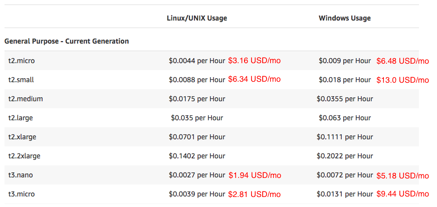
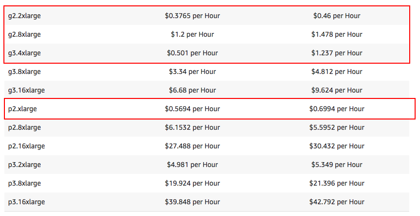
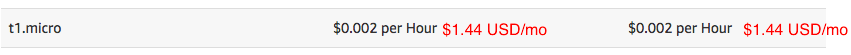
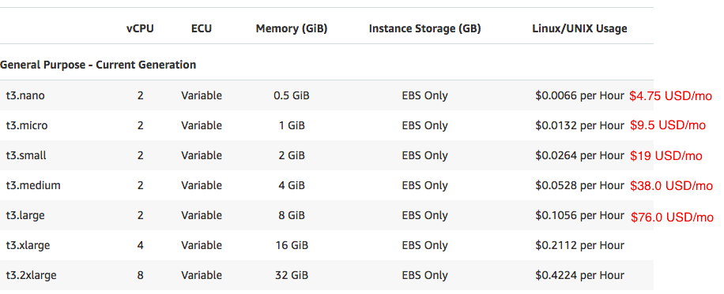
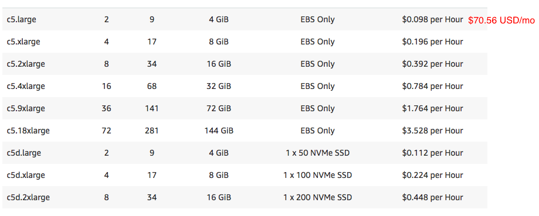
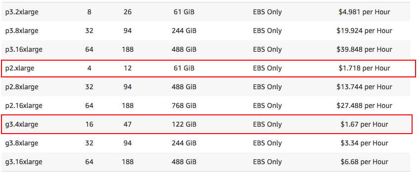
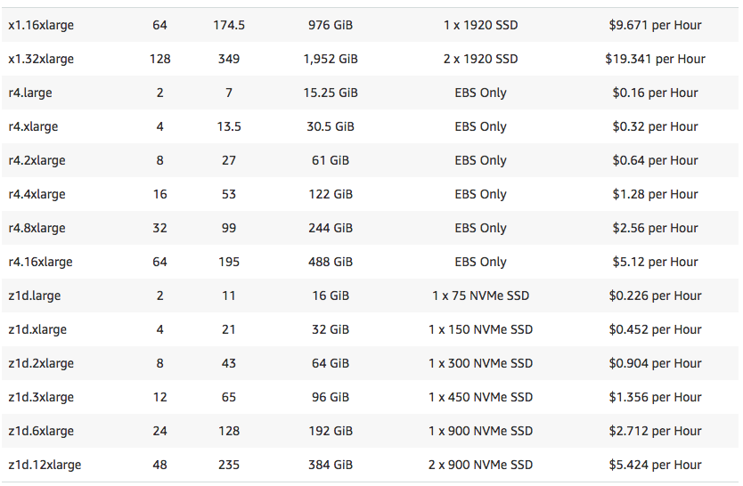
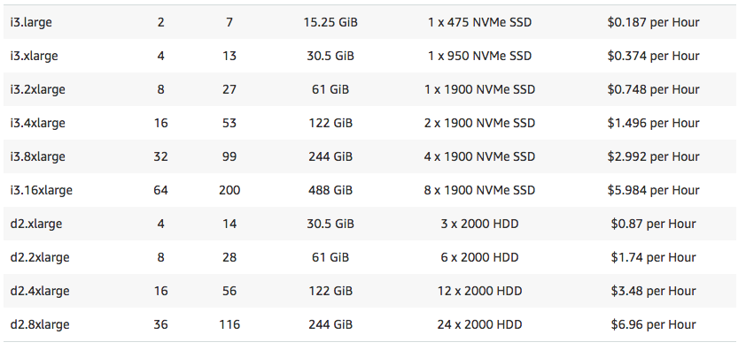
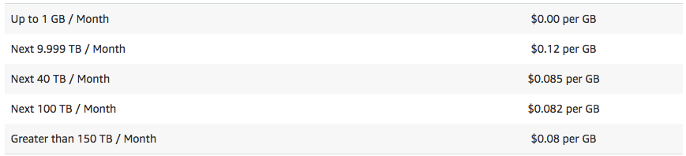

# ❖ 「AWS EC2」Server Overview [DRAFT]

## 「PRICING」

`On-Demand instances`, you pay for compute capacity by per hour or per second depending on which instances you run.
`Spot instances` are available at a **discount** of up to 90% off compared to On-Demand pricing.
`Reserved Instances` provide you with a significant discount (up to 75%) compared to On-Demand instance pricing. 

### 「SPOT INSTANCE」
[Refer to: Amazon EC2 Spot Instances Pricing](https://aws.amazon.com/ec2/spot/pricing/)

The _Spot instance_ is the `spare resources` of AWS computers, that being said, its existence **uncertain**, it all depends on the market.

The price for a _Spot instance_ is always changing. And the way to use it is to set a **maximum hourly price** for each instance. When the price hit the limitation you've set, the instance will be automatically **TERMINATED**!

> Hence, it's not good for long term running, but rather for short term computation needs.

For Asia Pacific (Singapore):
- General purposes:

- Compute Optimized:
- GPU Instances:

- Memory Optimized:
- Storage Optimized:
- Micro Instances:

> * Cluster GPU Instances are not available in all regions.

### 「ON-DEMAND」 Instance  (Standard)

[Refer to: Amazon EC2 Pricing](https://aws.amazon.com/ec2/pricing/on-demand/)

For Asia Pacific (Singapore):
- General purposes:

- Compute Optimized:

- GPU Instances:

- Memory Optimized:

- Storage Optimized:

Data transfer:
- All data Transfer IN: **FREE**
- Data Transfer OUT:

### 「RESERVED」 Instance (Yearly contract)
[Refer to: Amazon EC2 Reserved Instances Pricing](https://aws.amazon.com/ec2/pricing/reserved-instances/pricing/)

### 「DETICATED HOST」Instance
[Refer to: Amazon EC2 Dedicated Hosts Pricing](https://aws.amazon.com/ec2/dedicated-hosts/pricing/)

### 「EBS」Elastic Block Storage (including AMI)

[Refer to: Amazon EBS Pricing](https://aws.amazon.com/ebs/pricing/)
[Refer to Stackoverflow: Cost of storing AMI](https://stackoverflow.com/questions/18650697/cost-of-storing-ami)

