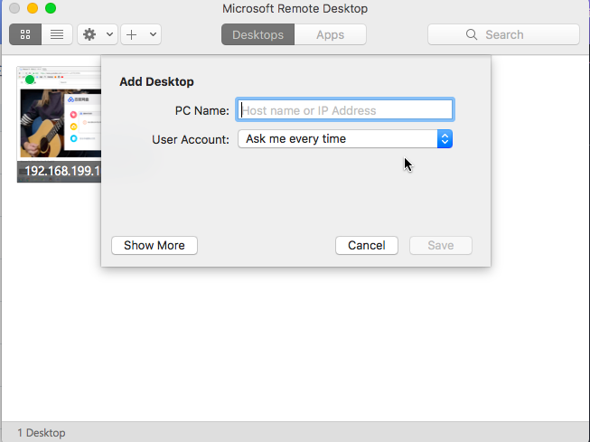
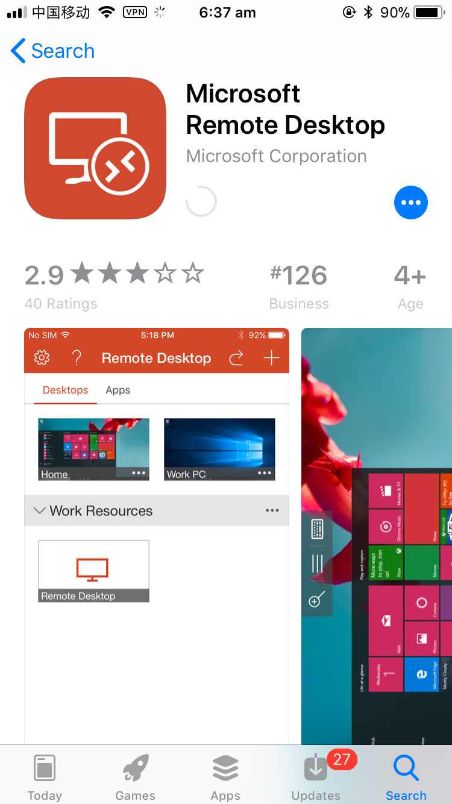
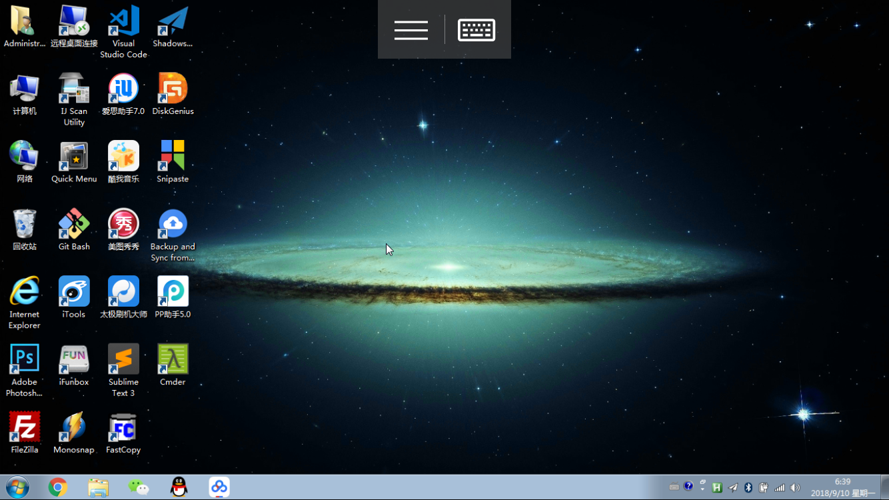

# ❖ 多设备连接Windows远程桌面

[参考：远程桌面问题终极解决方案](https://blog.csdn.net/molashaonian/article/details/53142886)


## Windows服务端设置
- 开始菜单中搜索`远程连接` 
- 打开设置中的远程连接设置 
- 允许远程连接等设置。
- 为机器设置用户名密码（不能为空密码）

同一时间只能在一台电脑中使用同一个用户，如果远程是用administrator用户登录的，那么本地的administrator用户就会被弹出。


## 多种系统的客户端上连接Windows的远程桌面

### Windows上连接另一台Windows的远程桌面
Windows有内置的远程基础设施，所以可以远程、客户端都可以无需安装任何工具就能连接。


Windows客户端设置：
开始菜单中搜索`远程连接` - 选择远程连接 - 输入服务端的IP地址和用户名 - 忽略证书之类的直接登录。


## Linux上连接Windows的远程桌面
下载`rdesktop`:
```sh
# 安装
$ sudo apt-get install rdesktop

# 连接
$ rdesktop -a 16 -u [USER] -p [PASSWORD] -f -r disk:name=/home/fz -r clipboard:PRIMARYCLIPBOARD -r sound:local [IP-ADDRESS]
```


### Mac上连接Windows的远程桌面

应用商店安装微软官方的`Microsoft Remote Desktop 10`(免费).
非常简单非常好用。




### iOS和Android上连接Windows的远程桌面
AppStore中搜索微软官方`Microsoft Remote Desktop`（免费）。用法一样，非常简单
应用只有18M左右，连接非常快，鼠标操作也很简单：直接在屏幕上移动鼠标，两指一起按相当于鼠标右键，还可以两指放大缩小。声音也可以播放，视频也可以看到（比较慢）




