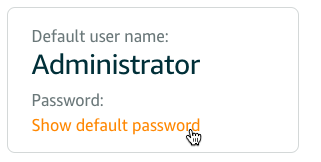
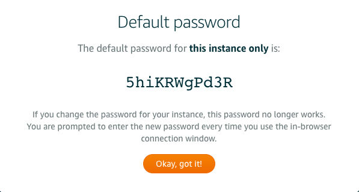
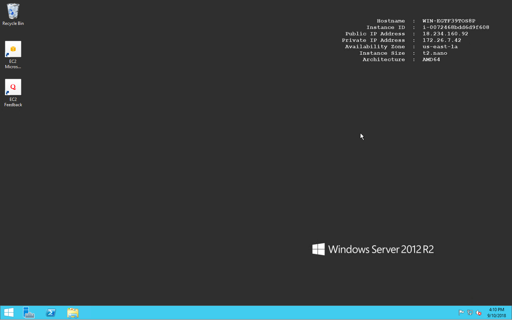

# ❖ 「AWS Lightsail」 Windows服务器试用感受

Lightsail或EC2都能设置Windows服务器，很简单。

创建好后，默认用户是`Administrator`，但是密码要等后台生成才能登录。
Lightsail后台里可以直接在浏览器里打开远程桌面，本地（Mac／Win／Linux）的工具连接也很简单。

有问题的地方是AWS生成Windows服务器的密码问题，它会生成一串随机的默认密码，需要你等待。

但是经常性的密码会无法生成，总显示：

根据网上的经验，如果10-15分钟还没有生成好密码，那等多久也没法生成出来，也就没法登录，需要删除实例再创建，直到能生成密码为止（可以换个windows版本试试）

换了几个region，换了个windows（2012），终于可以出来一个有密码的了。如下：

然后用administrator用户名，和这个密码，简单顺利登录。
桌面很简单,

测试，和一般的windows没什么区别，能正常装软件浏览器，看视频。只不过视频很卡就是了。

另外，同样水准的Windows，网速只有Linux的1/4。而且Windows只对桌面友好，而桌面和GUI的软件有耗费大量内存等资源，所以低配服务器运行还不如自己的500块钱老台式机。

看来低端配置下，果然linux是王道。
