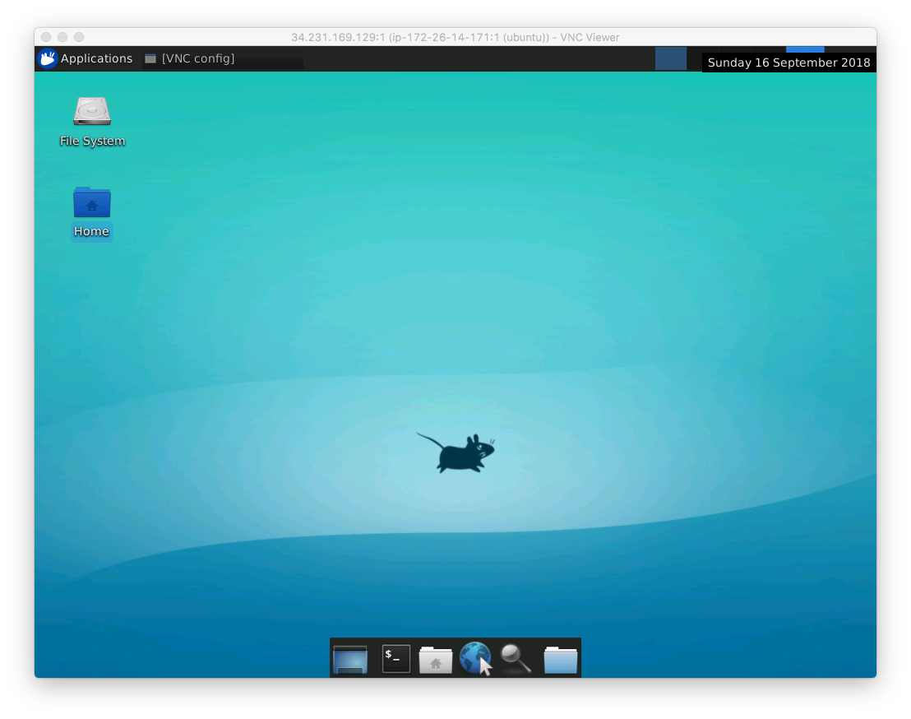
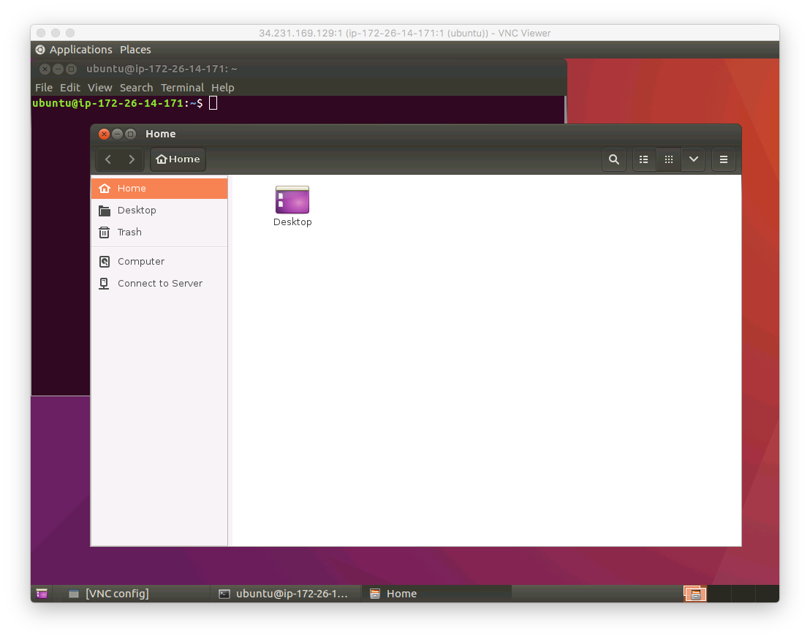

# ❖ AWS Lightsail/EC2 Ubuntu 安装桌面

> 低配的EC2服务器，运行桌面的话极其缓慢，打开什么都会卡半分钟，包括文件夹。看视频就更别想了。而且一般也没什么需要桌面的需求，只是玩玩，知道能GUI桌面登录就好了。

主要步骤如下：
- 第一步：先在管理后台开启默认的5901端口。
- 第二步：安装VNC服务，如`vnc4server`
- 第三步：安装桌面（xfce4, ubuntu-desktop等）
- 第四步：配置VNC文件`~/.vnc/xstartup`，设置开启哪个桌面等参数
- 第五步：重启VNC服务


## VNC服务：「vnc4server」
> 注意：`vnc4server`不支持MacOS自带的vnc连接方法，需要安装RealVNC的VNC Viewer一类软件连接。

安装：
```sh
$ sudo apt-get install vnc4server
```

开启／关闭VNC服务的方法：
```sh
$ vncserver :1
$ vncserver -kill :1
```

另外，在使用前，必须要填写VNC的配置文件`~/.vnc/xstartup`（比如选择什么桌面之类，根据桌面不同配置也不同），才能正确启动。


## 轻量版桌面：「xfce4」
[参考：How to install graphical Desktop in ec2 instance ubuntu16.04 (Linux) and access from mac](https://medium.com/techfeeds/aws-ec2-ubuntu-gui-2dd97be2822d)

```sh
$ sudo apt-get install xfce4
```


需要配置的VNC文件是`~/.vnc/xstartup`文件，全部修改如下：
```
#!/bin/sh

# Uncomment the following two lines for normal desktop:
# unset SESSION_MANAGER
# exec /etc/X11/xinit/xinitrc
#xrdb $HOME/.Xresources
#xsettroot -solid grey
#startxfce4&

[ -x /etc/vnc/xstartup ] && exec /etc/vnc/xstartup
[ -r $HOME/.Xresources ] && xrdb $HOME/.Xresources
xsetroot -solid grey
vncconfig -iconic &

x-terminal-emulator -geometry 80x24+10+10 -ls -title "$VNCDESKTOP Desktop" &
#x-window-manager &

sesion-manager & xfdesktop & xfce4-panel &
xfce4-menu-plugin &
xfsettingsd &
xfconfd &
xfwm4 &
```

配置好后，重启VNC服务，即可登录。

桌面很清简：




## 默认Ubuntu桌面：`ubuntu-desktop`
[参考：阿里云ECS，Ubuntu Server 16.04安装图形界面远程控制](https://blog.csdn.net/dk_0228/article/details/54571867)

```sh
$ sudo apt-get install ubuntu-desktop
$ sudo apt-get install gnome-panel gnome-settings-daemon metacity nautilus gnome-terminal

# 退出登录
$ exec sh /etc/X11/xinit/xinitrc.
```

编辑VNC配置`~/.vnc/xstartup`（包括选择默认桌面等）：
```
#!/bin/sh

export XKL_XMODMAP_DISABLE=1
unset SESSION_MANAGER
unset DBUS_SESSION_BUS_ADDRESS

[ -x /etc/vnc/xstartup ] && exec /etc/vnc/xstartup
[ -r $HOME/.Xresources ] && xrdb $HOME/.Xresources
xsetroot -solid grey
vncconfig -iconic &

gnome-panel &
gnome-settings-daemon &
metacity &
nautilus &
gnome-terminal &
```

配置好后，重启VNC服务，即可登录。

桌面非常丑，而且非常慢。




## 客户端
Mac上文件夹里自带的VNC连接，不支持打开`vnc4server`生成的远程桌面。所以必须要下载第三方客户端。

推荐用免费简单的[`VNCViewer`](https://www.realvnc.com/en/)。
登录的话直接在地址栏输入类似：`34.231.169.129:1`即可，注意ip后面有个`:1`


