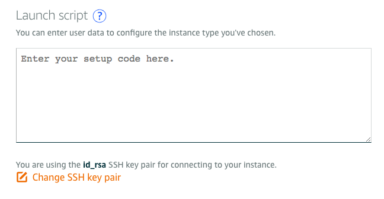

# 远程服务器一键安装开启Shadowsocks脚本

AWS的Lightsails在创建服务器时允许运行初始脚本，这个非常方便，省的我一个一个去敲代码了。




以下为脚本内容：
```sh
#! /bin/bash
# ---UBUNTU SERVER INITIAL SETUP---
# Notice: 
#    This script should be run by "$ sudo bash xxx.sh"

# Update server & install essentials
sudo apt-get update -y
#sudo apt-get upgrade -y
sudo apt-get install htop

# Install Shadowsocks & create config file
sudo pip install shadowsocks
sudo cat>/etc/shadowsocks.json<<EOF
{
    "server":"0.0.0.0",
    "server_port": 1111,
    "password":"abc123",
    "local_address":"127.0.0.1",
    "method":"aes-256-cfb",
    "local_port":1080,
    "timeout":300,
    "fast_open":false
}
EOF
# Auto start Shadowsocks service when system starts
#sudo echo "ssserver -c /etc/shadowsocks.json -d start" >> /etc/rc.local

# Start Shadowsocks server
sudo ssserver -c /etc/shadowsocks.json -d start
```

不要忘记ssh登录的设置，把本地`~/.ssh/id_rsa.pub`的内容复制到`SSH Keypair`里面，这样之后就不需要登录密码了。

注意，生成好服务器后，一定要去开启端口才能生效。
方法是：
点击这个服务器页面 -> Networking -> Firewall，
然后添加一个Custom端口，号码为刚刚脚本中设定的端口号码。


另外，如果不是使用Launch Script初始脚本，也可以直接自己用ssh把脚本上传到服务器，再执行。
方法如下：
```sh
# 上传shell脚本到服务器用户目录
$ scp ./server-init.sh user@ip-address:~

# ssh进入服务器终端
$ ssh user@ip-address

# 运行脚本
# sudo bash ~/server-init.sh
```
