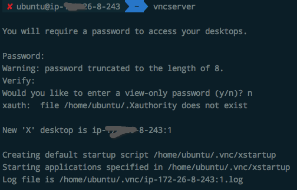
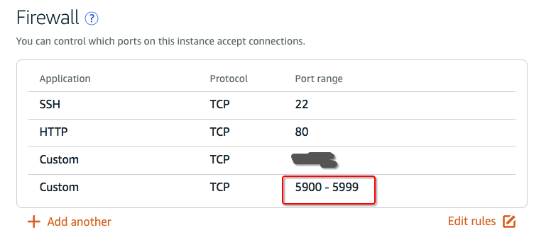
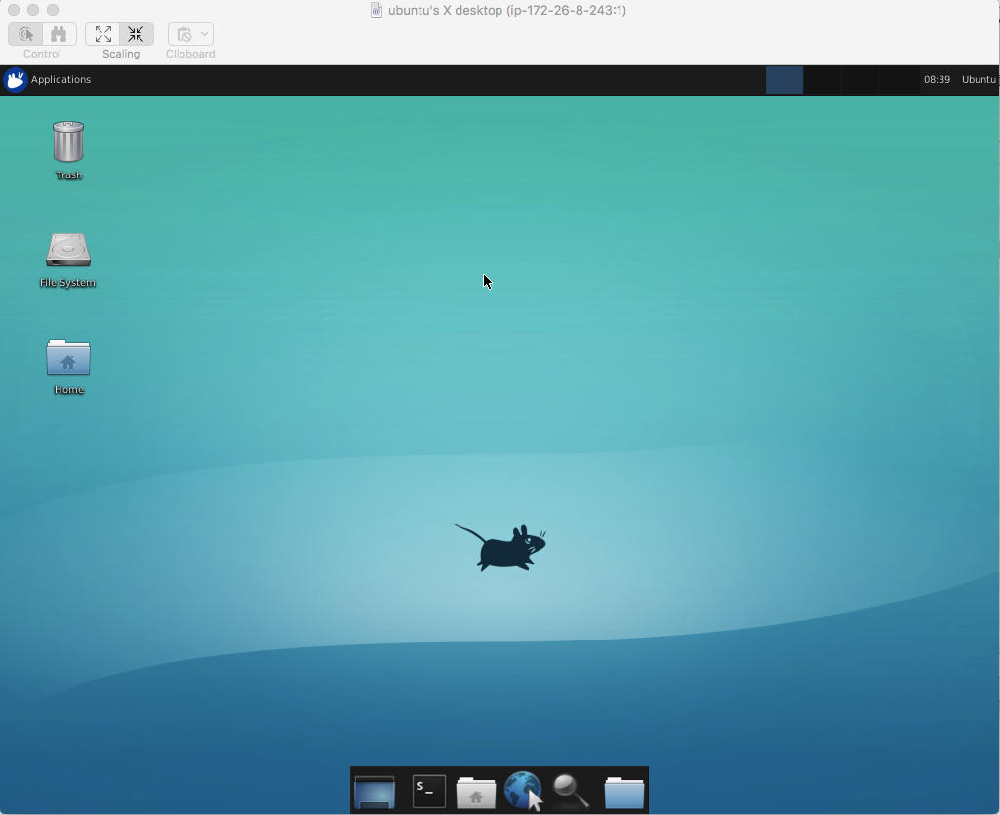

# 利用VNC连接远程服务器桌面：使用xfce桌面

实际上可以在服务器上安装桌面，然后用`VNC`服务从Linux、Mac和Windows等各种地方连接远程桌面。
[参考DigitalOcean的这篇攻略。](https://www.digitalocean.com/community/tutorials/how-to-install-and-configure-vnc-on-ubuntu-16-04)

这里选择的是xfce桌面，非常轻量化，和vnc的配合也很融洽。

1. 第一步：安装 -> 桌面和vnc服务
```shell
sudo apt-get update
sudo apt install xfce4 xfce4-goodies tightvncserver
```

2. 第二步：配置桌面环境

3. 第三步：启动VNC服务
```
$ vncserver
```
第一次启动时，会提示你创建一个登录密码和只供浏览用的登录密码。


4. 第四步：开启服务器端口
服务器端口开放需要在供应商的网页控制面板里调整，各不相同。
因为vnc使用的是从`5900`端口开始，第1个桌面为`5901`，第2个为`5902`以此类推。所以就索性设置为`5900-5999`之间的端口都开放。
下面的是Lightsail的配置：



5. 第五步：从本地计算机利用vnc访问
每种平台方式不同。Mac上直接在文件夹菜单里的`Connect to Server`就可以连上，地址格式是：`vnc://USER:IP:5901`

引用DigitalOcean的说明：
> A local computer with a VNC client installed that supports VNC connections over SSH tunnels. If you are using Windows, you could use TightVNC, RealVNC, or UltraVNC. Mac OS X users can use the built-in Screen Sharing program, or can use a cross-platform app like RealVNC. Linux users can choose from many options: vinagre, krdc, RealVNC, TightVNC, and more.

连接成功：


