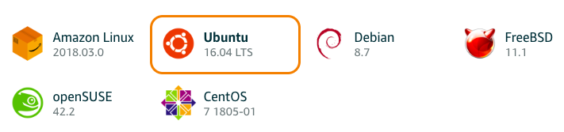
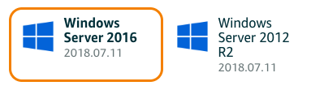
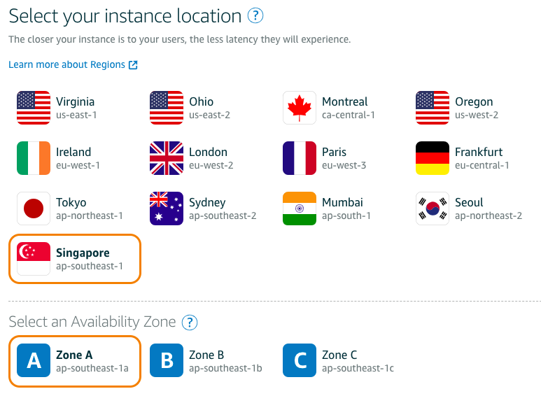
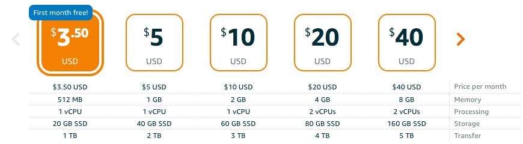
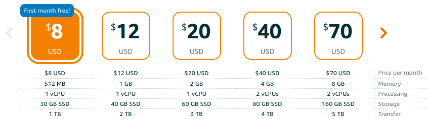
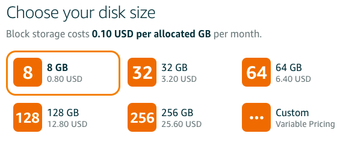

# ❖ 「AWS Lightsails」 Server Overview

[Official: AWS Lightsail.](https://lightsail.aws.amazon.com/)

## 「OS」Choices
- Linux (Only newest):

- Windows:

## 「REGIONS」

- Servers on DIFFERENT **regions** can't connect to each other through `Private IP`
- Servers on SAME **region** but DIFFERENT **zone** CAN connect through `Private IP`
- Snapshot can be used to create another server in SAME **region** but DIFFERENT **zone**
- Snapshot CAN'T be used to create another server in DIFFERENT **region**
- `Static IP` can be only applied to SAME **region**.

## 「PRICING」
- Linux

- Windows

Linux: $3.5 USD/mo (Lowest)
Windows: $8.0 USD/mo (Lowest)

## 「STATIC IP」
They're free in Lightsail, but it will be charged **$0.005 USD/hour** for static IPs not attached to an instance for more than 1 hour, which means it will cost **3.6 USD/mo** !! That's insane

## 「SNAPSHOT」
[Refer: What do Lightsail snapshots cost?](https://aws.amazon.com/lightsail/faq/)

$1.00 USD/20GB-mo (**Lowest**)
$0.05 USD/GB-mo.

> Snapshot of an instance, CANNOT cross region, but can change zone in the same region.

You can both create a `Snapshot` from an instance, or create an instance from a `snapshot`.

[Refer to: Create a Linux/Unix-based instance from a snapshot in Lightsail](https://lightsail.aws.amazon.com/ls/docs/en/articles/lightsail-how-to-create-instance-from-snapshot)

## 「BLOCK STORAGE」

**Block storage disks can only be attached to instances in the **same** `region` and `zone`.**

$0.10 USD/GB-mo.
$2.00 USD/20GB-mo.

**Scalable**
> Scale up or down within minutes with disks of up to 49TB– and attach up to 15 disks per instance.

**Disk limits**:
> **Block storage disks can only be attached to instances in the **same** `region` and `zone`.**
The new disk must be the same size or larger than: 8 GB.
You can create additional storage disks with a capacity of up to 16 TB (16,384 GB).
Your total disk storage must not exceed 20 TB in a single AWS account.
You can attach up to 15 disks to a single Lightsail instance, in addition to the system disk.
You can only attach a block storage disk to one Lightsail instance.

## 「LOAD BALANCER」

$18 USD/mo.
