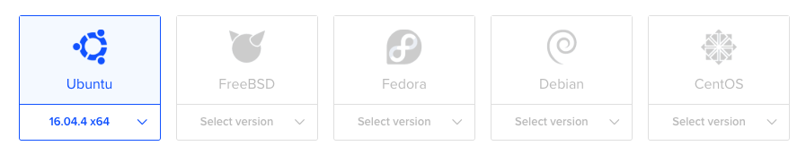
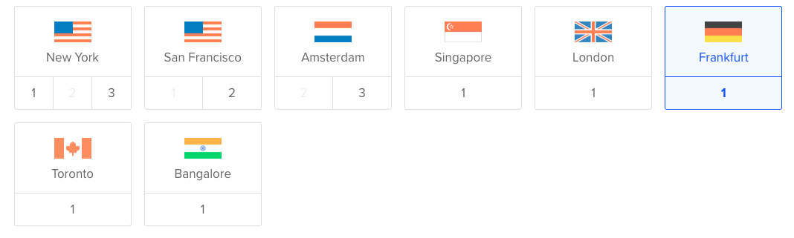
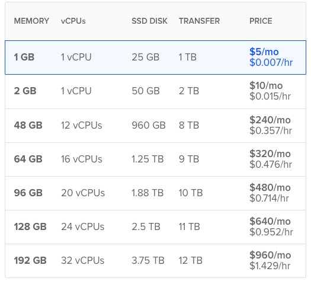
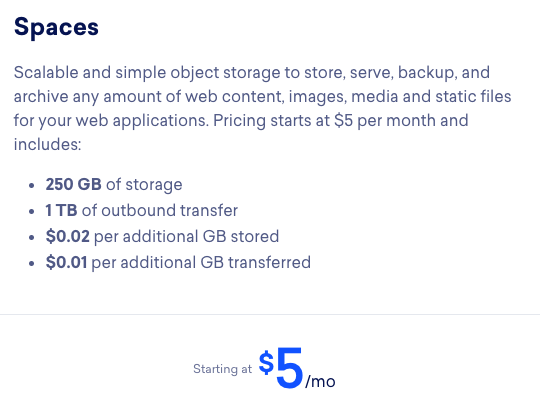
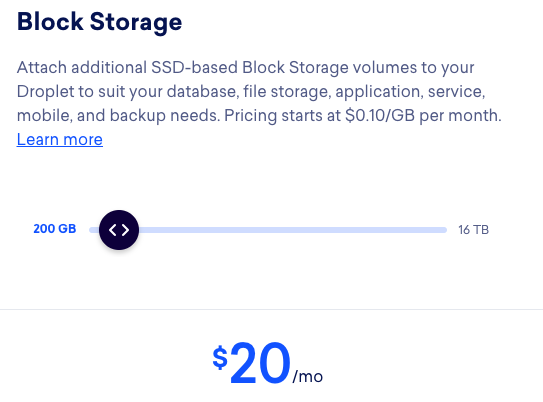

# ❖ 「DigitalOcean Droplet」 Server Overview

[Official: Digital Ocean](https://www.digitalocean.com/)

## 「OS」 Choices

## 「REGIONS」

## 「PRICING」

## 「FLOATING IP」 (Static ip)
Floating IPs are free to use, but it will be charged **$0.006 USD/hr** for each unassigned, reserved IP.

## 「SPACE」 (Static CDN)
[Refer to: Spaces](https://www.digitalocean.com/docs/spaces/)

$5 USD/mo, 250GB storage/mo, 1TB transfer/mo.
$20 USD/mo, 1TB storage/mo.

## 「BLOCK STORAGE」(Fully functioning storage)

$0.1 USD/GB-mo.
$10.0 USD/100GB-mo.
$100.0 USD/1TB-mo.

## 「SNAPSHOT」
[Refer to: Snapshot overview](https://www.digitalocean.com/docs/images/snapshots/overview/)

$0.05 USD/GB-mo.
$1.00 USD/20GB-mo (Lowest)

