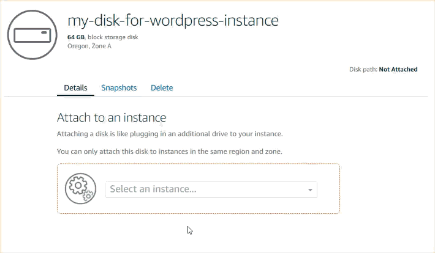
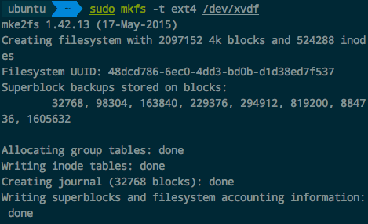
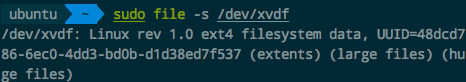

# ❖ 「AWS Lightsail」添加额外存储盘

[参考官网：Create and attach additional block storage disks to your Linux-based Lightsail instances](https://lightsail.aws.amazon.com/ls/docs/en/articles/create-and-attach-additional-block-storage-disks-linux-unix)

首先创建网盘并关联到同国同区的服务器上。
> 注意：一定要记住自己的服务器是哪个国家和哪个区域的，如果不是同样的位置，不能挂载。



然后SSH连接服务器，连接终端输入命令，准备挂载硬盘。

查看新磁盘是否格式化过：
```sh
# 查看添加的网盘名称和地址(如/dev/xvdf)
$ lsblk


# 查看网盘的文件系统状况（是否格式化了）
$ sudo file -s /dev/xvdf
```

如果显示一大堆磁盘属性，包括磁盘格式，那么它已经格式化过了，不用继续格式化了
如果显示`/dev/xvdf: data`，则证明是空盘，没格式化过，需要我们做一下

把刚才的新磁盘格式化为`ext4`格式：
```sh
$ sudo mkfs -t ext4 /dev/xvdf
```


如果要确认一下是否格好了，再次输入`sudo file -s /dev/xvdf`即可。这时就会显示：


现在就能开心的挂载磁盘了：
```sh
# 创建一个空文件夹（用来挂载磁盘），最好在根目录下，而不是用户目录
$ mkdir /data

# 挂载硬盘
$ sudo mount /dev/xvdf /data
```

然后就能正常读写操作了。
但是有一点注意，这个挂载的硬盘只能用`sudo`管理员权限读写，为了方便，可以更改一下磁盘的所有者：
```sh
$ sudo chown ubuntu:ubuntu /data
```
[参考官方：网络文件系统 (NFS) 级别用户、组和权限](https://docs.aws.amazon.com/zh_cn/efs/latest/ug/accessing-fs-nfs-permissions.html)

最后设置每次重启后自动挂载磁盘，编辑`/etc/fstab`文件，添加如下内容：
```sh
/dev/xvdf /data ext4 defaults, nofail 0 2
```
