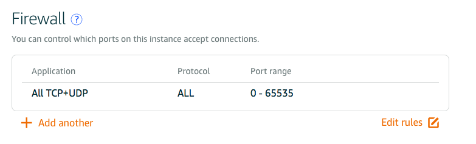
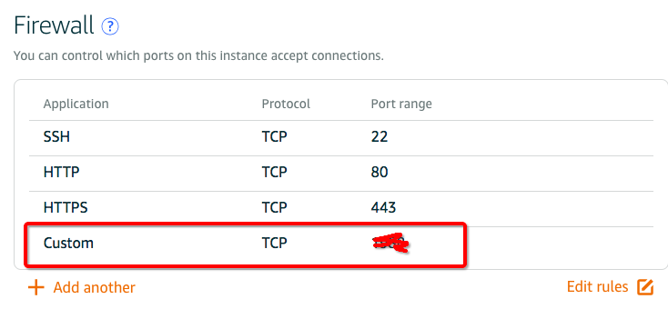
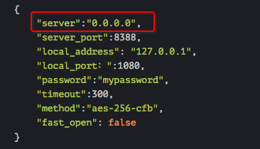

# Shadowsocks on AWS EC2

## Shadowsocks 创建好后无法访问
如果开着ss，打不开谷歌，那么最先尝试的是用ssh连接。如果连接成功，那么说明服务器和网络都没问题。剩下只是配置的事了。
1. 检查防火墙配置。亚马逊AWS的防火墙是很严格的，所以多半都会卡在这。
如果是AWS的Lightsails的话，直接在Networking配置里，开启全部端口，如下图：

或者谨慎点，在默认配置的基础上，添加自己连接的端口：

(注意：这里的Custom处是你在设置/etc/shadowsocks.json时候里面的端口)

2. 还不行的话，就在命令行里主动添加防火墙设置：
```shell
# 下载防火墙设置的软件
sudo apt-get install firewalld
# 开启相应的端口
sudo firewall-cmd --zone=public --add-port=你当前服务器的IP地址/tcp --permanent
sudo firewall-cmd --zone=public --add-port=你当前服务器的IP地址/udp --permanent
```
改好后，就可以通过`cat /etc/firewalld/zones/public.xml`这个文件里看到，刚刚的防火墙设置已经生效了。
3. 如果还不行，就试试这招，把ss配置文件的服务器段IP改为`0.0.0.0`（如果已经是这个设置则反之设置成服务器IP地址），然后保存，并重启ssserver，`sudo ssserver -c /etc/shadowsocks.json -d restart`。如下图：



## Shadowsocks在AWS EC2运行时的网关设置 (待验证)
```
Security Groups -> Inbound -> Edit -> Add -> Custom TCP Rule, TCP, 8000 - 9000, 0.0.0.0/0
Security Groups -> Inbound -> Edit -> All traffic, All, All, 0.0.0.0/0
```
