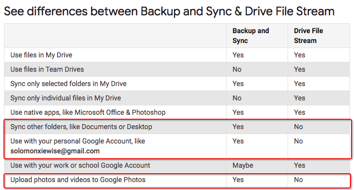

# ❖ Google Drive Mount onto Local File System [DRAFT]

Google提供了官方版本的`Google Drive Stream`，即将Google Drive映射为本地文件夹的工具，但是只提供给Mac和Windows。
但是`Google drive stream`不支持personal个人帐户，只支持企业帐户和学校帐户。

对于Linux，Google没有打算制作这个工具。但是有很多第三方工具可以实现，目前最好的是`ocamlfuse`。

以下分别讲解安装使用方法。


## Google Drive Stream for Mac

[参考官方：Deploy Drive File Stream](https://support.google.com/a/answer/7491144?hl=en)



建议删除本机的`Backup and Sync`软件，并删除`~/Google Drive`文件夹(如果存在的话).

```sh
# 下载工具
$ wget https://dl.google.com/drive-file-stream/GoogleDriveFileStream.dmg

# 后台挂在dmg镜像并安装
$ hdiutil mount GoogleDriveFileStream.dmg; 
$ sudo installer -pkg /Volumes/Install\ Google\ Drive\ File\ Stream/GoogleDriveFileStream.pkg -target "/Volumes/Macintosh HD"; 
$ hdiutil unmount /Volumes/Install\ Google\ Drive\ File\ Stream/

# 卸载
sudo mv /Applications/Google\ Drive\ File\ Stream.app/ /tmp/
sudo mv ~/Library/Application Support/Google/DriveFS/ /tmp/
```

配置：
配置文件为`~/Library/Preferences/com.google.drivefs.settings`

Proxy代理网络设置：
[参考官方：Configure Drive File Stream](https://support.google.com/a/answer/7644837)
```

```
