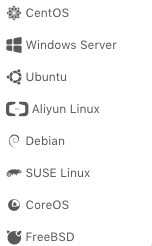
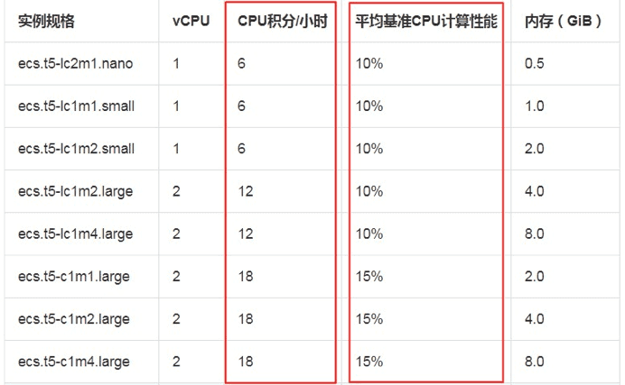
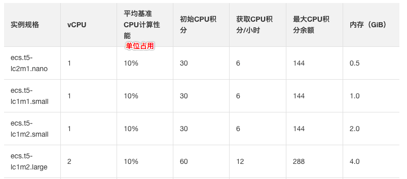
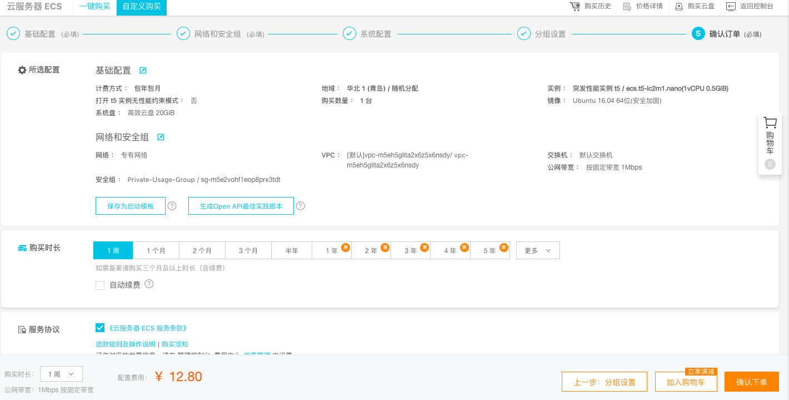
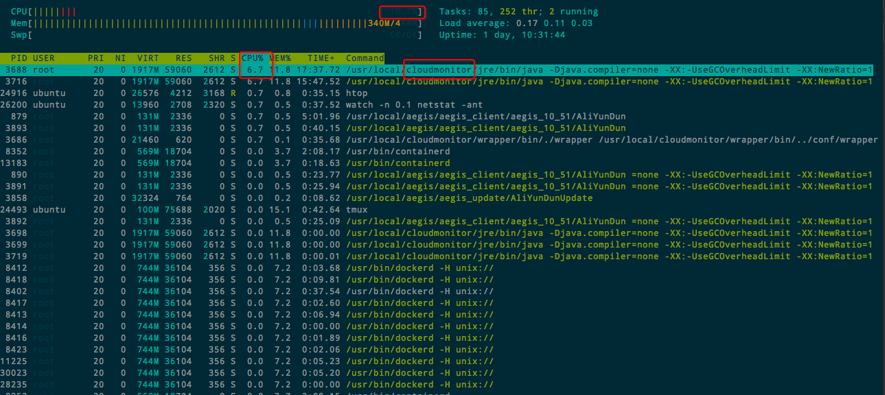

# ❖ 「Aliyun ECS」 Server Overview [DRAFT]

## 「REGION」

## 「OS」Choices

## 「INSTANCES」

- t5 Burstable instance 突发性能实例

### t5 Burstable instance 突发性能实例

性能最低，且以`CPU积分`的方式计费。

> "每台t5实例都有一个基准CPU计算性能，并会根据实例规格以指定速度持续获取CPU积分。每台t5实例一旦启动，就会开始消耗积分以满足需求。当实例实际工作性能高于基准CPU计算性能时，会消耗更多的CPU积分来提升CPU性能，满足工作需求。"

[参考：阿里云 突发性能实例 > 基本概念](https://help.aliyun.com/document_detail/59977.html?spm=5176.ecsbuyv3.0.0.41ea3675Ndsgpf)
[参考：阿里云 t5性能约束实例](https://help.aliyun.com/document_detail/90635.html?spm=a2c4g.11186623.2.11.4b8c7272vF1PpO#concept-fl1-tl4-cfb)
 

t5实例的规模类型：
- nano: 初始30积分，单位CPU占用为10%，+6积分/小时，-6积分/小时/单位占用。
- small: 初始30积分，单位CPU占用为10%，+6积分/小时，-6积分/小时/单位占用。
- large: 初始60积分，单位CPU占用为15%，+12积分/小时，-6积分/小时/单位占用。
- xlarge: 初始120积分，单位CPU占用为15%，+36积分/小时，-6积分/小时/单位占用。

所拥有的积分消耗完后，实例的CPU使用率，最大只能为`单位CPU占用`，一个单位占用为10%或15%，每种实例规模不同。当然，这个时候可以选择减少CPU使用，来增加积分。

t5实例的约束选项：
- 约束型：约束型是默认类型，如果积分消耗为0，则限制在`单位CPU占用`以内不能使用更多CPU。
- 非约束型：开启`非约束`后，积分消耗为0后，可以使用超过`单位CPU占用`的CPU，但需额外付费。

## 「PRICING」

- t5 突发性能实例
    - nano，1 CPU, 0.5 GB Mem, 20 GB Storage, Public IP，1 Mbps Bandwidth：12.8元/周，44.8元/月
    - small，
    - large，

> 其中，在最便宜的t5 nano实例中，公网IP几乎增加了一倍的成本：无公网IP的实例仅为7元/周。
如果选择不使用系统分配的公网IP，则需要自己购买阿里云`弹性公网IP`: 固定带宽计费的话，最便宜也是8.4元/周。

能选择的最便宜实例：

## 「弹性公网IP」

如果选择不使用系统分配的公网IP，则需要自己购买阿里云`弹性公网IP`.

## 「CPU积分实测」

基本上感受是：
- 运行七八个网络相关的docker，几乎不占用什么CPU
- 网络访问量大时，CPU也不会占用很多
- 只有在主机执行脚本、安装程序等操作时，会大量占用CPU，轻松超过10%

总结就是：如果作为个人的”网络中转站“，t5.nano的CPU积分基本上不会超，而且还会有剩余。

我设定的是CPU占用整个小时平均都超过10%就发邮件，于是就频繁收到监控台的警报邮件。
于是检查了下HTOP，发现后台各种阿里云的进程乱飞，实在不能忍啊！最重要是：
**让CPU占用超10%的，恰就是阿里云监控台本身！**

可以看到，这个服务器我几乎没在用什么，放在那浪费的。只是阿里云自己的服务占用了这么大的CPU资源，这让人怎么想？

## 「t5.nano 1Mbps」 Net Speed 网速实测

> 就结果来说，可以是相当的失望。比起AWS等国际服务器，在网络的速度、带宽、价格上根本不能比。

本机是北京100MB带宽的宽带，日常下载可高达7Mbps，上传可达1Mbps。

网络通畅下，`北京`客户端连接`阿里云青岛`服务器：
- SCP: 从阿里云下载130kbps，上传到阿里云950kbps。
- Webdav：从阿里云下载速度145kbps, 上传到阿里云150-300kbps.

感受：这种速度和便宜很多的AWS实例，_在不被干扰情况下_，**网速慢了十倍以上。**
