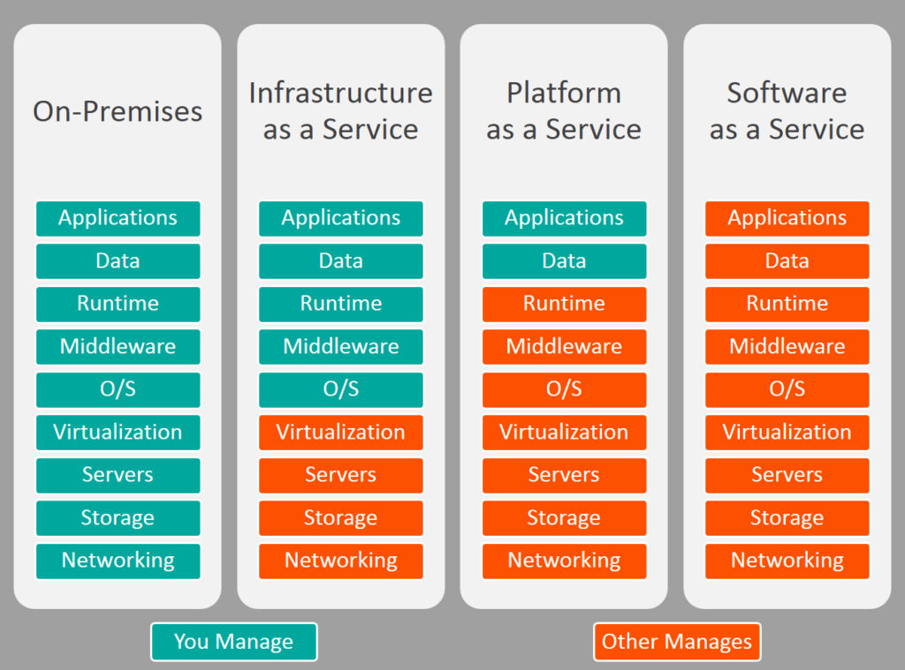

# ❖ 理解IaaS, SaaS, PaaS等云模型 (Cloud Models)

[参考：SaaS vs PaaS vs IaaS: What’s The Difference and How To Choose](https://www.bmc.com/blogs/saas-vs-paas-vs-iaas-whats-the-difference-and-how-to-choose/)
[参考：怎么理解 IaaS、SaaS 和 PaaS 的区别？知乎](https://www.zhihu.com/question/20387284)

如何快速记忆区分这几个名字？
秘诀：**只要记住几个首字母即可：包括I,P,S. 其中`I`-Infrastructure; `P`-Platform; `S`-Service.** 
后面的话都是统一的`aaS`，即"as a service"。后面这个不重要，换成"as a product", "as a f__", "business"什么的，都无所谓。

> 为什么要提到记忆问题？因为如果不先在脑子里区分这几个单词，那么即使看过类各自代表的意义，第二天也会忘的一干二净。

记住了名字后，我们先要知道这几个东西是在说什么。

IaaS, PaaS, Saas, 都是Cloud Models，即云端项目的模型。
如果你要组成一个在线运行的云项目，必须具备很多组件，如硬件的CPU、硬盘，软件的OS系统，HTTP服务器，数据，应用程序等等。根据app需求，它们的搭配运作肯定是你指定的，也就是“固定”的。

但问题是，各个组件谁来提供？谁来管理？
根据各个组件的提供和管理者的不同，就划分出了不同的`Cloud Models`。

简单来说：
- `On Premises`: 全部自己管。自己买电脑主机，集群，自己装系统装软件，自己更新运维所有Bug。
- `IaaS`: 我们就称它为`硬件服务`。商家负责所有硬件部分，你负责所有软件部分。你只需要按期给钱，剩下硬件问题如硬盘坏了风扇不转了，都不需要你管。
- `PaaS`: 我们就称它为`平台服务`。商家负责绝大部分，你只需要写app的代码和管理自己的数据库。其它比如OS系统漏洞补丁，网线断了，主机散热什么的，都不需要你管。你只需要按月给钱就行了。
- `SaaS`: 我们就称它为`全套服务`。这下好了，连代码都不需要自己写，数据也不用自己找，商家全给足了！你只需要配置下名字，改个Logo，选自己喜欢的功能就够了。其它软件硬件维护更新找Bug，全都不是自己事。比如在线财务报表软件，比如Wordpress博客。

这些很好理解。真正用起来，就针对不同的项目不同的细节了，这里不多说。下面就说说各自的特点。

## 各个云模型特点

### IaaS (硬件服务)

> 相当于让你租硬件。

优点：
- 轻松扩容
- 用户可以完全控制和定制硬件设施

案例：
一般是VPS云服务器提供商。
DigitalOcean, Linode, Rackspace, Amazon Web Services (AWS), Cisco Metapod, Microsoft Azure, Google Compute Engine (GCE)

### PaaS (平台服务)

> 相当于让你租硬件和系统级软件。

优点：
- 高可用，
- 轻松扩容
- 轻松移植
- 大量减少代码量
- 用户可以专心构建自己的业务应用，不用被杂事干扰

案例：
一般是具体的云服务提供商。
AWS Elastic Beanstalk, Windows Azure, Heroku, Force.com, Google App Engine, Apache Stratos, OpenShift

### SaaS (全套服务)

> 相当于让你租软件硬件全团队服务，你只是个给钱的土豪甲方。

优点：
- 自己什么都不用管理维护
- 全网可以访问
- 可以集中管理

案例：
一般是完整的云应用。
Google Apps, Dropbox, Salesforce, Cisco WebEx, Concur, GoToMeeting
