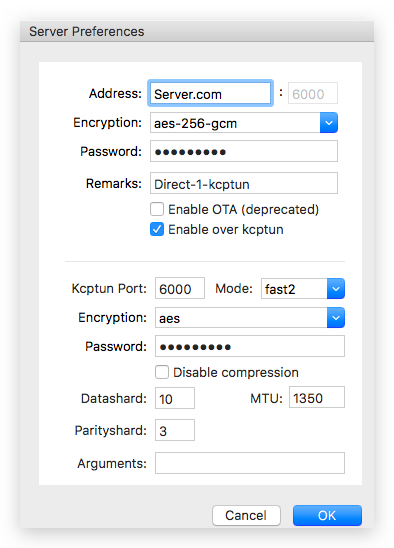

# Docker一键部署Shadowsocks + Kcptun


## 分别部署：Shadowsocks和Kcptun两个容器

Shadowsocks服务器：
```sh
# 使用shadowsocks官方容器
docker run -d --restart always -p 6000:8388 -e METHOD=aes-256-gcm --name "ss6000" \
    -e PASSWORD=shadow123 shadowsocks/shadowsocks-libev
```
记住上面ss对外暴露的是6000端口。

Kcptun服务器：
```
# xtaci/kcptun 为kcptun的官方容器
docker run --name kcptun -p 6000:6500/udp -d --restart=always xtaci/kcptun \
    server -t "$(hostname -i):6000" -l ":6500" -key "kcptun123" -crypt aes \
    -datashard 10 -parityshard 3 -mtu 1350 -sndwnd 512 -rcvwnd 512 -dscp 0 -mode fast2
```
Kcptun也可以暴露同样的6000端口，两者一个用tcp一个用udp，互不冲突，比较好记。

Mac上ShadowsocksX-NG客户端连接：



## 统一部署：Shadowsocks + Kcptun 同在一个容器内

参考：https://github.com/mritd/dockerfile/tree/master/shadowsocks

```sh
# 使用第三方镜像：mritd/shadowsocks
docker run -dt --name ss -p 6000:6443 -p 6000:6500/udp \
    -e SS_CONFIG="-s 0.0.0.0 -p 6443 -m aes-256-gcm -k shadow123" \
    -e KCP_CONFIG="-t 127.0.0.1:6443 -l :6500 -mode fast2" -e KCP_FLAG="true" \
    -e KCP_MODULE="kcpserver"  mritd/shadowsocks
```


