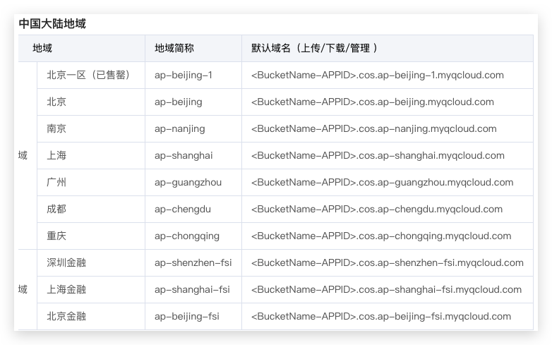
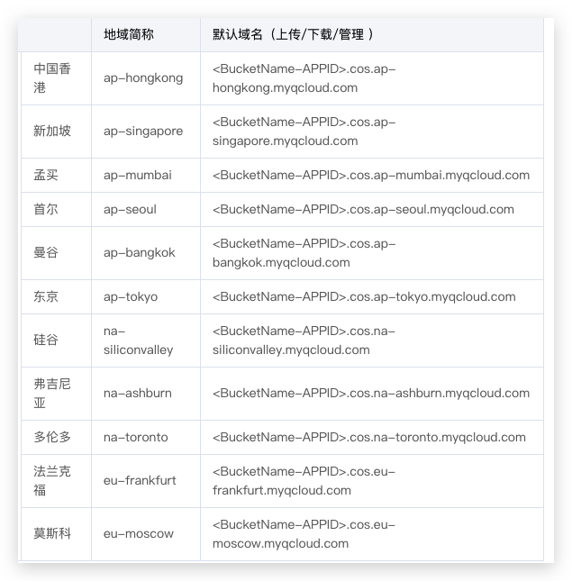
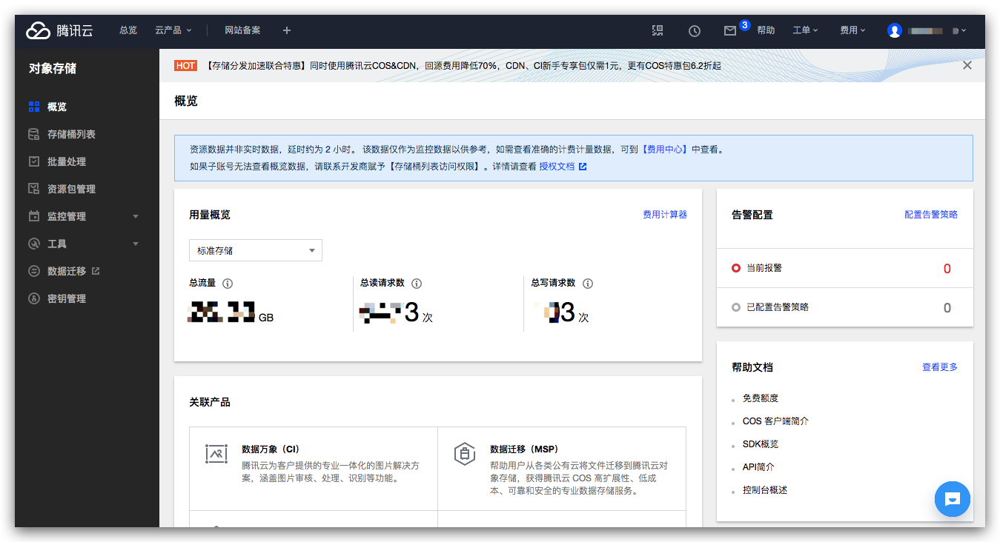
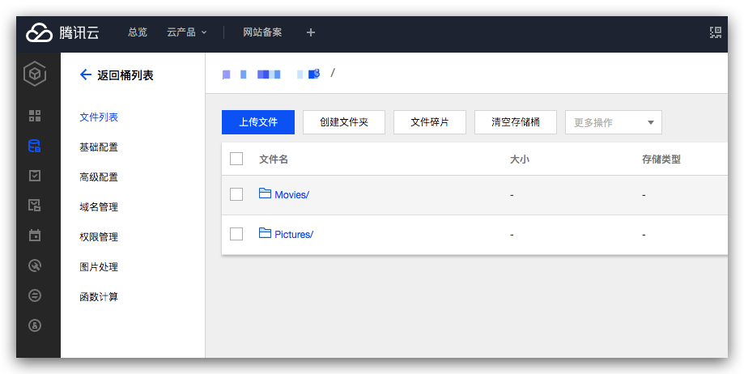
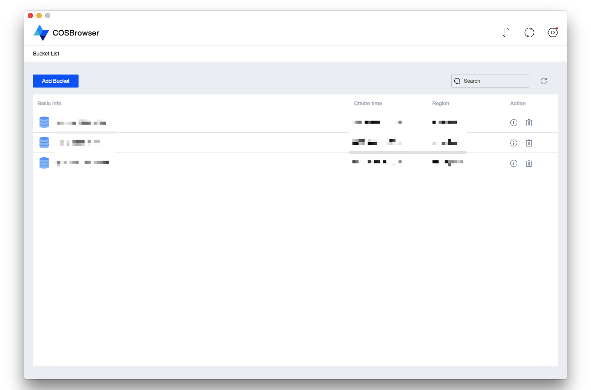
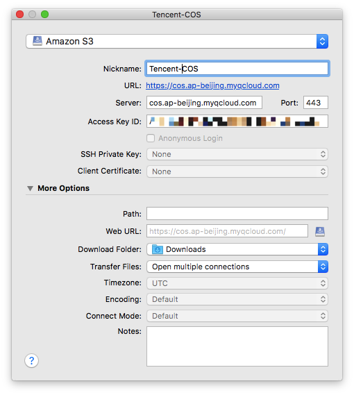

# 腾讯云“S3”对象存储 COS

Region区域名称：




## 使用Web网页客户端操作
进入COS Console：https://console.cloud.tencent.com/cos



创建后进入Bucket的主页，在这里进行各种控制：



## 使用官方桌面客户端操作

电脑的客户端强制要求使用key和secret来登录。

除了登录外，使用方法和WEB大致相同：



## 使用Cyberduck桌面客户端操作


填写自定义endpoint-url（注意复制的时候不要加上http）：



## 使用Python boto3操作

```py
import os
import boto3
from logging import getLogger

import settings

logger = getLogger(__name__)


class S3Operator:
    def __init__(self, access_key=None, secret=None, endpoint=None, region=None):
        self.client = self.get_s3_client(
            access_key or settings.AWS_ACCESS_KEY_ID,
            secret or settings.AWS_SECRET_ACCESS_KEY,
            endpoint=endpoint,
            region=region
        )
        self.resource = self.get_s3_resource(
            access_key or settings.AWS_ACCESS_KEY_ID,
            secret or settings.AWS_SECRET_ACCESS_KEY,
            endpoint=endpoint,
            region=region
        )

    def get_s3_client(self, access_key, secret, endpoint=None, region=None):
        return boto3.client(
            's3',
            aws_access_key_id=access_key,
            aws_secret_access_key=secret,
            endpoint_url=endpoint,
            region_name=region,
            # config=boto3.session.Config(signature_version='s3v4'),
        )

    def get_s3_resource(self, access_key, secret, endpoint=None, region=None):
        return boto3.resource(
            's3',
            aws_access_key_id=access_key,
            aws_secret_access_key=secret,
            endpoint_url=endpoint,
            region_name=region,
            # config=boto3.session.Config(signature_version='s3v4'),
        )

    def upload_file(self, localpath, bucket_name, object_name=None):
        if not os.path.exists(localpath):
            return False
        object_name = object_name or os.path.basename(localpath)
        try:
            self.client.upload_file(localpath, bucket_name, object_name)
        except S3Exception as ex:
            print(ex)
        return True

    def get_signed_url(self, bucket_name, object_name, expiredin=86400, httpmethod=None):
        url = self.client.generate_presigned_url(
            ClientMethod='get_object',
            Params={
                'Bucket': bucket_name,
                'Key': object_name,
            },
            ExpiresIn=expiredin,
            HttpMethod=httpmethod,
        )
        return url

    def create_bucket_if_not_exists(self, bucket_name):
        existing = [b['Name'] for b in self.client.list_buckets()['Buckets']]
        if bucket_name not in existing:
            info = self.resource.create_bucket(Bucket=bucket_name)
            print('Created bucket:', info)
        return self.resource.Bucket(bucket_name).creation_date

    def delete_bucket(self, bucket_name):
        existing = [b['Name'] for b in self.client.list_buckets()['Buckets']]
        if bucket_name in existing:
            bucket = self.resource.Bucket(bucket_name)
            _ = [key.delete() for key in bucket.objects.all()]
            bucket.delete()

    def list_objects(self, bucket_name):
        keys = [obj.key for obj in self.resource.Bucket(bucket_name).objects.all()]
        return keys
```


## 使用aws-cli命令行工具操作

参考：https://github.com/aws/aws-cli/issues/1270
参考：http://www.lbtyeya.com/cloud_tencent_/developer/article/1557702


配置文件：
```ini
# 此处使用AWS
[default]
aws_access_key_id=abc
aws_secret_access_key=abc
region = us-east-1
output = json

# 此处是使用腾讯云
[profile tencent]
aws_access_key_id=abc
aws_secret_access_key=abc
```

然后再命令行里
```sh
# 列出此region的所有bucket
aws --profile tencent --endpoint-url http://cos.ap-beijing.myqcloud.com s3 ls

# 列出某个bucket的所有文件
aws --profile tencent --endpoint-url http://cos.ap-beijing.myqcloud.com s3 ls --recursive s3://BucketName/
```

如果想把`endpoint-url`加到配置文件里这样就不需要每次都在命令里面指定，这需要安装aws-cli的第三方插件`awscli-plugin-endpoint`:
Refer to: https://github.com/wbingli/awscli-plugin-endpoint

```sh
pip install awscli-plugin-endpoint
```


然后在aws配置文件里面加一段这个来指定插件：
```ini
[plugins]
endpoint = awscli_plugin_endpoint
```

整体效果如下:
```ini
[plugins]
endpoint = awscli_plugin_endpoint

[default]
region = us-east-1a
output=json

[profile tencent]
aws_access_key_id = abc
aws_secret_access_key = abc
region = ap-beijing
output = json
s3 =
    endpoint_url = http://cos.ap-beijing.myqcloud.com
```

当然，还可以为aws的各个子命令配置不同endpoint：
```ini
[profile localstack]
s3 =
    endpoint_url = http://localhost:4572
kms =
    endpoint_url = http://localhost:4599
lambda =
    endpoint_url = http://localhost:4574
iam =
    endpoint_url = http://localhost:4593
kinesis =
    endpoint_url = http://localhost:4568
logs =
    endpoint_url = http://localhost:4586
sts =
    endpoint_url = http://localhost:4592
ec2 =
    endpoint_url = http://localhost:4597
```

最后使用的时候，直接指定profile即可：
```sh
aws --profile tencent s3 ls
```


## 使用Grep删除一些匹配的文件

```sh
bucket="BucketName"
for f in $(aws --profile tencent s3 ls --recursive --human-readable "$bucket/" |grep 'some_pattern' |awk '{print $5}')
do
    aws --profile tencent s3 rm "s3://$bucket/$f"
done
```
