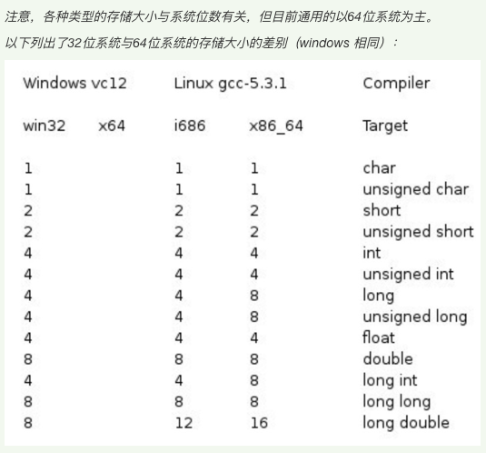
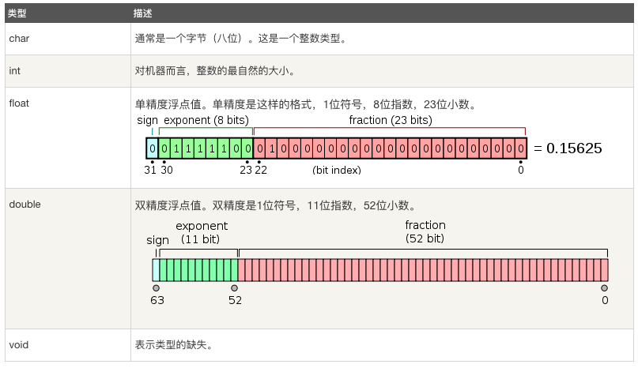

# ❖ C Intro

C语言的代码运行速度相当于`汇编语言`的运行速度，所以一般用C语言作为系统级开发语言。

## 环境搭建
C语言只需要一个编译器`C Compiler`就可以工作，代码直接用各种文本编辑器写就行了。
目前比较流行的C编译器有：
- `gcc`: 是GNU出的编译器，即`GNU C Compiler`

用`gcc -v`检查当前编译器版本，如果没有，则需要安装gcc了。

Ubuntu上，
```sh
sudo apt-get install build-essential
```

Mac上，需要在App Store安装`Xcode`，然后就有了gcc。

Windows上，需要安装`MinGW`

## 编译和运行C代码

假设现在写了一个最最最简单的`hello-world.c`，如下：
```c
#include <stdio.h>
int main() {
    printf("Hello, world!");
    return 0;
}
```

> 注意：C语言中的`#`不代表注释，而是要调用`预处理器`的意思。

最最简单的编译命令就是：
```sh
$ gcc hello-world.c
```
然后目录中就会自动生成一个`a.out`的文件，是个二进制机器可读懂的东西。这个名字`a.out`是默认的，因为我们没有自己指定名称。

如果要指定输出名称(-o 参数)：
```sh
$ gcc hello-world.c -o hello
```
这时候目录就会出现一个叫`hello`的没有后缀名的文件。

运行：
因为C代码编译出来是`二进制可执行文件`，也就是文件默认就有`x`属性，所以我们可以像bash脚本一样直接在命令行打开：
```sh
$ ./hello
```
这样就会显示出`Hello, world!%`这样的信息。


## C的数据类型

C的数据类型分为几大类，各个类下有非常多的细分类型。
与动态类型的Python等语言不同，作为静态类型的C语言必须严格区分类型，这样才能在创建变量时候就给它开辟一块**固定**的内存空间。

C的数据类型分为这几大类：
- 基本类型
    - 整数类型
    - 浮点类型
- 枚举类型
- Void类型
- 派生类型

其中，`整数类型`可以细分为以下：


> 可以看到，同样的细分类型，如`char`，在每种OS和每种CPU架构上分配的内存空间是很不同的。这也就是为什么程序在另一个平台不那么容易直接用的原因。

所以为了确定当前OS和架构环境下的类型所占内存，需要用`sizeof(type)`方法来检验。


## 变量类型

C变量分为如下类型：
- char
- int
- float
- double
- void




C语言声明变量：
```c
// 只声明一个变量的类型（只分配空间，不赋值）
int i;
// 为变量赋值
i = 10;

// 或，声明变量类型，且初始化赋值
int i = 123;
```


定义常量，有两种方法：
```c
// 使用预处理器
#define LENGTH 10
#define WIDTH 5

int area = LENGTH * WIDTH;

// 或者，
// 使用const关键字
const int HEIGHT = 100

int volume = area * HEIGHT;
```


## 存储类
C中的`存储类`可以定义变量或函数的`生命周期`和`活动范围`，放在`type`前作为修饰。
一般分为：
- auto：
- register：将变量注册为`寄存器`变量，即变量值直接存在CPU寄存器中，极快。但是空间限制很大。
- static：将变量注册为静态变量，相当于声明一个全局变量。
- `extern`：即external，如果被extern修饰，则代表引用外部变量，而不重新分配空间和赋值


## 条件判断

### if...else

单句if...else：
```c
int a = 100;

if( a > 20 )
    printf("a 小于 20\n" );
else
    printf("a 大于等于 20\n" );
```

多句：
```c
int a = 100;
 
/* 检查布尔条件 */
if( a = 20 ) {
    printf("a = 20\n" );
} else if(a = 10) {
    printf("a = 10\n");
} else {
    printf("a 大于 20\n" );
}

printf("a 的值是 %d\n", a);
```

### switch

```c
char grade = 'B';

switch(grade) {
   case 'A' :
      printf("很棒！\n" );
      break;
   case 'B' :
   case 'C' :
      printf("做得好\n" );
      break;
   default :
      printf("无效的成绩\n" );
}

printf("您的成绩是 %c\n", grade );
```

### 三元运算符

```c
Condition ? Exp_if_True : Exp_if_False;
```


## 循环

循环分为：
- for循环
- while循环
- do...while循环：不推荐。没什么太大意义。

循环控制语句有：
- `break`：退出循环。
- `continue`：进入下一次循环。
- `goto`：不推荐。这是汇编式的指针移动，会导致逻辑混乱。

### for循环

```c
for( int a = 10; a < 20; a = a + 1 ) {
   printf("a 的值： %d\n", a);
}
```

无限for循环：
```c
for( ; ; ) {
   printf("该循环会永远执行下去！直到Ctrl+C终止程序。\n");
}
```

### while循环

```c
while( a < 20 ) {
   printf("a 的值： %d\n", a);
   a++;
}
```

无限while循环：
```c
while( 1 == 1 ) {
   printf("该循环会永远执行下去！直到Ctrl+C终止程序。\n");
}
```

### do...while循环

```c
do {
   printf("a 的值： %d\n", a);
   a = a + 1;
} while( a < 20 );
```


## 使用函数

不同于高级语言，C语言的函数分为`声明`和`定义`，函数头相当于要写“两遍”。
**函数的定义和声明都可以在任意位置写**，
但是必须在正式使用前写其中一个，否则编译器会找不到引用。

示例：
```c
#include <stdio.h>

int main() {
    // 先要声明函数：
    int max(int num1, int num2);

    // 才能使用函数
    printf( "%d", max(3, 90) );
}

// 定义函数
int max(int num1, int num2) {
   int result;
 
   if (num1 > num2)
      result = num1;
   else
      result = num2;
 
   return result; 
}
```

以上为最简单的函数调用，且传输的参数值`3 & 90`，会被`复制`到函数中使用。函数中无论怎么改，都不影响原先的变量值。

但是，如果想要允许函数修改原变量的值，那么就不能直接传递值，而是要`传递引用`。即把每个变量的内存地址的指针传进去：

```c
#include <stdio.h>

void clear(int *a, int *b);

void clear(int *a, int *b){
    *a = 0;
    *b = 0;
    return;
}

int main(){
    int a = 10;
    int b = 20;

    clear(&a, &b);

    printf( "a = %d\n", a);
    printf( "b = %d\n", b);
    return 0;
}
```

注意，其中函数参数声明时候是在变量前加`*`，而使用时，传入变量引用需要在变量前加`&`。

## 局部变量和全局变量

和其它语言一样。

但是要注意：
当局部变量被定义时，系统不会对其初始化，必须手动去初始化。
定义全局变量时，系统会自动对其初始化。

## 形参与实参

C的函数的参数有很多种类型：
- 指定大小的数组
- 未定义大小的数组
- 指针

```
// 参数为指定大小的数组
void myFunction(int param[10]) { /*....代码....*/ }

// 参数为未指定大小的数组
void myFunction(int param[]) { /*....代码....*/ }

// 参数为指针的数组
void myFunction(int *param) { /*....代码....*/ }

```

## 函数返回数组

C语言不支持直接返回数组，但是可以返回一个指针，指向数组。

```c
int * myFunc() {
    arr = {1,2,3};
    return arr;
}

int *p;
p = myFunc();
```
