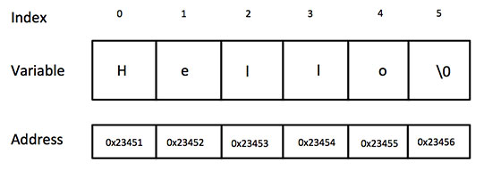

# ❖ C语言数据类型 [DRAFT]

## 数组类型

格式：
```c
type arrayName [ arraySize ];
```

示例：
```c
// 声明数组 (只创建指定大小的内存空间，不赋值）
double balance[5];

// 数组初始化并赋值 （注意是{} 符号）
double balance[5] = {1000.0, 2.0, 3.4, 7.0, 50.0};

// 或者，自动识别数组中项目数量
double balance[] = {1000.0, 2.0, 3.4, 7.0, 50.0};

// 为数组的某一项赋值
balance[4] = 50.0;

// 读取数组某一项元素
double salary = balance[2];
```

多维数组：
```c
int a[3][4] = {  
 {0, 1, 2, 3} ,   /*  初始化索引号为 0 的行 */
 {4, 5, 6, 7} ,   /*  初始化索引号为 1 的行 */
 {8, 9, 10, 11}   /*  初始化索引号为 2 的行 */
};

// 或者，省略{}括号，根据纬度自动填充
int a[3][4] = {0,1,2,3,4,5,6,7,8,9,10,11};

// 访问多维数组
int val = a[2][3];
```


## 字符串

C语言中，字符串实际上是一个特殊的`数组`，即每一个字符为数组中的一个元素，且数组的最后一个元素必须是`'\0'`。

如以下二者是完全想等的：
```c
// 按数组形式直接声明字符串：
char greeting[6] = {'H', 'e', 'l', 'l', 'o', '\0'};

// 更简单的方式声明字符串：
char greeting[] = "Hello";
```

那么，无论用以上哪种方式创建一个数组，内存中的结构都是一样的：




## 枚举类型 Enumeration

理解`枚举类型`：
C中的Enumeration是一个`常量集合`，相当于Python的Dict字典变量，即`key-value`数组。

在Python中，定义一个字典是：
```py
WEEK = {
    "MON": 1,
    "TUE": 2,
    "WED": 3 
    #....
}
```

而在C中，定义一个“字典”是：
```c
enum WEEK {
    MON = 1,
    TUE = 2,
    WED, THU, FRI, SAT, SUN
}
```
C中的“字典”特殊的是，如果后面的`keys`不赋值，那么会自动在前面一个值上+1。如果前面没有项，那么自动变为0。

C语言中，定义枚举类型变量，需要两步：
1. 自定义枚举类型 （相当于创建类）
2. 定义枚举变量 （相当于根据类创建对象实例）

```c
// 先定义类型
enum WEEK{
      MON=1, TUE, WED, THU, FRI, SAT, SUN
};
// 再定义变量
enum WEEK day;

// 或者，同时定义类型和变量
enum WEEK {
      MON=1, TUE, WED, THU, FRI, SAT, SUN
} day;

// 或者，省略类型名称，直接定义变量（只能用一次）
enum {
      MON=1, TUE, WED, THU, FRI, SAT, SUN
} day;
```

使用enumeration：
```c
enum WEEK day;
day = TUE;

printf( "%d", day)
```

定义的时候好理解，使用的时候这里非常容易混淆。


switch判断enumeration：
```c
// 定义枚举
enum color { red=1, green, blue };
enum  color favorite;

fav = blue

// 开始判断
switch (fav) {
   case red:
     printf("你喜欢的颜色是红色");
     break;
   case green:
     printf("你喜欢的颜色是绿色");
     break;
   case blue:
     printf("你喜欢的颜色是蓝色");
     break;
   default:
     printf("你没有选择你喜欢的颜色");
}
```

循环遍历enumeration类型（前提：枚举中定义的数是连续的）：
```c
// 定义枚举
enum DAY {
    MON=1, TUE, WED, THU, FRI, SAT, SUN
} day;

// 循环遍历枚举
for (day = MON; day <= SUN; day++) {
   printf("枚举元素：%d \n", day);
}
```


## 结构体

C语言中的`结构体`实际上是`类`的原型，是可以让用户自定义的数据结构。

定义一个结构的语法，例如：
```c
struct Books {
   char  title[50];
   char  author[50];
   char  subject[100];
   int   id;
};
```

使用结构体：
```c
struct Books b = {"C 语言", "RUNOOB", "编程语言", 123456};

printf("%s, %s, %s, %d", b.title, b.author, b.subject, b.id);
```

作为函数参数的结构体：
```c
void func(struct Books b) {
    b.title = "C语言";
    b.author = "RUNOOB";
    b.subject = "编程语言";
    b.id = 123456;
}
```


## 共用体

和结构体相似，是让用户自定义的数据类型，只是允许在`相同的内存位置`存储不同的数据类型。

定义语法：
```c
union Data {
   int i;
   float f;
   char  str[20];
};
```

使用共用体：
```c
union Data d;  

d.i = 10;
d.f = 220.5;
strcpy( d.str, "C Programming" );
```
