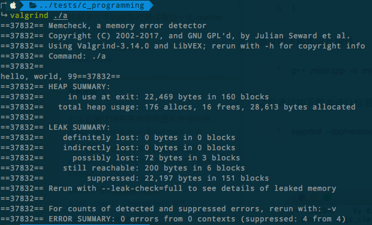

# ❖ C动态内存管理 [DRAFT]


## 理解内存管理

内存管理分`static memory`静态内存和`dynamic memory`动态内存。

一般当我们直接设置变量如`int v = 99;`时，就是静态内存设定。这个变量的内存保留直到程序结束。
但当我们不知道变量是什么，它会动态变化时，我们就要动态设定内存了。

**只有动态内存设定时，才会用到`ma-la ca-la re-a-lac and free`。**


## C语言管理内存的函数

主要是用`<stdlib.h>`这个头文件，其中常用的方法有：
- `void *malloc(int num); `
- `void *calloc(int num, int size);`
- `void *realloc(void *address, int newsize); `
- `void free(void *address); `

光看名称有点迷惑，实际上：
- `malloc` -> `m-alloc` -> `Memory Allocation`
- `realloc` -> `Re-Allocation`
- `calloc` -> `c-alloc` -> `Contiguous Allocation`

> 记忆：像念绕口令一样重复念：`ma-la` `ca-la` `re-a-lac` and `free`.
[参考：Allocating memory with malloc, calloc, realloc, and free](https://www.youtube.com/watch?v=P6oqhAxV0dA&index=10&list=PL9IEJIKnBJjGsttQusXPNuEknLQ6leUfS&t=0s)


## 动态给变量设定内存

**设定内存时，先要给指针设定，然后再用指针来储存具体的值。**


最简单的内存设定方法就是`malloc`：
```c
// 单变量
int *v = malloc( sizeof(int) );
*v = 99;

// 长度为9的数组
int *arr = malloc( sizeof(int)*9 );
*arr[0] = 34;
*arr[101] = 99; // 这样直接写不好，很有可能超出界限
```

`calloc`和`malloc`区别只在于，`calloc`有两个参数，一个是单项所占内存大小，另一个是多少个数量。
用法如下：
```c
int *arr;
*arr = calloc( sizeof(int), 9 );
```

`realloc`用于resize，即更改内存占用大小。第一个参数是指针，第二个参数是新的内存占用大小。
```c
*new_arr = realloc( arr, sizeof(int)*9 )
```

`free`用来清除内存。用完变量后即使清除是良好的实践。
如果不自己清除的话，很有可能造成对内存的占用累积越来越多，导致内存过载。
```c
free( arr );
arr = NULL;
```


## 使用Valgind检测程序的内存信息

Valgind能够检测并动态显示某个二进制文件的内存占用信息，非常友好。

Mac安装：
```sh
$ brew install valgrind
```

Ubuntu安装：
```sh
$ sudo apt-get install valgrind
```

注意：Valgrind程序比较大，Ubuntu上需要150MB左右，Mac上50MB左右。

使用：
```sh
$ valgrind ./hello
```
注意：这里必须要用`./`指定当前目录，而不能直接`valgrind hello`。

开始后，会显示类似这样的信息：



### 解读Valgrind信息 [DRAFT]

在`HEAP SUMMARY`中，

在`LEAK SUMMARY`中，会显示内存泄漏的问题。
如果没有泄漏，则会在`definitely lost`和`indirectly lost`处显示0。

如果没问题的话，就会在最后的`ERROR SUMMARY`那行显示` 0 errors from 0 contexts`
