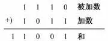
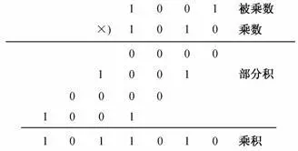
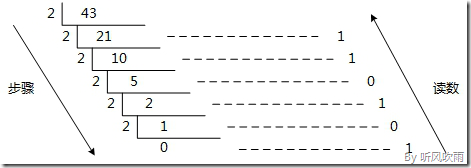

# ❖ All about Binaries [DRAFT]

## 二进制基础运算


### 二进制加减法

加法：


减法：


### 二进制乘除法

乘法：


除法：


## 二进制转换

[参考：二、八、十、十六进制转换（图解篇）](https://www.cnblogs.com/gaizai/p/4233780.html)


### 二进制 -> 十进制

> 总之就是一个`Σ Value * 2^index`的过程。

假设有一个二进制`ABCDE`, 那么转换过程就是：
```js
A * 2^4 +
B * 2^3 +
C * 2^2 +
D * 2^1 +
E * 2^0
```

比如二进制`101011`，那么最方便的就是我们竖着写（建议从下往上写）：
```js
1 * 2^5 +
0 * 2^4 +
1 * 2^3 +
0 * 2^2 +
1 * 2^1 +
1 * 2^0
```

以上简化一下就是：
```js
2^5 +
0 +
2^3 +
0 +
2 +
1
= 43
```


### 十进制 -> 二进制

> 总之就是：**不断除以2来取余数的过程，所有的余数按倒序排列出来就是二进制的结果。**



假设十进制数`43`，转换为二进制的过程就是：
```js
43 / 2 = 21   ---mod---> 1
21 / 2 = 10   ---mod---> 1
10 / 2 = 5   ---mod---> 0
5 / 2 = 2   ---mod---> 1
2 / 2 = 1   ---mod---> 0
1 / 2 = 0   ---mod---> 1
```
那么结果按照倒序取余数，结果是：`101011`
