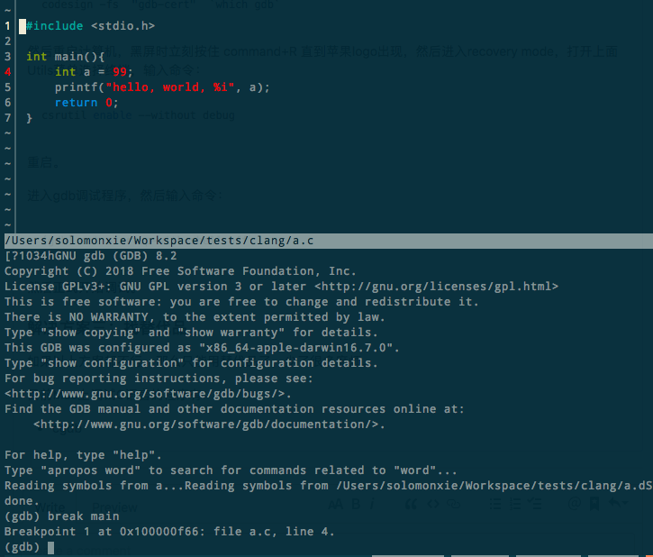
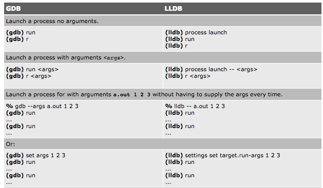

# ❖ 调试C, C++的利器：GDB

[参考：Learn GDB in 60 seconds](https://www.youtube.com/watch?v=mfmXcbiRs0E&index=6&list=PL9IEJIKnBJjG5H0ylFAzpzs9gSmW_eICB)
[参考：使用 GDB 调试 Linux 软件 - IBM](https://www.ibm.com/developerworks/cn/linux/sdk/gdb/index.html)

`GDB`是GNU出品的超强力debug工具，有人因为觉得是在命令行里手动调试而看不起它，但是真的很难说你用的哪个IDE调试器比这个强。

Facts:
- `GDB`支持所有的*nix系统，基本上已经是和`gcc`,`make`之类的成为系统标配。
- `GDB`支持的调试语言有C, C++, Fortran, Assembly汇编。
- `GDB`是在**编译后**的二进制文件上进行debugging的，而不是在源码上排错。

对C/C++程序的调试，需要在`编译时`就加上`-g`选项:
```sh
$ gcc -g hello.c -o hello
$ g++ -g hello.cpp -o hello
$ clang -g hello.c -o hello
```

然后运行gdb来调试-g选项编译后的二进制文件：
```sh
$ gdb ./hello
```

进入调试后，按照顺序，一般的操作有：
- 设置断点：一般是`break main`，即在`main()`函数中断点。或`break 30`在第30行断点。
- 添加变量监视：`watch 变量名`
- 运行调试器：`run`
- 查看某变量值：`print 变量名`
- 下一步(Step into function): `step`
- 下一步(Step over function): `next`
- 运行至下一个断点: `continue`
- 查看当前的代码片段：`list`


## Mac上的`gdb`及其替代品

`gdb`对Mac的支持不好，经常会报错：
```
Unable to find Mach task port for process-id 82541: (os/kern) failure (0x5).
 (please check gdb is codesigned - see taskgated(8))
```
而且问题很难处理，所以一般情况下是找个替代品。

### cgbd

`cgdb`本身只是gdb的包装，让gdb更好看更好用。

Mac安装很简单：`brew install cgdb`
Ubuntu安装也一样：`sudo apt-get install cgdb`



配置很好看，默认自动分屏，用颜色显示。
但是，既然只是gdb的包装，所以gdb在Mac上的`please check gdb is codesigned - see taskgated(8)`还是不能解决。

### LLDB：在Mac上调试的正确用法

由于GDB在Mac上的一系列问题，`lldb`属于Xcode默认调试器，无需任何配置。
唯一的问题就是，调试中的各个命令稍有不同。但是不用担心，学起来非常快。

[参考：The LLDB Debugger](https://lldb.llvm.org/lldb-gdb.html)
[参考：GDB and LLDB Command Examples](https://developer.apple.com/library/archive/documentation/IDEs/Conceptual/gdb_to_lldb_transition_guide/document/lldb-command-examples.html)

常用命令(GDB与LLDB对比）：
- `(gdb) break xx` -> `(lldb) b xx`
- `(gdb) run` -> `(lldb) run`
- `(gdb) step` -> `(lldb) step`
- `(gdb) next` -> `(lldb) next`
- `(gdb) until xx` -> `(lldb) thread until xx`




与gdb相比，目前已知缺点：很多IDE、GUI、插件都是基于gdb的，所以LLDB就与他们都无缘了。
