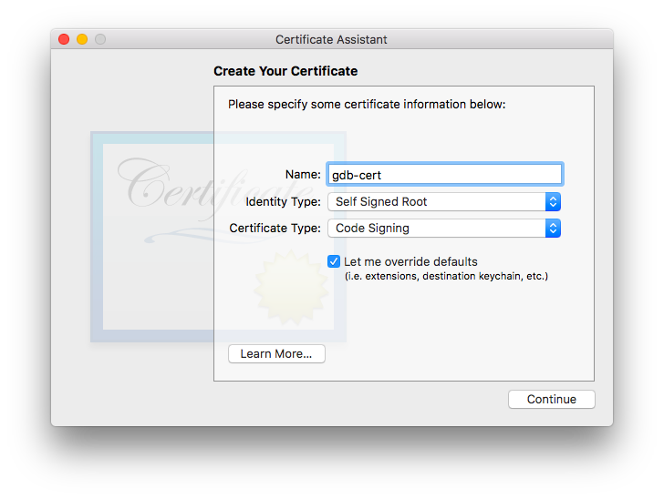
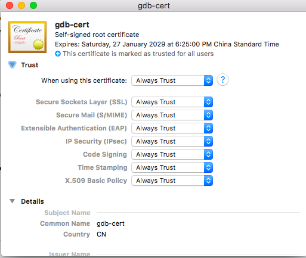

# ❖ Mac上的gdb之：从入门到放弃
`副标题：Mac上的gdb无法正常调试的问题`

Mac上用`brew install gdb`安装gdb后，无法正常的运行`run`命令，报错如下：
```
(gdb) break main
Breakpoint 1 at 0x100000f66: file a.c, line 4.
(gdb) run
Starting program: /Users/solomonxie/Workspace/tests/clang/a
Unable to find Mach task port for process-id 63414: (os/kern) failure (0x5).
 (please check gdb is codesigned - see taskgated(8))
```

这个不是c程序的问题，也不是gdb的问题，而是Mac的问题。

[参考：gdb doesn't work on macos High Sierra 10.13.3](https://stackoverflow.com/questions/49001329/gdb-doesnt-work-on-macos-high-sierra-10-13-3)


为什么Mac不能调试？

> "因为 Darwin 内核在你没有特殊权限的情况下，不允许调试其它进程。调试某个进程，意味着你对这个进程有完全的控制权限，所以为了防止被恶意利用，它是默认禁止的。允许 gdb 控制其它进程最好的方法就是用系统信任的证书对它进行签名。"


[参考：gdb fails with “Unable to find Mach task port for process-id” error](https://stackoverflow.com/a/48550474/9172013)
[参考：How to install and codesign GDB on OS X El Capitan](https://medium.com/@royalstream/how-to-install-and-codesign-gdb-on-os-x-el-capitan-aab3d1172e95)

具体步骤如下：


#### 开启root权限

用Spotlight搜索`Directory Utility`程序，打开后，点击左下角解锁，然后打开菜单->Edit->`Enable root user`->创建密码。

#### 修改`/System/Library/LaunchDaemon/com.apple.atrun.plist`文件

将第22行的`-s`改为`-sp`然后保存退出。

一般来讲管理员是没有权限修改的，所以需要重启进入“安全模式”用root权限解开系统文件的保护，再重启，修改文件，再重启进入安全模式，再开启系统文件保护，再重启回到正常系统。
步骤为：
重启，黑屏时按住`Ctrl-r`不松手一直到苹果标志出现。进入安全模式后，打开菜单Utilities-Terminal终端，输入`csrutils disable`解锁系统文件保护。然后重启，回到正常系统中，`sudo vim /System/Library/LaunchDaemon/com.apple.atrun.plist`将文件中22行`-s`改为`-sp`，保存退出。重启再次进入安全模式，命令行输入`csrutils enable`锁定系统文件保护。再重启，回到正常系统，进行下一步。

#### 删除所有现有的gdb版本：

```sh
brew uninstall --force gdb
```

打开系统的`Applications -> Utilities -> Keychain Access`删除所有gdb相关的证书。

#### 重新安装gdb：

```sh
brew install gdb
```

#### 创建证书

打开系统keychain管理器：`Keychain Access, go to menu Keychain Access-> Certificate Assistant -> Create a Certificate`。



创建新的证书，所填内容如下：
```
Name : gdb-cert
Identity Type: Self Signed Root
Certificate Type : Code Signing
[X] Let me override defaults

Serial Number : 1
Validity Period (days): 3650

Key Size : 2048
Algorithm : RSA

[X] Include Key Usage Extension
[X] This extension is critical
Capabilities:
[X] Signature

[X] Include Extended Key Usage Extension
[X] This extension is critical
Capabilities:
[X] Code Signing

[X] Include Subject Alternate Name Extension

Keychain: System
```

#### 为证书添加信任

在Keychain管理器里，双击刚刚创建好的证书，在`Trust`中全部选择为`Always Trust`:




#### 重启taskgated并codesign将程序与证书关联

再打开命令行输入：
```sh
sudo killall taskgated
codesign -fs  "gdb-cert"  `which gdb`
launchctl load /System/Library/LaunchDaemons/com.apple.taskgated.plist
```

### 设置set startup-with-shell off

进入gdb调试程序，然后输入命令：
```
(gdb) set startup-with-shell off
```

然后正式开始调试。

如果调试没有问题，则将`set startup-with-shell off`这句话写入`~/.gdbinit`文件中，长久生效。


## 如果经历了这一切都没用，那么试试自己编译第三方gdb

因为看到有人是由于更新了gdb或更新了os系统后才遇到问题，所以想是不是gdb版本与当前os版本不合的问题。
所以决定自己编译别的版本gdb。

官方各个版本的下载地址：https://ftp.gnu.org/gnu/gdb/
(经过测试，我的在MacOS 10.12 Sierra上编译各个新老版本gdb都编译不成功)

开始下载编译：
```sh
cd /tmp
wget https://ftp.gnu.org/gnu/gdb/gdb-7.12.1.tar.gz
cd gdb-*/
./configure --prefix=/opt/gdb-7.12 && echo [  OK  ]
make && echo [  OK  ]
sudo make install && echo [  OK  ]
```


## 如果还是没用，那么需要针对自己的OS版本做调查了


我当前的系统是MacOS 10.12 Sierra。相关的说法是：

> "None GDB 7.11 or 7.12.1 will not work on Sierra 10.12.4 In short it's because of Apple security upgrade. We need to wait for re-enabling when some new version will shows up."

顺着这条思路搜索，找到一个有人已经编译好的`gdb`二进制单文件。然后再用`codesign`给它签名，竟然就可以用了！

在[这里下载gdb_7.12.1_ sierra .zip](https://mega.nz/#!VkBWVJ7J!LzA51cXfWPK_o7TrNz6jU5jMaNGGmkgH-tj5kj-DIpI)
或在[百度网盘下载](https://pan.baidu.com/s/1NVsnZvcwBi68iF5gxqAqyg)。

解压后，备份并替换本机的gdb，放到`/usr/local/bin/`中。然后`pkill taskgated`并`codesign -s gdb-cert /usr/local/bin/gdb`进行签名。
但是直接`gdb`还不行，需要用`sudo gdb ..`才能正常用。

注意：重新安装gdb后。第三方软件如`cgdb`，需要重新安装才能使用，否则完全无法用。


## 最后的最后

Mac上`LLDB`才是王道。Xcode默认调试器是LLDB，说明了苹果不鸟GNU。也有人说，GDB是过去，LLDB是将来。虽然不一定正确，但也证明了LLDB也很强大。

再有一点最重要的理由：你的项目生产环境真的是在Mac上吗？
既然生产环境不在Mac，为什么要用Mac编译？
这个逻辑一想通，就全通了—— 一般生产环境是在Linux服务器上的，所以你大可以共享项目文件夹给服务器，然后SSH进服务器进行编译调试。
如果只是学习语言用的小文件，那么更没必要用到强大的GDB功能，在Mac本地用LLDB即可。

所以，唯一的缺点就是用不了各类GDB的衍生品、GUI一类，排除这点，还是安心用LLDB吧，不要在Mac上折腾GDB了。。。
