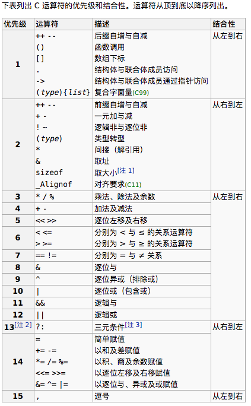

# ❖ C Operators 操作符 [DRAFT]

[参考Youtube：A Tour of C's Many Operators](https://www.youtube.com/watch?v=PLnmboUvqq8&list=PL9IEJIKnBJjG5H0ylFAzpzs9gSmW_eICB&index=9)

## Arithmetic Operators 基本运算操作符

- 基本运算：`+`, `-`, `*`, `/`, `%`

## Increment/Decrement Operators 增量操作符

- 后置增量符：`y = x++`或`y = x--`，这里面x是自己+1或-1变`新值`了，但是y获得的是x的`旧值`。
- 前置增量符：`y = x++`或`y = x--`，这里面x自己+1或-1变为`新值`，y也同时获得x的`新值`。


## Comparison Operators 比较操作符

- 等：`==`, `<=`, `>=`, `!=`
- 大小：`<`, `>`

## Logical Operators 逻辑运算符

- AND: `&&`
- OR: `||`
- NOT: `!`


## Member Operators 成员操作符

- Dot operator: `.`，如`Jason.age`
- Arrow operator: `->`，如`Jason->age`，等同于`(*Jason).age`

[参考：What does "->" mean in C/C++ programming?](https://www.quora.com/What-does-mean-in-C-C++-programming)


## （重要）Bitwise Operators 二进制运算符

`二进制运算符`，就是先把数字转为二进制，然后对每一位进行运算。

- Bitwise AND: `&`, 比如`9 & 5 = 1001 & 0101 = 0001 = 1`
- Bitwise OR: `|`，比如`9 | 5 = 1001 | 0101 = 1101 = 13`
- Bitwise NOT: `~`, 比如`~9 = ~1001 = 0110 = 6`
- Bitwise XOR: `^`, "exclusive or", 只有`0^1`和`1^0`结果为1，而`1^1`和`0^0`结果都是0


> `XOR Gate`: 电路逻辑中的绝妙设计，即如果有两条线路同时运行:即`1^1`或同时关闭:即`0^0`，那么线路就全部关闭。这样轻松的就解决了线路冲突问题。


## （重要）Shift Operators 位移运算符

首先要确认位移的几个点：
- 位移是针对二进制的位置移动
- **位移后和位移前的总位数必须一致**
- 超出总位数的部分要被删除，空出来的位置用0补足

左右位移：
- Shift left: `<<`，比如`9<<3`，意为9的二进制向左移动3位。
- Shift right: `>>`，比如`9>>3`，意为9的二进制向右移动3位。

左位移`9<<2`的详细步骤：
```
9 十进制数
01001 转为二进制
~~~~~ 先确认总位数为5位
010_01000 因为向左移动了3位，后面空出来的用0补足
01000 因为下划线左边的部分超过了长度，所以要被删除
72 转换回十进制
```

右位移`9>>2`的详细步骤：
```
9 十进制数
01001 转为二进制
~~~~~ 先确认总位数为5位
00001_001 因为向右移动了3位，前面空出来的用0补足
00001 因为下划线右边的部分超过了长度，所以要被删除
1 转换回十进制
```

快捷算法（数学意义）：
- Shift left: 用`十进制数 * 2^位移数`。如`9<<3 = 9 * 2^3 = 72`
- Shift right: 用`十进制数 / 2^位移数`后只取整数部分。如`9>>3 = 9 / 2^3 = 1.125 => 1`


## （重要）运算符的顺序（优先级）问题




```c
( (x>y) && ((a>b) || (a>c)) )
```

