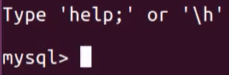

# MySQL客户端

MySQL的客户端太多了，各种GUI、CLI、网页等都可以连接到MySQL服务器操作。

## CLI命令行客户端

Ubuntu安装：
```sh
sudo apt-get install mysql-client
```

进入交互shell：
```sh
# -u为用户名，-p为密码
$ mysql -u root -p mysql123

# 中间空格可以省略
$ mysql -uroot -pmysql123
```

进入Mysql-shell后，显示如下：



常用命令：
```sql
# 显示版本号
select version();

# 显示服务器中所有的数据库
show databases;

# SQL语句
select * from ....
```

## 语法高亮的命令行客户端

mycli:
```sh
pip install -U mycli
```

grc:
```sh
$ apt-get install grc
```

## GUI客户端


