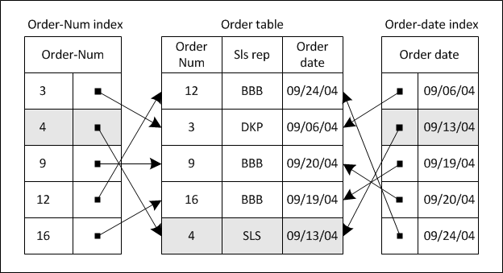
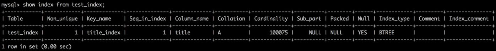

# ❖ MySQL索引 Indexing

> 一个网站的读、写比例一般是10: 1，所以查询永远是数据库的大头。

如果一个网站只有几万条数据，那么完全不需要索引。但是一旦到了百万级以上，没有索引的话，每次查询都会造成数秒级的等待！这是用户绝不能忍的。

为了加快查找速度，数据库一般都会有`索引`功能，即类似图书馆中书籍编号的索引。
数据库中的索引是一个特殊文件，存储了 _某个数据库表_ 中 _所有记录_ 的`指针引用`。

而数据库中索引的实现方法，要远比建立图书的索引要复杂很多。(一般不需要深入了解)

数据库建立索引的目的是：**让你不用遍历每一条信息去找到结果。** 而要达到这种效果，很明显数据结构中的`树`是专门做这种事的。

而MySQL建立的索引就是采用数据结构的树形结构来存储一整列的信息的，从而代替线性表，以加速查找效率：




创建Index索引须知：
- 一个索引只能针对一个表中的一列
- 一个表可以针对多列创建多个索引


为一个表`tb1`的`title`列创建一个索引，名为`index1`：
```sql
CREATE INDEX index1 ON tb1( title(10) ) ;
```
其中`列名(length)`中的length代表字段的长度，一般等于原表的列类型的长度，如果少于它的话则会降低速度。INT型无需指定长度，一般只有文本需要。

~这时候，MySQL会自动给每条数据的指定列生成一个索引值。然后这些索引也变成了一个列`index1`。这时候我们就可以把这个列加入到表中，然后被查询引用了。~


这时候可以直接从索引中搜索了：
```sql
SELECT title FROM index1 ;
```
如果我们用`show profiles ;`就可以看到，与直接查询原表比，当查询数万、百万级数据时，索引快了不是一个数量级。


显示一个表中的所有索引：
```sql
SHOW INDEX FROM tb1 ;
```

生成索引时，系统会生成一个表格，名为`index1`，其中包含index索引的很多详细数据。


删除索引：
```sql
DROP INDEX 索引名字 ON 表名 ;
```


## MySQL自动生成索引

MySQL会为每个表的Primary key主键和每个Foreign key外键自动创建索引，无需我们手动创建。
所以如果我们是通过主键和外键去搜索，速度是极快的。


## 给哪些列加索引

因为索引是单独的表，占用空间。所以只会给常用的列建立索引。

另一点，索引的建立相当于增加了数据库维护的工作量，即指针更新问题。当原表改了值的时候，索引是需要更新的。
