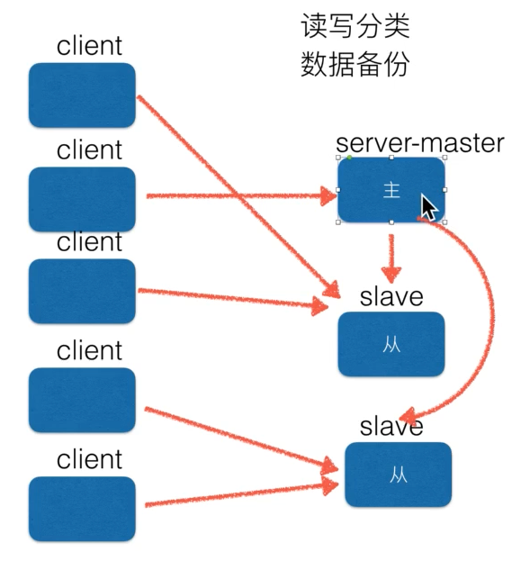
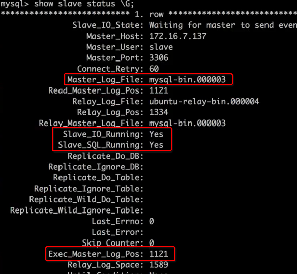
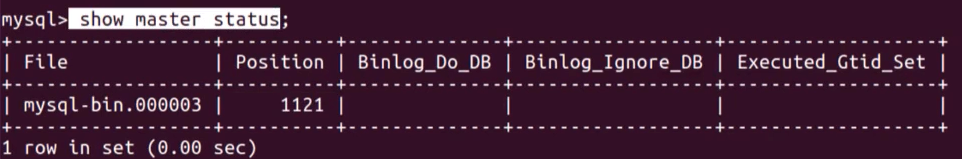

# ❖ MySQL的主从架构Master-Worker

> 所有数据库的主从架构，主要做的都是`读写分离`。

数据库的主从概念，就是指的数据库存储在多台电脑上，互作备份，同时读写分离。也就相当于硬盘组合中的`RAID 1`形式。
一般的设计是，写就直接写入Master数据库，但是读就从各个Worker从数据库来读取。这样的分配是因为一般的读写配比是10: 1。

所以一般商业网站，最少要有2台电脑，一台Master，一台Worker。因为主从在同一台机器上，是完全没有意义的。




整个数据库的备份与修复：
```sh
# 备份某个数据库的所有表结构和数据
$ mysqldump -u root -p "password123" 数据库名 > backup.sql

# 备份整个服务器的所有数据库和数据
$ mysqldump -u root -p "password123" --all-databases --lock-all-tables > master_db.sql

# 修复（导入）备份的数据库：
$ mysql -u root -p "password123" 数据库名 < backup.sql
```


## 主从的配置

前提条件：
- 两台电脑都具备完全相同的数据（需要备份和导入）

Master电脑和Worker电脑，分别都有一个同样的配置文件`/etc/mysql/my.cnf`。
注意：MySQL的主从设置，在配置文件里是没有说明的。需要在MySQL的shell里输入命令来指明。

### Master配置

Master需要在`mysql.cnf`中配置以下几个选项：
```ini
server-id = 123    #  为本机设置的服务器ID，可以是任意整数，但不能和其它主机重复
log_bin = /var/log/mysql/mysql-bin.log  # 日志文件
```

重启服务器：`$ sudo service mysql restart`

然后在Master的MySQL服务中，创建专属的账号，作为Worker服务器远程连接登录用：
```sql
GRANT REPLICATION SLAVE ON *.* TO worker1@'%' IDENTIFIED BY 'password123' ;
FLUSH PRIVILEGES ;
```


### Worker配置

同样是修改`/etc/mysql/my.cnf`:
```ini
server-id = 234    # 为本机设置的服务器ID，可以是任意整数，但不能和其它主机重复
log_bin = /var/log/mysql/mysql-bin.log
```

重启服务器：`$ sudo service mysql restart`


### 开启运行主从架构

以上配置完成后，实际上MySQL是分不出谁是主谁是从的。需要在每个`Worker服务器`的MySQL的shell里来指明自己的主人是谁：
```sql
-- 指明主人是谁，以及连接方式
CHANGE MASTER TO master_host='192.168.1.101', 
    master_user='worker1', master_password='password123', 
    master_log_file='mysql-bin.000006', master_log_pos=590 ;

-- 开始连接
START SLAVE ;

-- 查看Worker从属的状态 （自己的状态）
SHOW SLAVE STATUS \G ; 
```


只有以上标注的两个Yes后，才证明同步成功。


此时如果在Master主机上，可以看到自己的状态：
```sql
-- 查看Master主人的状态 （自己的状态）
SHOW MASTER STATUS ;
```



此时，任何在Master主机上的修改，立刻就会同步更新到Worker从服务器。
