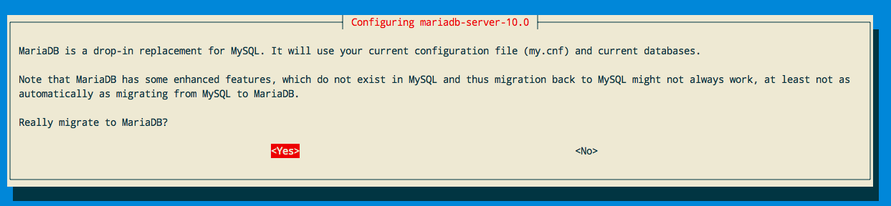
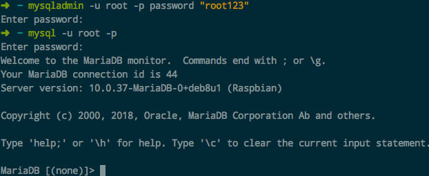

# ❖ MariaDB：简而言之 就是MySQL

[参考：MariaDB教程 - W3School CN](https://www.w3cschool.cn/mariadb/)

## MariaDB和MySQL
MariaDB是MySQL的直接Fork分支，而且与MySQL 5.5以前的版本都同步适配。5.5之后就不再和MySQL的版本号挂钩了。
主体上，几乎没什么区别。只是在开发中，解决了很多MySQL遗留的问题，添加了一些更好用的功能。

所以这里不会详细介绍所有内容，而是只挑出来与MySQL不同的地方。而相同的地方，直接参考MySQL即可。

## 安装和使用

Mac安装：
```sh
$ brew install mariadb

# 启动服务
$ mysql.server start
```
Mac用Brew安装的Mariadb或Mysql的默认存储位置为：`/usr/local/var/mysql`


Ubuntu安装：
```sh
# 建议删除mysql后再安装，（注意数据备份）
# 因为他们有很多的配置文件、客户端都在共用。
$ sudo apt-get remove --purge mysql-server

# 安装
$ sudo apt-get install mariadb-server

# 启停
$ sudo systemctl  start  mariadb
$ sudo systemctl  stop  mariadb
$ sudo systemctl  restart  mariadb
```
安装时会进入交互界面，设置密码后会弹出提示：是否从MySQL迁移到MariaDB，因为会覆盖配置。



修改root密码：
```sh
$ mysqladmin -u root password "[enter your password here]";
```

客户端登录：
完全完全完全，和MySQL一样，连客户端名字都没有改：
```sh
# 进入数据库终端
$ mysql -uroot -p 
Enter password:*******
```




## SQL语句

进入MariaDB后使用的SQL语句命令等，也和MySQL一模一样。


