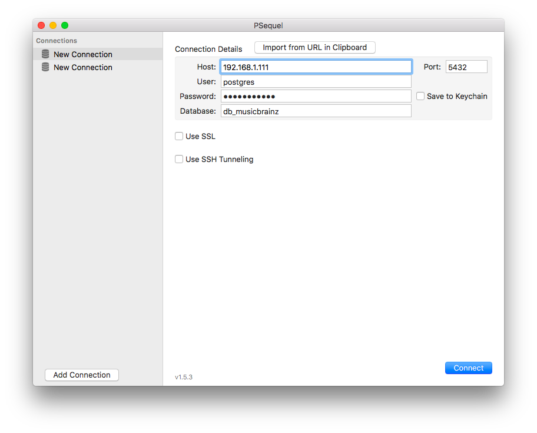
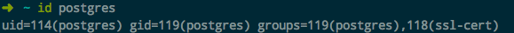
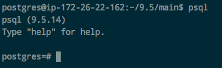
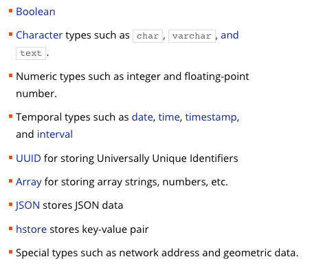

# ❖ 一篇文章入门PostgreSQL [DRAFT]


## 安装
详细参考：https://postgresapp.com/

**Mac安装：**
1. 需要到官网下载`Postgres.app`，保存在本地`/Application`文件夹里，双击运行即可启动服务。
2. app右上角点击 `initialize` 初始化server
3. 安装psql命令行客户端：`pip install pgcli --user`
3. 使用app自带psql命令行客户端：`alias psql=/Applications/Postgres.app/Contents/Versions/latest/bin/psql`
4. 然后在环境变量`$PATH`中添加执行文件路径：
```sh
sudo mkdir -p /etc/paths.d &&
echo /Applications/Postgres.app/Contents/Versions/latest/bin | sudo tee /etc/paths.d/postgresapp
```

**Ubuntu安装：**
```sh
$ sudo apt-get install postgresql
```
整个包只有20MB左右，功能强大，但是非常轻量！
检查是否安装成功: `$ psql --version`
可以看到：Ubuntu 16.04支持的版本为`psql (PostgreSQL) 9.5.14`，且长期支持维护5年。


**Docker安装：**
```sh
docker run --restart always \
	--name pg \
	-p 54320:5432 \
	-e POSTGRES_PASSWORD=123123 \
	-e POSTGRES_USER=sol \
	-d postgres postgres -c log_statement=all
```

> 如果是docker版安装，可以跳过后面的基本配置部分。


**客户端：**
CLI版本的客户端：直接使用官方的`psql`即可。
GUI的话使用官方推荐的`pgadmin`，或Mac的`psequel`。


## Ubuntu PG server 初始设置

[参考：Connecting to PostgreSQL on Linux for the first time](http://connect.boundlessgeo.com/docs/suite/4.6/dataadmin/pgGettingStarted/firstconnect.html)

创建初始密码：
```sh
# 以OS中的postgres用户的身份打开psql客户端的postgres数据库用户
sudo -u postgres psql postgres

# 交互式输入密码
\password postgres

\q
```

允许本地连接登录:
需要修改`/etc/postgresql/9.3/main/pg_hba.conf`文件（其它系统类似）：
```
将以下内容中的peer改为md5
local   all             all                                      peer

将以下内容的ident改为md5
host    all             all             ::1/128                 ident
```

允许远程连接登录：
需要修改`/etc/postgresql/9.3/main/pg_hba.conf`文件，其它系统类似：
```
将这句话
local   all             all                                      peer
改为这句话
host    all             all             0.0.0.0/32               trust
```

再修改`/etc/postgresql/9.3/main/postgresql.conf`：
```
将listen_addresses取消注释并改为：
listen_addresses = '*'
```
同时在文件中确认下`port`设置的默认端口，以便之后客户端的正确连接。

保存退出后，重启postgresql：
```sh
sudo service postgresql restart
```


## 客户端连接

在服务器端正确设置好了密码、允许远程连接、默认端口后，GUI客户端就能正常连接了。

### PSequel




## 进入Postgres客户端

这一步因为涉及权限问题，所以会复杂一些。

用`apt-get`安装好后，会在系统中自动添加一个`postgres`用户。


我们只有在系统里用postgres帐户登录，然后才能有权限用客户端进行各种交互：
```sh
sudo su postgres
```

有两种用户权限方法来使用postgresql：
- `sudo su postgres`直接切换到有操作权限的用户shell中
- `sudo -u postgres <命令>` 以有权限的用户身份来执行命令

一般比较推荐第二个。

进入主目录后，就可以执行很多数据库服务器级的操作了，如：
```sh
# 列出当前所存在的所有「数据库」
$ sudo -u postgres psql -l

# 创建数据库
$ sudo -u postgres createdb 数据库名称

# 删除数据库
$ sudo -u postgres dropdb 数据库名称

# 进入Postgresql 的shell客户端，并对指定的数据库进行操作
$ sudo -u postgres psql 数据库名称
```

进入`psql`客户端提供的shell后，就可以真正的开始对数据库、数据表进行各种熟悉的操作了。
不过要注意，`psql`的shell命令与Linux系列的shell完全不同，连参数都是用`\h`这样的。



注意：
- PostgreSQL是遵循标准的SQL语法标准，所以是不区分大小写的。
- 除了SQL语句外，其它命令都是以反斜杠`\命令 参数`这样的格式进行的。

常用语句:
```sql
-- 查看当前版本号
SELECT version();

-- 查看现在时间
SELECT now();

-- 查看所有的数据库 List
\l

-- 进入某个数据库 Connect
\c DB-Name

-- 查看当前库中的「所有表格」 Define Tables
\dt

-- 查看某个表的详细信息 Define
\d table001

-- 导入外部的sql文本，并执行其中的所有命令 Import
\i db.sql

# 退出客户端 quit
\q
```

## 数据类型

[参考官网：PostgreSQL Data Types](http://www.postgresqltutorial.com/postgresql-data-types/)




## 运算符


## 增删改查 CRUD


## 高级查询 
