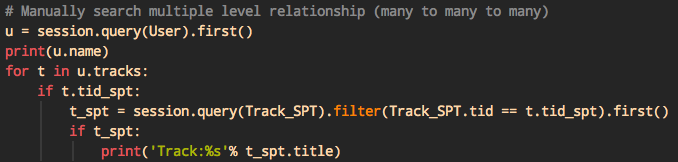

# ❖ SQLAlchemy中的表关系 Table Relationships 

SQL中的表关系一直是比较难理解的地方。同样SQLAlchemy也对他们做了实现，如果对SQL中的表关系理解透彻的话，这里也可以更容易理解。

## 为什么需要定义Relationships

在相关联的表中，我们可以不创建表关联的定义，而只是单纯互相引用id即可。但是，查询和使用起来就要麻烦很多：
```py
＃给定参数User.name,获取该user的addresses
# 参考知乎：https://www.zhihu.com/question/38456789/answer/90470689

def get_addresses_from_user(user_name):
    user = session.query(User).filter_by(name=user_name).first()
    addresses = session.query(Address).filter_by(user_id=user.id).all()
    return addresses
```

可以看到，这样的效率非常低。
好在原生的SQL就有relationship设置，SQLAlchemy将其引入到了ORM模型中。

**它可以让我们只在表中声明表之间的关系，之后每次使用就完全无需手动`交叉搜索`，而是像对待一个表中的数据一样直接使用。**


## 为什么不需要定义relationships？

经过实践返回来加的这一节：实践中的SQLAlchemy的"relationship"在一定程度上反而导致了整体表关联关系的极大复杂化，还有效率的极其低下。

如果你的数据库只有两个表的话，那么relationship随便定义随便用。如果只有几百条数据的话，那么也请随便玩。

但是，当数据库中有数十个表以上，单个关联层级就多过三个表以上层层关联，而且各个数据量以万为单位。那么，"relationship"会把整个人都搞垮，简直还不如手写SQL语句清晰好理解，并且效率也差在了秒级与毫秒级的区别上。

> SQLAlchemy只能很轻松handle `Many to Many`，但是如果是常见的`Many to Many to Many`，或者是`Many to Many to Many to Many`，那简直就是噩梦。

但是，我们都知道，项目做到一定程度，都会摆脱不了ORM。无论是自己造轮子还是用别人的，无论起点是不是纯SQL，终点都是ORM。
那么该怎么办呢？

网友的建议是：
**用SQLAlchemy建立各种ORM类对象，不要用内置的关联，直接在查询的时候手动SQL语句！**

经过实践，我的建议是：
- 容易SQL-Injection注入的地方，用SQLAlchemy的`query`
- 创建ORM对象时候，用SQLAlchemy
- **多层关联的时候，不要用SQLAlchemy**
- 查询的时候，用SQL
- 插入数据的时候，不要用SQLAlchemy。（官方都说明了插入百万级的时候，和SQL插件是秒级的）


## relationship() 函数

[参考官方文档：Linking Relationships with Backref](https://docs.sqlalchemy.org/en/rel_1_0/orm/backref.html#relationships-backref)

SQLAlchemy创建表关联时，使用的是`relationshi()`这个函数。
它返回的是一个类的属性，比如father类的`children`属性。但是，它实际上并没有在father表中创建任何叫children的列，而是自动帮你到相关联的children表中去找数据，让你用起来感觉没有差别而已。
这是非常方便的！

`relationship()`这个函数的参数非常多，每一个参数都有很多内容需要理解。因为所有的表关联的形态，都是在这个函数里面定义的。
以下分别讲解。


## Reference 正向引用

传统的方法，是在父类中定义一个`关系 relationship`或叫`正向引用 Reference`，子类只需定义一个外键。比如：
```py
class Father(..): 
    id = Column(..)
    children = relationship('Child')

class Child(..):
    father_id = Column( Integer, ForeignKey('father.id') )

# 添加数据
daddy = Father()
jason = Child()
emma = Child()

# 将孩子挂到父亲名下
daddy.children.append(jason)
daddy.children.append(emma)
```
这样当每次我们使用`father.children`的时候，就会自动返回与这个father相关联的所有children了。


## Back Reference 反向引用

单纯定义的`relationship('子类名')`只是一个正向引用，也就是只能让父类调用子对象。反过来，如果要问children他们的父亲是谁，就不行了。

**所以，我们还需要一个`反向引用 (Back Reference)`的声明，让子对象能够知道父对象是谁。**

定义方式是在父类的relationship(..)中加一个参数`backref`：
```py
class Father(..): 
    children = relationship( 'Child', backref='parent' )
```
注意：
1. backref参数里面使用的随便写，主要用于之后子类的引用。
2. backref参数是`双向性`的，意思是，只需要在父类中声明一次，那么`父⇄子`的双向关系就确立了，不用再去子类中写一遍。

这时候，我们在添加就可以这样互相调用了：
```py
>>> Jason = Child()
>>> print( Jason.parent )
 <__main__.Father object at 0x10222f860>
```


## Bidirectional & Unidirectional Back Reference 双向和单向的反向引用

后来，SQLAlchemy发现这种只在一边定义双向性`backref`的方法有点不太直观，所以又添加了另一个参数`back_populates`参数，而这个back_populates参数是单向性的，也就是说：
你要确立双方向关系就必须在两边的类中都声明一遍。这样比较直观。

> 可以把`backref`和`back_populates`都读为"as"，这样就好记忆了。

比如：
```py
class Father(..): 
    id = Column(..)
    children = relationship( 'Child', back_populates='parent' )

class Child(..):
    father_id = Column( Integer, ForeignKey('father.id') )
    parent = relationship( 'Father', back_populates='children' )
```

**注意：`back_populates`要求父类子类的关系名称必须严格“对称”：**
- 父类的relationship属性名`children`，必须对应子类的关系中的`back_populates`中的值
- 子类的relationship属性名`parent`，必须对应父类的关系中的`back_populates`中的值

这样一来利用`反向引用`参数创建的关系就确立了。但是注意，
无论用`backref`还是`back_populates`创建的关联，如果我们必须要为父子对象添加对象间的关联才能引用，否则谁也不知道谁是谁的父亲、儿子：
```py
>>> daddy = Father()
>>> son = Child()
>>> daughter = Child()

>>> daddy.children
[]
>>> son.parent
None

>>> daddy.children.append( son )
>>> daddy.children.append( daughter )

>>> daddy.children
[ <Child ...>, <Child ...> ]

>>> son.parent
<Father ...>
```

另外：上面添加父子关系的时候，不光可以用`daddy.children.append`，
还可以在声明子对象的时候确定：`son = Child( parent=daddy )`


`反向引用`参数对比：
- `backref`参数：双方向。在父类中定义即可。只能通过`daddy.children.append()`方式添加子对象关联。
- `back_populates`参数：单方向。必须在父子类中都定义，且属性名称必须严格对称。还可以通过`Child(parent=daddy)`的方式添加父对象关联。


## SQL中的表关系

对应关系：
- One to Many 一对多： 
- Many to One 多对一：
- Many to Many 多对多：


### One to Many 一对多

建立一个`One-to-Many`的多表关联：
```py
# ...

class Person(Base):
    id = Column(...)
    name = Column(...)
    pets = relationship('Pet', backref='owner')
    # 上面这句是添加一关联，而不是实际的列
    # 注意：1. 'Pet'是大写开头，因为指向了Python类，而不是数据库中表
    # 2. backref是指建立一个不存在于数据库的“假列”，
    # 用于添加数据时候指认关联对象，代替传统id指定


class Pet(Base):
    id = Column(...)
    name = Column(...)
    owner_id = Column(Integer, ForeignKey('person.id')
    # 上面这句添加了一个外键，
    # 注意外键的'person'是数据库中的表名，而不是class类名，所以用小写以区分
```

创建好关联的表以后，我们就可以直接插入数据了。注意，插入带关联的数据也和SQL插入有些不同：
```py
#...

# 添加主人
andy = Person(name='Andrew')
session.add( andy )
seession.commit()

# 添加狗
pp01 = Pet(name='Puppy', owner=andy)
pp02 = Pet(name='Puppy', owner=andy)
# 注意这句话中，owner是刚才主表中注册relationship中的backref指定的参数名，
# 传给owner的是主表的一个Python实例化对象，而不是什么id
# 看起来复杂，实际上sqlalchemy可以自动取出object的id然后匹配副表中的foreignkey。

session.add(pp01)
session.add(pp02)
session.commit()

print( andy.pets )
# >>> [<Pet 1>, <Pet, 2>]
# 返回的是两个Pet对象

print( pp01.owner )
# >>> <Person 'Andrew'>
# 同样，副表中利用owner这个backref定义的假列，返回的是Person对象。
```


### Many to One 多对一

比如职工和公司的关系就是多对一。这和公司与职工对一对多有什么区别？
区别其实是在SQL语句中的：多对一的关联关系，是在多的一方的表中定义，一的一方表中没有任何关系定义：
```py
class Company(...):
    id = Column(...)

class Employee(..):
    id = Column(...)
    company_id = Column( ..., ForeignKey('company.id') )
    company = relationship("Company")
```


### Many to Many 多对多

多对多的关系也很常见，比如User和Radio的关系：
一个Radio可以有多个用户可以订阅，一个用户可以订阅多个Radio。

SQL中处理多对多的关系时，是把多对多分拆成两个一对多关系。做法是：新创建一个表，专门存储映射关系。原本的两个表无需设置任何外键。

SQLAlchemy的实践中，也和SQL中的做法一样。

**注意：既然有了专门的Mapping映射表，那么两个表各自就不需要注册任何ForeignKey外键了。**

示例：
```py
# 做出一个专门的表，存储映射关系
# 注意：1. 这个表中两个"id"都不是主键，因为是多对多的关系，所以二者都可以有多条数据。
#  2. 映射表必须在前面定义，否则后面的类引用时，编译器会找不到
radio_users = Table('radio_users', Base.metadata,
    Column('whatever_name1', Integer, ForeignKey('radios.id')),
    Column('whatever_name2', Integer, ForeignKey('users.id'))
)

# 定义两个ORM对象：
class Radio(Base):
    __tablename__ = 'radios'

    rid = Column('id', Integer, primary_key=True)
    followers = relationship('User',
        secondary=radio_users,     # `secondary`是专门用来指明映射表的
        back_populates='subscriptions'    # 这个值要对应另一个类的属性名
    )

class User(Base):
    __tablename__ = 'users'

    uid = Column('id', Integer, primary_key=True)
    subscriptions = relationship('Radio',
        secondary=radio_users,
        back_populates='followers'   # 这个值要对应另一个类的属性名
    )
```
其中，`secondary`是专门用来指明映射表的。

> 注意：多对多的时候我们也可以用`backref`参数来添加互相引用。但是这种方法太不直观了，容易产生混乱。所以这里建议用`back_populates`参数，在两方都添加引用，表现一种平行地位，方便理解。

然后插入数据时候是这么用：
```py
r1 = Radio()
r2 = Radio()
r3 = Radio()

u1 = User()
u2 = User()
u3 = User()

# 添加对象间的关联
r1.followers += [u1, u2, u3]

# 反过来添加也一样
u1.subscriptions += [r2, r3]
```


## Many to Many to Many 多对多对多 （深层关联）

深层关联，为了避免理解困难，最笨的方法就是简单的使用外键ID，然后手动搜索另一个表的对应ID。



但是SQLAlchemy也可以实现这种深层关联：


