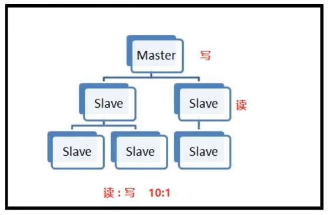

# ❖ Redis入门 [DRAFT]

Redis是目前最流行的NoSQL数据库，最重要的是它是运行在内存上的数据库。所以几乎所有高并发需求的产品都会考虑使用Redis作为数据库缓存。

不同于MongoDB的以硬盘存储为主、内存为辅，Redis是`真·内存存储`，即所有数据都存在内存中，只是偶尔间歇性的保存到硬盘上备份。

Redis特点：
- NoSQL：采用类似JSON的Key-Value键值对存储。
- 存储在内存中：几乎是计算机存储的最高读写速度（除CPU寄存器外）。
- 可持久化：定期可以把内存中的数据备份到硬盘。
- 轻量化：整个软件才1M，内存占用极少。
- 单机多实例：同机器可以给多个应用配置多个Redis数据库，因为资源占用极少。

## 理解Redis

### 原子性
Redis处理高并发最强的就是其`原子性`。完全基于单线程，抛弃多进程、多线程等逻辑。

什么是“原子性”？[参考：深入学习RedisAPI的原子性分析](http://www.hoohack.me/2017/04/04/learning-redis-deeply-analysis-redis-commands-atomicity)
> 原子性是数据库的事务中的特性。在数据库事务的情景下，原子性指的是：
一个事务（transaction）中的所有操作，要么全部完成，要么全部不完成，不会结束在中间某个环节。
对于Redis而言，命令的原子性指的是：一个操作的不可以再分，操作要么执行，要么不执行。

### Redis vs. JSON

作为NoSQL初学者，我觉得所有的NoSQL不过是一个更复杂的JSON文件而已。

但是只是一个文本文件的JSON面临IO堵塞、文本解析等很大屏障，速度决定了它的天花板。即使是放在Ram Disk内存盘上的JSON，也解决不了高并发的问题
而Redis不光用了内存，还用了`原子性`逻辑来加速运行，同时还加入了一系列的备份、恢复、分布式多机器运行的功能。

所以真的没法再说和JSON一样了。


### Redis vs. MongoDB

MongoDB是基于Documentation的，

....

### Redis vs. Memcached
....


## 安装

[参考：How To Install and Secure Redis on Ubuntu 18.04](https://www.digitalocean.com/community/tutorials/how-to-install-and-secure-redis-on-ubuntu-18-04)

> 整个软件大约1M左右。

Mac的Homebrew安装：
```sh
brew install redis
```

Ubuntu安装：
```sh
sudo apt install redis-server
```

Docker安装：
因为Redis实在是太轻量了，而且原生支持多实例运行，配置也是单文件配置，所以不太需要专门用docker来做隔离。如果真有docker需要的话，也不会难。参考hub.docker.com。

编译安装：
如果需要自己编译的话，就到Redis的下载最新的release，一般用tar.gz格式。
目前最新的稳定版5.0。中文官网地址：http://www.redis.cn/
```sh
wget http://download.redis.io/releases/redis-5.0.0.tar.gz
tar -xvzf redis-*.tar.gz
cd redis-*

make
make test
sudo make install
```

## 配置

Redis配置很好理解，只需一个`redis.conf`配置文件。

找到文件后，一般需要修改的地方只有以下几点：
```ini
# 绑定主机IP和端口，端口是redis默认
bind 127.0.0.1
port 6379

# （推荐）以守护进程方式运行，这样就不会进入命令行”前台堵塞模式“
daemonize yes

# 数据文件
dbfilename dump.db

# 数据存储的位置，运行前需手动创建文件夹，否则报错
dir /var/lib/redis/

# 日志文件
log /var/log/redis/redis-server.log

# 数据库数量，默认16个数据库
database 16
```

## 运行交互

启动redis服务器：
```sh
redis-server

# 或指定配置文件启动 (Brew安装的话位置在/usr/local/etc/redis.conf)
redis-server /etc/redis/redis.conf
```

> 如果没有在配置中设置`daemonize`，那么这里就会在`前端启动`，即堵塞整个shell来运行这个程序。如果已经是守护进程了，那么就会在后台运行，可以用`ps aux |grep redis`看到。
如果要开机启动，直接在`/etc/rc.local`中加入启动redis的命令即可，不过这样的还不如设置系统service好管理。关闭服务器的方法就是直接kill掉进程即可：`pkill redis-server`

客户端：
```sh
# 客户端shell，与服务器进行命令交互
redis-cli 

# 关闭客户端
redis-cli shutdown
```

最简单cli:
```sh
$ nc -v 127.0.0.1 6379

# with ssl
$ nc -v --ssl 127.0.0.1 6379
```


## Redis的主从 "RAID 1"

以上是最简单的单机设置。然而，Redis的主从设置也不难，很简单。

**记住：Redis的`Master-Slave`的结构，实际上只是一种`备份关系`！而不是数据分散在各地的那种。**

Redis的`Master-slave`架构的作用：
- 备份：slave从的最主要作用是备份，以弥补单机内存数据不稳固的缺点。
- 读、写分离：写入是很耗时间的，而读很快。那么如果读和写分离，会加速很多。




设置方法：
- 主从两台机器上，都安装了redis-server
- 两台机子上都有一个配置文件`redis.conf`
- 两台机子上的`redis.conf`中，互相指明自己是主还是从，主的IP是什么，以及权限等相关设置。
- 两台机子同时启动`redis-server`

这个设置方法是最简单的主从设置，甚至有点像`ssh-tunnel`或`frp`内网穿越等设置。都是基于一个配置文件就能完成自动连接的。

主从可以在同一台机器（但是没有什么意义），只是注意端口号不要冲突。如果不是同一台机器，那么端口号就无所谓了。


## Redis集群 "RAID 0"

> 如果说`主从架构`是硬盘组合的`RAID 1`模式，那么`Redis集群`就是`RAID 0`——数据是分布在各个机器上的。

如果只是简单的`主从架构`，那么主要的压力还是都集中在Master主机上，万百万级别的高并发肯定是扛不住的。所以要用到Redis集群。

`Redis集群`才是真正的`分布式`。

集群分为软件层面的和硬件层面的。
Redis在同一台机器可以启动多个服务，也就是在本机可以使用多个Redis数据库服务，这叫软件层面集群（没什么用）。因为一台机器死机，整个集群就没了。所以软件方面的只适合同一台机器给不同应用配置redis数据库，不适合集群。
硬件集群是每台机器上都有redis，用于分担数据。

集群有这几大特点：
- Slots：代表Redis对数据自动切分(Split)的能力
- Partition：代表数据的高可用性(Availability)


### 集群的槽 Slots 

Redis怎么把全部数据分配个集群的每台机器？
它会先把数据分为16,384个slots槽，然后把这些槽平均分配个每台机器。比如机器A分了0-1000的槽用来存数据，机器B分了1001-2000的槽。。。每台机器都会知道自己会负责哪些槽。

如果一台机器接收到不是自己负责的slot的数据，就会把请求“转发”给该负责的机器。这个就叫`转向` （Redirection)。

怎么确定新来的数据在哪台机器上写入呢？

Redis利用了`Hash Table`数据结构的基本原理，即通过一个`Hash function`把key映射为一个固定的整数number。通过`number % 16384`而得到一个固定的index整数值，根据这个index就能直到它所属的slot在哪个“负责人”位置了。

### 集群的分区 Partition

如果有partition分区，那么及时有些机器突然不可用、断线，集群也可以继续完成请求任务。


## Redis于Python交互

Python需要安装redis包：`pip install redis`

基础交互代码`test.py`：
```py
import redis


```
