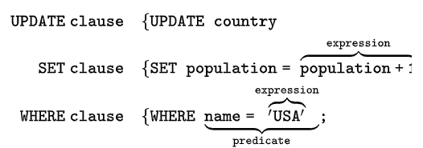
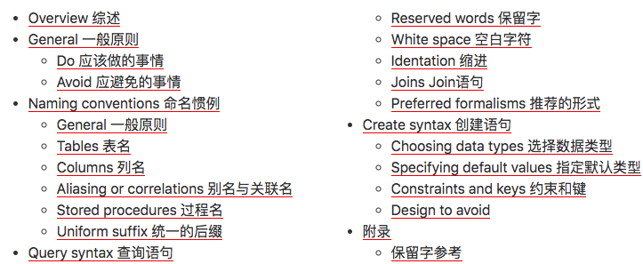
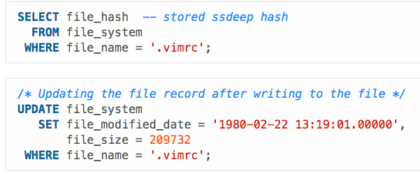
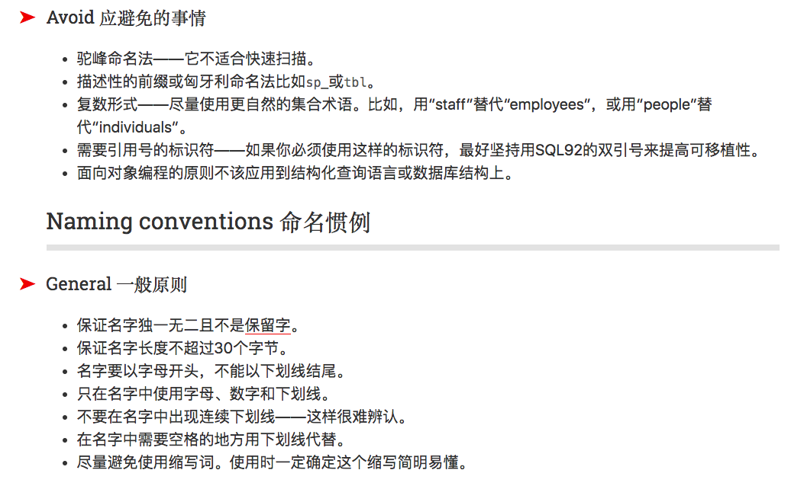
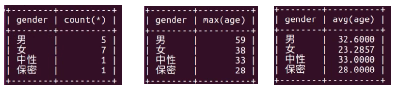
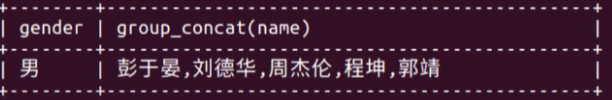
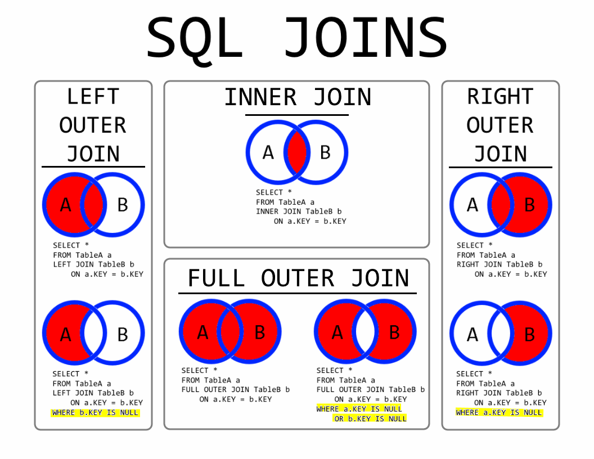
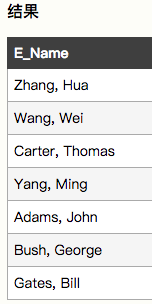
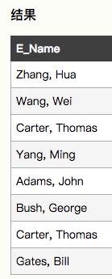

# ❖ SQL语句基础

`SQL` Structured Query Language，是专门用来查询关系型数据库的语言。也就是说不是关系型数据库，就不能用SQL查询了。

> MySQL的主要学习，其实都是集中在SQL上的。另外一部分，才是数据库的配置和速度优化。

SQL语句的分类：
- `DQL`: 数据查询语句，如select
- `DML`: 数据操作语句，如update／insert／delete
- `TPL`: 事务处理语句，如commit／rollback／begin transaction
- `DCL`: 数据控制语句，即权限管理，如grant／revoke
- `DDL`: 数据定义语句，如create／drop
- `CCL`: 指针控制语句，通过指针完成表操作，如declare cursor

## 语法结构

一些特点：
- SQL**不区分**大小写
- 每句话以`;`结束
- 断行、缩紧无需任何符号，解释器在解释时会把所有空符号都会合并为一个空格。
- 单行注释采用`-- `，多行注释采用`/* ... */`
- 值的引号可以同时用`"`和`'，但是`"`兼容性更强。
- 数据库名、表名、列名，都可以用反引号\`来包起来

SQL的语法，是将一条语句拆分成几个组成部分：
- `Clauses`：主要命令，如 update／set／where
- `Expressions`: 能产生值的语句，如`"Jason"`，或`age + 12`。
- `Predicates`: 条件判断，即如果True则使用A值，否则B值。
- `Queries`: 即Select查询读取数据库的语句。
- `Statements`: 即一整条以`;`结尾的SQL语句



## SQL Style 编写风格

[参考 Simon Holywell：SQL Style Guide](https://www.sqlstyle.guide/)
[参考 Simon Holywell：SQL样式指南 · SQL Style Guide](https://www.sqlstyle.guide/zh/)








## 常用语句

[参考W3School：SQL Tutorial](http://www-db.deis.unibo.it/courses/TW/DOCS/w3schools/sql/default.asp.html)

服务器查询：
```sql
-- 显示服务器中所有的数据库
show databases ;

-- 进入一个数据库
use 数据库名 ;

-- 显示当前所在数据库的信息
select database() ;

-- 显示当前数据库所有表名 (MySQL)
show tables;

-- 显示指定数据库所有表名 (MySQL)
select table_name from information_schema.tables where table_schema='数据库名' and table_type='base table';

-- 显示指定表格的所有字段名（MySQL）
select column_name from information_schema.columns where table_schema='数据库名' and table_name='表名';

-- 查看某表结构
DESC 表名 ;
```

数据库操作：
```sql
-- 创建一个数据库
CREATE DATABASE 数据库名 CHARSET=utf-8 ;

-- 查看数据库的创建信息
SHOW CREATE DATABASE 数据库名 ; 

-- 删除数据库
DROP DATABASE 数据库名 ;
-- 或，用反引号包起来
DROP DATABASE `数据库名`
```

数据表操作：
```sql
-- 显示当前数据库中的所有表
show tables ;

-- 创建表
CREATE TABLE 表名 (字段 类型 约束, 字段 类型 约束, 字段 类型 约束....) ;
-- 如
CREATE TABLE staff (
    id int primary key not null auto_increment, 
    name varchar(30)
);

-- 删除表
DROP TABLE 表名 ;

-- 查看表的创建语句
SHOW CREATE TABLE 表名 ;

-- 查看表结构
DESC 表名 ;

-- 修改表：添加一个字段
ALTER TABLE 表名 ADD 字段 类型 约束 ;

-- 修改表：修改一个字段
ALTER TABLE 表名 MODIFY 字段 类型 约束 ;

-- 修改表：删除一个字段
ALTER TABLE 表名 DROP 字段 ;


-- 添加一条记录
INSERT INTO 表名 VALUES(字段1, 字段2, , 字段4) ;

-- 
```


## CRUD 增删改查

`Create / Read / Update / Delete`


## 查询 SELECT

select查询永远是SQL中学习时间最长的。因为增删改都是固定模式，语句也很简单。但是查询拥有极多的方式方法和关键字，能够创造超多的组合搭配查询，且每种查询方式效率速度不一。所以SQL主要学的就是SELCT。

最简单的select查询：
```sql
SELECT filed1, field2, field3 FROM table_name ;

SELECT filed1 AS age, field2 AS gender, field3 FROM table_name ;

SELECT table_name.filed1, table_name.field2, table_name.field3 FROM table_name ;

SELECT t.filed1, t.field2, t.field3 FROM table_name as t ;

-- 删除重复行
SELECT DISTINCT field1 FROM table_name ;
```

以下为各种Select语句的方式方法总结。

## 条件 WHERE

- 比较运算符：小于`<`, 大于`>`, 小于等于`<=`, 大于等于`>=`, 等于`=`, 不等于`!=`或`<>`
- 逻辑运算符：`and`, `or`, `not`
- 模糊查询：
    - `like`: 用`%`替换1个字或多个字，`_`替换1个字，`word`包含指定的字word
    - `rlike`: 正则查询，如`^周.*$`
- 范围查询：`field in (v1, v2, v3...)`, `not in (...)`, `between v1 and v2`, `not between v1 and v2`
- 空判断：`field is null`, `field is not null`

```sql
SELECT filed1, field2 FROM table_name 
    WHERE field3 > 10;

... WHERE field1 = "hello" AND field2 = "world" ;

... WHERE filed1 LIKE "Hel%" or filed2 LIKE "Hel__" ;

... WHERE field1 RLIKE "^He.*$" ;

... WHERE filed1 IN (12, 18, 19) and NOT IN (30, 40, 50) ;

... WHERE field1 BETWEEN 10 AND 20 and NOT BETWEEN 40 AND 50 ;

... WHERE filed1 IS NULL OR field3 IS NOT NULL ;
```

## 排序 ORDER BY 

```sql
... WHERE ... ORDER BY age, gender ;

... WHERE ... ORDER BY age ASC ;

... WHERE ... ORDER BY age ASC, id DESC, gender ASC ;
```


## 内置聚合函数 FUNCTIONS

内置函数能够处理一些很简单的计算问题。
但是切记，查询一个函数值时不要查询其它字段，除非使用GROUP分组等方法。

```sql
SELECT COUNT(*) FROM ...

SELECT MAX(age) FROM ...

SELECT SUM(age) FROM ...

SELECT AVG(age) FROM ...

SELECT ROUND( SUM(age)/COUNT(*), 2 ) FROM ...

SELECT MAX(age) FROM ...


-- 不允许：(因为逻辑不通，需要用到分组才行）
-- SELECT name, age, ROUND( SUM(age)/COUNT(*), 2 ) FROM ...
```


## 分组 GROUP BY

SQL分组是一个比较容易混淆的概念。

**SQL的分组是会完全破坏原先表结构的，然后生成一个`统计表`，纯粹是为了数量统计用的。**

> 分组GROUP单独使用是没什么意义的，除非是和聚合函数Functions一起用。

分组的做法是：如果按gender分组，就只把gender一列取出来，做成一个unique的唯一gender列表，如`男； 女`，然后再创建一列，值对应的是每一种gender的记录条数。



如果要查看各组的其它信息，需要用到特殊的函数`group_concat(filed1)`:




```sql
-- 报错：
-- SELECT name FROM ... GROUP BY gender ;
-- SELECT * FROM ... GROUP BY gender ;

-- 显示gender的每种分组类别以及其下的记录条数！
SELECT gender, COUNT(*) FROM ... GROUP BY gender ;

-- 显示分组的平均
SELECT gender, AVG(*) FROM ... GROUP BY gender ;

-- 显示分组最大值
SELECT gender, MAX(*) FROM ... GROUP BY gender ;

-- 显示分组所包含的其它信息
SELECT gender, GROUP_CONCAT(name) FROM ... GROUP BY gender ;
SELECT gender, GROUP_CONCAT(name, "_", age) FROM ... GROUP BY gender ;
```

分组还有一个配合的关键字`having`，类似与where的筛选功能：
```sql
SELECT gender, COUNT(*) FROM ... GROUP BY gender HAVING COUNT(*) > 3 ;
```

## 分页 LIMIT

```sql
-- 限制显示结果的条数
SELECT ... FROM ... LIMIT 2 ;

-- 分页 格式为：LIMIT (第N页-1)*每页个数, 每页个数

-- 第1页，每页2条
SELECT ... FROM ... LIMIT 0,2 ;

-- 第2页，每页2条
SELECT ... FROM ... LIMIT 2,2 ;

-- 第3页，每页2条
SELECT ... FROM ... LIMIT 4,2 ;

-- 第4页，每页2条
SELECT ... FROM ... LIMIT 6,2 ;
```

## 连接 JOIN

SQL中的JOIN连接，实际上是用了数学上的`集合`概念。其中：
- `Inner Join` 内连接： 相当于`A and B`，代表两个集合(表)的交集，即表中某字段匹配上的条目。
- `Full Outer Join 全连接：相当于`A or B`，代表两个表的并集，即两表合并所有字段和数据为一个表，未匹配的数据中的空字段以null填充。
- `Right Join` 右连接：使用left表里所有数据，而right表中只保留匹配数据，且未匹配数据条目中的right表字段以null填充。
- `Left Join` 左连接：使用right表里所有数据，而left表中只保留匹配数据，且未匹配数据条目中的left表字段以null填充。



怎么理解Left Join和Right Join？
首先，两表匹配，各表都会有各自的`未匹配数据条目`。
**那么怎么处理这些`未匹配数据`，就是这些左右的考量目标。**
Left join，保留左表的未匹配数据。Right join，保留右表中的未匹配数据。Full join，保留所有未匹配数据。
那么保留下的这些`未匹配数据`，肯定会有几个来自`外面的字段`是空的，这时候都统一以null填充。


另外，SQL连接两表，不光要指定连接方式，还要指定`主键-外键`的对应关系，使用`ON`关键字。


```sql
-- 内连接
SELECT ... FROM tb1 INNER JOIN tb2 ON tb1.key = tb2.id ;

-- 左连接
SELECT ... FROM tb1 RIGHT JOIN tb2 ...

-- 右连接
SELECT ... FROM tb1 LEFT JOIN tb2 ...

-- 全连接 (MySQL不支持)
SELECT ... FROM tb1 FULL OUTER JOIN tb2 ...

-- 差集连接 (MySQL不支持)
SELECT ... FROM tb1 FULL OUTER JOIN tb2 ON tb1.key = tb2.id 
    WHERE tb1.key IS NULL OR tb2.id IS NULL;
```

## 自关联

自连接，连接的两个表都是`同一个表`，同样可以由内连接，外连接各种组合方式，按实际应用去组合。

```sql
SELECT a.*, b.* FROM tb1 a, tb2 as b WHERE a.[name] = b.[name]  
```

## 联合 Union

UNION 操作符用于合并两个或多个 SELECT 语句的`结果集`。

使用Union联合的前提条件：
- UNION 内部的 SELECT 语句必须拥有相同数量的`列`
- 对应位置的列必须拥有相似的数据类型
- 每条 SELECT 语句中的列的顺序必须相同。

列出所有在中国和美国的不同的雇员名：
```sql
SELECT E_Name FROM Employees_China
UNION
SELECT E_Name FROM Employees_USA
```



`UNION ALL` 命令和 `UNION` 命令几乎是等效的，不过 UNION ALL 命令会列出`所有的值`。

列出在中国和美国的所有的雇员：
```sql
SELECT E_Name FROM Employees_China
UNION ALL
SELECT E_Name FROM Employees_USA
```



## 子查询

实际上就是用`( select ...)`子语句返回一个值，来方便主句查询。相当于bash脚本中的`$(...)`功能。

```sql
SELECT ... FROM ... WHERE height = (SELECT MAX(height) FROM ...)
```
