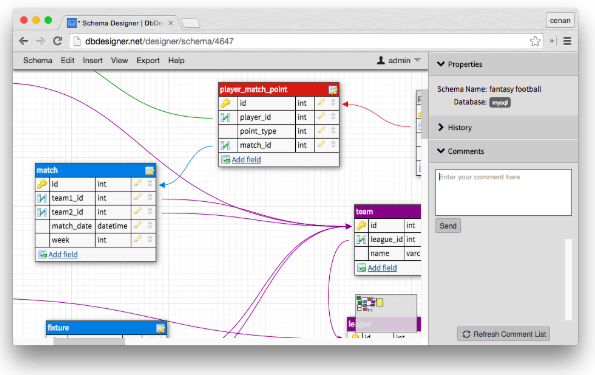
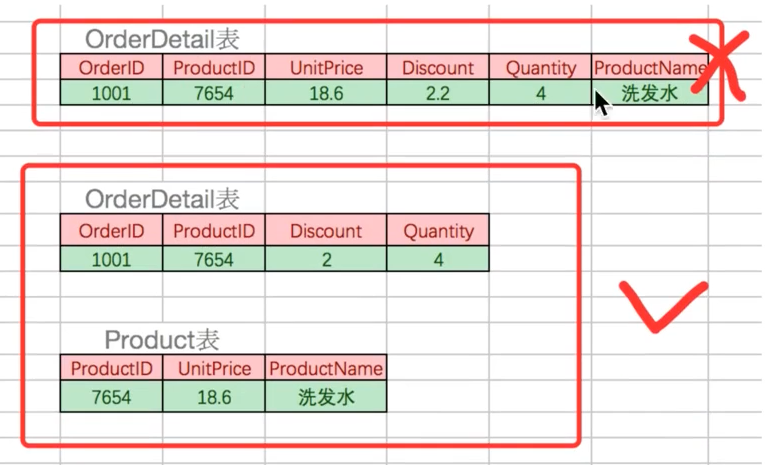
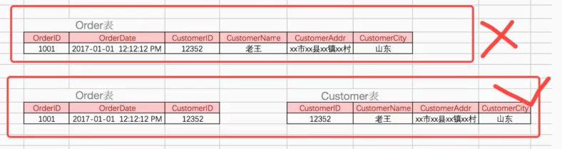

# ❖ 理解数据库设计 [DRAFT]

> 谈到`数据库设计`，其实主要就是设计`关系型数据库`。
而非关系型的NoSQL不需要太麻烦的设计，只要把数据一股脑塞进去就行了。

数据库设计软件：
- `SAP Power Designer` 付费强大设计工具
- `DB Designer` 免费网页版数据库设计工具

[参考其它免费设计软件：Free SAP PowerDesigner Alternatives - AlternativeTo.net](https://alternativeto.net/software/sap-powerdesigner/?license=free)

## ER模型 （Entity-Relationship Model)

关系型数据库是建立在`ER模型`的理论基础上的。ER-Model 或 ER-Diagram，包括了各个实体间的对应关系、关系连接所需的因素(主键等)。

其中：
- `Entity`: 实体，在数据库中是指：把数据抽象为一个表格。
- `Relationship`: 指实体(表格)之间的对应关系，可以一对一、一对多、多对多

## 范式 Normal Form (NF)

经过前人经验总结出来的数据库设计模式、范式，目前有8种常用范式。
我们最最常用的只有三种，称为著名的`三范式`。

8种范式：
- `第一范式(1NF)`: 强调`列`的`原子性`，即不能再拆分，也就是说不能几个数据组合在一起。
- `第二范式(2NF)`: 在1NF基础上，1. 每个表必须有ID主键(或组合主键) 2. 其它列必须`完全依赖`于ID主键，而不能是主键组合中的某一个键。
- `第三范式(3NF)`: 基于2NF，非主键的列必须`直接依赖`于主键，不能通过别的列来间接依赖。
- `第四范式(4NF)`: 略。
- `第五范式(5NF)`: 略。
- `第六范式(6NF)`: 略。
- `第七范式(7NF)`: 略。
- `第八范式(8NF)`: 略。

其中涉及几个比较混淆的概念：
- `组合主键`的意思是，一个主键不光可以是一个ID，根据业务需要，还可以是一个`(IDa, IDb)`的组合主键。**如果主键是一个组合主键，那么组合主键就每次都作为一个整体使用。** 
- `完全依赖主键`的意思是，如果主键是一个组合主键，那么一个普通列不能只依赖这个组合中的某一个列，而必须依赖整个组合才行。比如一个order订单中有多样商品，那么在order订单表中，每个商品不能只依赖OrderID或只依赖ProductID来区分，必须组合来确定。

- `直接／间接依赖主键`的意思是，普通列A必须直接依赖ID主键，而不能是先依赖B，而B依赖ID，就说这是A依赖ID了。这种传递是不存在的。 比如下图上表中，后面很多列都不是直接依赖于主键的。

这些范式，如果没有遵循，那么就会产生错误、冗余，造成生产减速。

