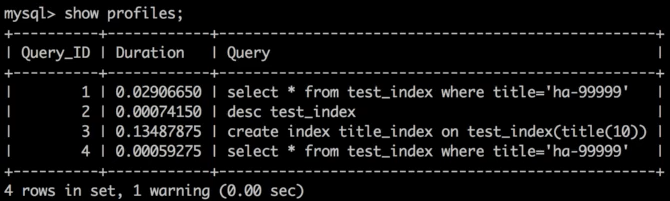

# ❖ MySQL常用高级操作：视图、事务、账户管理 [DRAFT]


## 视图 View

一个View视图是一个`虚拟的表格`，是从各个真实表格中抽取各种数据而成，但是只能查询不能删改。
为什么要用视图？因为一般查询经常会涉及多个表多个字段，非常繁琐。为了简化流程，适合未来业务改变，所以更方便的是抽象出一个视图来查询。

也就是，用View的意义在于：
- 简化复杂的查询语句
- 方便维护，在业务变化后不需要修改大量原表内容
- 可以针对不同的用户显示不同结构的表，但是原表原封不动

定义View视图：
```sql
CREATE VIEW 视图名称 AS
    SELECT ... FROM ... WHERE ... ;
```

定义好后，一个View视图就会成为一个数据库中的“表格”，当我们用`show tables;`时就会显示出来所有的表和视图。

删除视图：
```sh
DROP VIEW 视图名称 ;
```


## 事务 Transaction

一个事务Transactin代表一个`操作序列`，即联动的好几条语句。那么，

当我们将Transaction作为一个_整体_执行时，操作序列中的语句要么**全部执行成功**，要么**全体执行失败**。

在很多时候，这种`操作序列`的绑定是至关重要的。比如A向B进行银行转帐分为这三步：
- [x] 检查A的账户余额是否充足
- [x] 从A的账户扣钱
- [ ] 在B的账户加钱

那么，如果转账系统突然故障，只执行了2步就死机，那么这时候**必须**视为整体执行失败，否则将会引发大问题。

如果一个Transaction中有一个执行失败的语句，那么数据库会立即进行`Rollback`回滚操作。

MySQL中执行事务的语句格式：
```sql
START TRANSACTION ;

    SELECT ... FROM ... ;
    UPDATE ... SET .... ;
    INSERT INTO ... ;

COMMIT;
```
(以上的`Start Transaction ;`也可以用`Begin ;`来代替。)

如果`Commit`报错，那么我们可以进行手动回滚：
```sql
ROLLBACK ;
```

### 事务的四大特性 (ACID)

事务Transaction是保证数据更新100%成功的一种方式。
（注意：事务只是为了增删改而设计的。而单纯的查询，是不需要事务的。）

它具有如下特性：
- `Atomicity` 原子性: 一个事务必须视为不可分割的最小单位，要么全成功，要么全失败。
- `Consistency` 一致性：总是从一个`一致性状态`转到另一个`一致性状态`，没有中间状态。
- `Isolation` 隔离性：当事务没有执行完时，是对外不可见的，也就是这时候数据库还没有完成真正的修改，别人也看不到有任何变动。
- `Durability` 持久性：一旦事务执行成功，那么就真正完成数据库的修改，电脑关机也不会有变动了。


## 账户管理 Account Management

根据权限，分为这几类账户：
- Root账户：拥有一个mysqld服务的全部权限。
- 数据库级账户：可控制某个数据库。
- 表级账户：只能控制某个或某些表。
- 字段级权限：只能修改某个表的某些字段。
- 存储级别账户：对存储程序进行CRUD操作。

其中Root账户有权利创建、修改账户，并分配相应的权利。

所有账户（用户）相关的信息，都存在MySQL服务器上叫d`mysql`的数据库中的`user`表中，包括名称、权限、所在主机，甚至密码等信息。

常用操作：
```sql
-- 查看user表结构
DESC user ;

-- 查看所有用户
USE mysql ;
SELECT * FROM user ;

-- 查看某用户有哪些权限，如user1
SHOW GRANTS FOR 'user1'@'主机IP' ;

-- 创建一个用户
GRANT 权限列表 ON 数据库 TO 数据库账户名@主机IP IDENTIFIED BY '密码' ;
-- 如：
GRANT select on mydb1.* to user1@192.168.1.111 IDENTIFIED BY 'password123' ;

-- 修改用户权限
GRANT select, insert on mydb1 to user1@localhost WITH GRANT OPTIONS ;
FLUSH PRIVILEDGES ;    -- 刷新，使更改生效

-- 修改密码
UPDATE user SET authentication_string=password('密码') WHERE user='用户名' ;

-- 删除用户
DROP USER 用户名@主机IP ;
-- 或
-- DELETE FROM user WHERE user='用户名' ;
FLUSH PRIVILEDGES ;    -- 刷新，使用更改生效
```

以上的`权限列表`有固定的语法格式：`操作名 ON 数据库名.表名, 操作名 ON 数据库名.表名....`
如：
- `select on mydb1.products, update on mydb1.employees` 具体指定
- `select, insert on mydb1.products` 宽泛指定
- `select on mydb1.*` 可以查询该数据库所有表

远程登录 ：
如果主机IP写`'%'`，则代表允许可以从任何IP访问此数据库。如果指定某IP，那么MySQL则只接收来自此IP的登陆，从其它机器不能登录。
另外，如果要`直接远程登录`，除了在`user`表中修改允许的IP外，还需要在MySQL服务器的配置文件`/etc/mysql/mysql.con.d/mysql.cnf`中的`bind_address`的允许IP。
但是！
但是，这种方法不推荐，会有很大的被黑危险。正确的做法是，**通过SSH登录远程主机进行操作**，这样就不需要开发IP限制了。


## 执行时间查看

在MySQL中，可以开启`时间监控`的功能。

```sql
-- 开启时间监控，0为关，1为开
SET profiles = 1 ;

-- 任意执行一个语句
SELECT ... FROM ... ;

-- 显示之前那句的执行时间
SHOW profiles ;
```

显示效果如下（包括具体的sql语句和执行时间）：


实际上profiles就是一个简单的表，记录了每一次的sql语句和其执行的时间。


