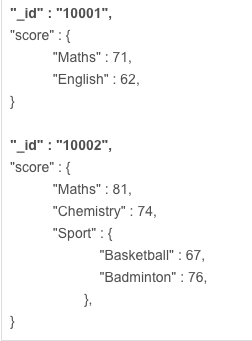
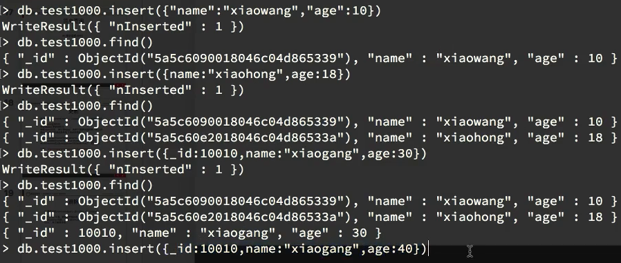

# ❖ 一篇文章入门 MongoDB

MongoDB既是`NoSQL数据库`，又是`内存数据库`，而且它是现在最强大、最流行的NoSQL数据库。区别与别的NoSQL数据库，MongoDB主要是基于Documents文档(即一条JSON数据)的。

MongoDB的特点：
- NoSQL数据库
- 内存数据库
- 存储基于JSON或BSON
- 支持丰富的高级查询
- 命令基于Javascript语法
- 对数据之间关系的支持比较弱
- 支持map-reduce的运算框架
- 支持GirdFS的分布式文件系统


## MongoDB持久化

MongoDB虽然是`内存数据库`，但是它主要是将数据存储在硬盘的，所有要操作的数据通过mmap的方式映射到内存某个区域内。所以相对于Redis的`真·内存数据库`而言，MongoDB只是将大部分的操作数据存在内存中。

Mac中，Mongodb的数据存储位置默认为：`/usr/local/var/mongodb`。
里面名称类似`collection-4-3122184014923990948.wt`即为一个collection。


## 安装

Ubuntu安装：
```sh
$ sudo apt-get install mongodb-org
```

Mac安装：
```sh
$ brew install mongodb

# 启动mongodb服务
$ brew services start mongodb
#或前端启动
$ mongod --config /usr/local/etc/mongod.conf
```


## 配置

MongoDB的配置文件在`/etc/mongod.conf`。
常用的配置项有：
```ini
# 默认端口27107

# 日志位置 /var/log/mongodb/mongod.log
```


## Mongo Shell (Javascript)

当我们进入MongoDB客户端后，实际上是进入了一个`类Javascript`语言的Shell交互环境。
也就是说，MongoDB中的很多命令，尤其是包括定义函数等高级命令，实际上都是Javascript语言。
了解了这点，一些高级命令如Aggregation学起来就会放松很多。


## 常用命令

```sh
# 服务端启动
$ mongod /etc/mongod.conf

# 服务端启停 （Ubuntu上）
$ sudo service mongod start
$ sudo service mongod stop
$ sudo service mongod restart

# 进入客户端
mongo
```

进入mongo客户端后，就进入了shell交互页面了。
常用的命令如下(注意mongodb区分大小写)：
```js
# 显示当前数据库
db

# 显示所有数据库
show databases
# 或
show dbs

# 切换数据库
use 数据库名

# 删除当前数据库
db.dropDatabase()
```

## 集合

首先要记住，

MongoDB中，有这么几个概念：
- `Database` 数据库：即一个NoSQL的非关系型数据库
- `Collection` 集合: 即代替传统"表格"概念的一个集合，收集性质相似的一些数据，如员工集合，或产品集合。
- `Document` 文档: 即一个标准JSON格式数据。相当于传统数据库的一行record数据。

在关系数据库中，是以表为一个数据集。而MongoDB中，是以Collection为一个数据集：


其中每一个配有`_id`的记录，就是一个`Document`文档。相当于一条记录。

> 可以看出，MongoDB对**数据之间事务关系支持比较弱**，如果业务这一方面要求比较高的话，MongoDB还是并不适合此类型的应用。


创建集合：不用手动创建集合，当第一条数据插入时，集合自动就生成了。当然，手动创建也是可以的：
```js
db.createCollection( "集合名", {各种属性设置} )
# 如 (capped表示是否设置容量上限)
db.createCollection( "Products", {capped: true, size: 1000} )

# 查看所有集合
show collections

# 删除集合
db.集合名称.drop()
```


## 数据类型

在MongoDB中的一个Document，即一个JSON格式的文档中，每个值都是要指定数据类型的。
现有数据类型如下：
- `Object ID`：文档ID，相当于传统表中的表主键ID。
    - 可以自己创建
    - 如果自己不设置，MongoDB会自动生成一个名为`_id`的"主键"
- `String`
- `Boolean`
- `Integer`
- `Double`
- `Array`：列表，可以存储多个值。
- `Object`：可以嵌套另一个子Document文档，或说JSON数据。
- `Timestamp`
- `Date`
- `Null`


## 数据操作

```js
# 插入数据
db.集合名称.insert( {数据} )
# 如
db.mycollection1.insert( {"name": "Jason", "age": 18} )
# 或
db.mycollection1.insert( {name: "Jason", age: 18} )

# 显示集合中所有数据
db.集合名.find()

# 修改数据 (如果不存在对应的ID，则创建一条新数据）
db.集合名.save( {"_id": "ID号", 数据} )

# 更新单条数据
db.集合名.update( {查询条件}, {更新项目} )
# 如
db.mycollection1.update( {name:"Jason"}, {age:30} )
# 或
db.mycollection1.update( {name:"Jason"}, { $set:{age:30} } )

# 更新多条数据 (使用"multi"选项)
db.mycollection1.update( {job: "HR"}, {salary: 8000}, {multi: true} )

# 删除单条数据
db.mycollection1.remove( {查询}, {justOne: true} )

# 删除多条数据 ("justOne"选项默认为false)
db.mycollection1.remove( {查询} )
```



## MongoDB数据备份和恢复

注意：MongoDB导出时候不是单文件，而是巨多JSON和BSON文件。

```sh
# 备份
$ mongodump -h 主机IP:端口 -d 数据库名 -o 导出路径
# 如
$ mongodump -h 192.168.1.101:27017 -d mydb1 -o /var/db/mongodb/

# 从本机恢复
$ mongorestore -d mydb1 --dir /var/db/mongodb/
```
