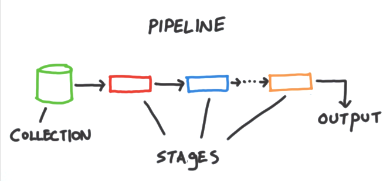
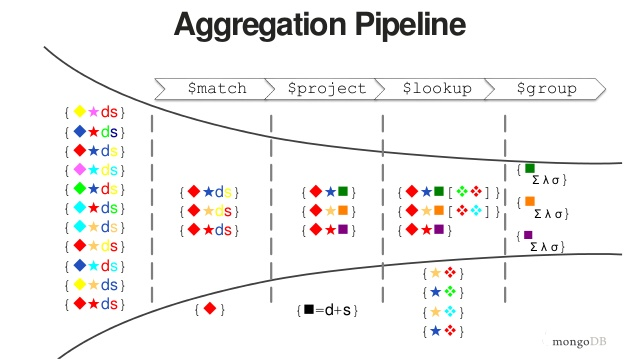
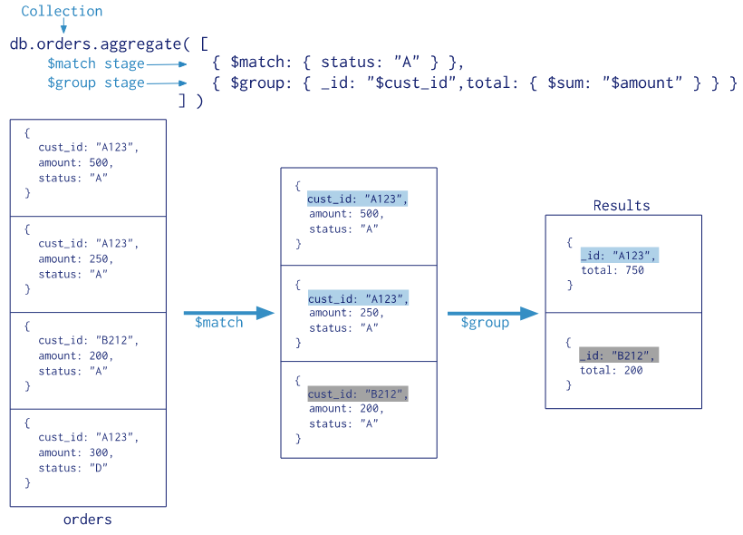
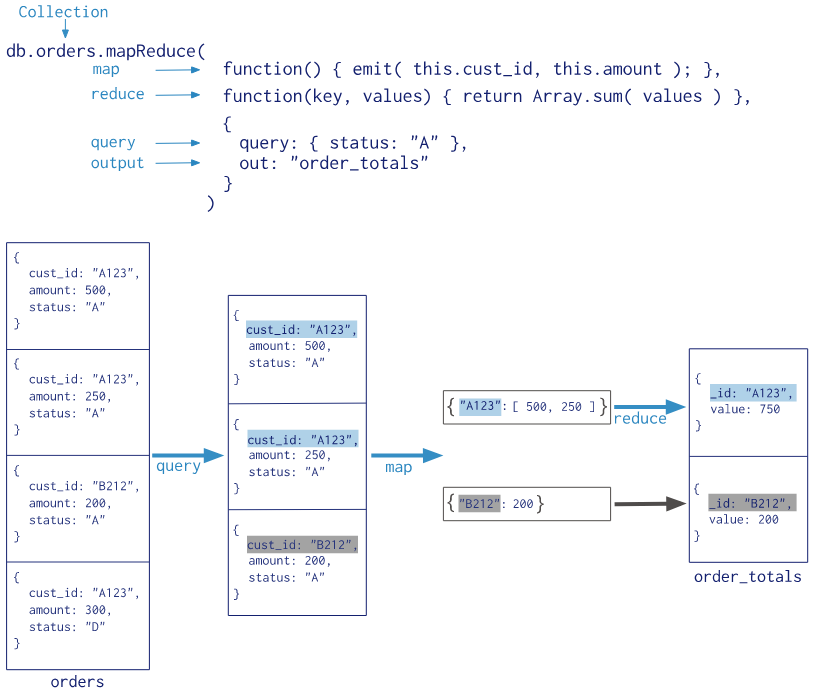

# ❖ MongoDB 高级查询

[参考官方文档（图文并茂非常好看）：Getting Started - MongoDB Documentation](https://docs.mongodb.com/manual/tutorial/getting-started/)

MongoDB的查询功能非常强大，同时有些地方也会有点复杂。所以需要下点功夫学习和操练才能用好。


## 关于Mongo Shell

当我们进入`Mongo Shell`客户端后，实际上是进入了一个`Javascript语言`的交互环境。
也就是说，MongoDB中的很多命令，尤其是包括定义函数等高级命令，实际上都是Javascript语言，甚至说可以是`jQuery`。
了解了这点，一些高级命令如Aggregation学起来就会放松很多。

官方说明：


## 基本查询功能

### 比较运算
- `:` 等于
- `$lt`: Less Than
- `$gt`: Greater Than
- `$gte`: Greater Than or Equal
- `$ne`: Not Equal

```js
# age大于等于18
db.mycollection1.find( { age:{$gt: 18} } )
```

### 逻辑运算
- `$and`
- `$or`

```js
db.mycollection1.find( {
    $or: [
        { age: {$gte: 20} },
        { salary: {$gt: 5000} },
        { job: "HR" }
    ]
} )
```

### 范围运算
- `$in`
- `$nin`: Not In

```js
db.mycollection1.find( {
    age: {
        $in: [10, 20, 30]
    }
} )
```

### 正则表达式
有两种方法：
- `/表达式内容/`
- `{$regex: "表达式内容"}`

```js
db.mycollection1.find( {
    name: /^Ja\w+$/
} )

# 或
db.mycollection1.find( {
    name: {
        $regex: "/^Jaso\w?$"
    }
} )
```


### limit和skip

```js
# 限定显示条数
db.mycollection1.find().limit(数量)

# 跳过指定第几条数据
db.mycollection1.find().skip(2)

# 混合使用
db.mycollection1.find().limit(10).skip(3)
```


### 自定义函数查询
自定义查询是指使用自定义函数，格式为`$where: function(){...}`

```js
db.mycollection1.find( {
    $where: function() {
        return this.age >= 18;
    }
} )
```


### 投影

即搜索的返回值中，只显示指定的某些字段。字段指为0的不现实，指为1的显示，默认为1。

```js
# 格式为：
db.mycollection1.find(
    {查询条件},
    {显示与否的选项}
)

# 如:
db.mycollection1.find(
    {},
    { _id: 0, name: 1, age: 1 }
)
```


### 排序

可以按指定的某些字段排序，字段标记为1的为Asc升序，标记为-1的为Desc降序。

```js
db.mycollection1.find().sort({  name:1, age:-1 })
```


### 统计

使用count()函数。

```js
db.mycollection1.find().count()

db.mycollection1.count( {查询条件} )
```

### 消除重复

使用distinct()函数。

```js
# 格式为：
db.集合名.distinct( "指定字段", {查询条件} )

# 如
db.mycollection1.distinct( 
    "job", 
    { age: {$lt: 40} } 
)
```


## 聚合管道 Aggregation

Aggregation是MongoDB特有的一种Pipline管道型、聚合查询方式。语法稍微复杂一些。

聚合管道可以达到多步骤的分组、筛选功能。这个管道中的每一个步骤，成为一个`stage`。



常用的管道有：
- `$match`：简单的根据条件过滤筛选
- `$group`：将数据分组，一般配合一些统计函数，如`$sum`。
- `$project`：修改document的结构。如增删改，或创建计算结果
- `$lookup`：
- `$unwind`：将List列表类型的Document进行拆分
- `$sort`
- `$limit`
- `$skip`




语法格式为：
```js
db.集合名.aggregate( [
    {管道表达式1},
    {管道表达式2},
    {管道表达式2}
] )
```


示例：
```js
db.Orders.aggregate( [
    {$match: {
        status: "A"
    } },
    {$group: {
        _id: "$cut_id",
        total: { $sum: "$amount" }
    } }
] )
```




### 管道的Map Reduce



