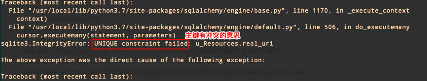

# ❖ SQLAlchemy的进阶小操作汇总 [DRAFT]


## 根据表名获取对应的ORM类引用

```py
def get_class_by_tablename(tablename):
    for cls in Base._decl_class_registry.values():
        if hasattr(cls, '__table__') and cls.__table__.fullname == tablename:
            return cls

print( get_class_by_tablename('tb_Tracks') )
```


## 检验是否已存在数据再插入

[参考：SQLAlchemy commit(), flush(), expire(), refresh(), merge() - what's the difference?](https://www.michaelcho.me/article/sqlalchemy-commit-flush-expire-refresh-merge-whats-the-difference)

以下方法先称为`session.merge()方法`, 它能极快的完成插入之前的数据是否重复的检验：
```py
user1 = User.query.get(1)
user1.name  # ==> 'user1'

new_user = User(user_id=1)  # ==> a second in-memory object with the same key!
new_user.name = 'user2'
user1.name  # ==> 'user1'. Without merging, user1 doesn't know it is the same as new_user

db.session.merge(new_user)
user1.name  # ==> 'user2'. Now updated in memory. Note not yet updated in db, needs flush() and commit()
```

### merge()发生冲突

我们知道虽然`merge()`可以解决数据库中的冲突问题，但是当我们在还没进入数据库之前，如果`批量merge`，如果数据中有重复（包括主键重复），都会产生异常，停止程序运行。
报错信息一般如下：



很“抱歉”的是，SQLAlchemy没有内置的解决办法，想想可能也不会有。
因为逻辑上来说，你在插入数据库之前，同时准备了多条数据，其中有一些重复的条目，比如有两个主键相同但是其它内容不同的条目，那么问题来了：SQLAlchemy怎么替你选择让这两个条目的哪一个插入到数据库中？
答案是：它不能！
选择哪条数据进入数据库这么重要的选择权必须在我们手里，机器不能随便决定。

所以，主要解决方案有两个：
- `flush`或`commit`：逐条数据插入到数据库中，这样在merge里就不会有主键冲突了。重复的对象只会被认为是更新数据库中的数据。但是这样做效率会低很多很多。
- 自己手动筛选出一个unique唯一的列表或集合，批量插入。

手动筛选的话，目前只能用最古老的for循环逐个查找。因为SQlalchemy的ORM对象特殊，**不能**用python的魔法方法`__hash__`和`__eq__`来实现快速筛选。


## 定义复合主键

有时候表中不是以单一的主键来标示一条数据的唯一定位，而是以组合主键的方式。比如订单表中的订单号和商品号组合，两者单独的话都会有重复数据，组合起来才能定位到一个具体销售出的商品。

SQLAlchemy定义组合主键的有两种方法：直接定义primarykey，或使用`PrimaryKeyConstraint`。

注意：
- 一旦定义了多重主键，那么插入数据时候即使在某一个ID上重复了，只要不是组合ID全部重复，就没有问题。
- 有了多重主键，就无需作为序列号的id来撑场面了。

方法一：直接定义
```py
class User(Base):
    field1 = Column(Integer, primary_key=True)
    field2 = Column(Integer, primary_key=True)
```

方法二：使用PrimaryKeyConstraint（需要导入相关）
```py
class User(Base):
    field1 = Column(Integer)
    field2 = Column(Integer)
    __table_args__ = (
        PrimaryKeyConstraint('field2', 'field1'),
        {},
    )
```


## ORM类多文件定义

因为要想各个ORM类互相沟通，互相引用ID，首先要保证他们在一个`Base`之中才行。
所以，最简单的方法是在一个单独文件中定义`Base = declarative_base()`，然后所有的ORM文件都引用统一个Base，这样就挂钩在一起了。

同理，为了方便，我们也可以把`engine`都放进来：

common_base.py:
```py
from sqlalchemy import create_engine
from sqlalchemy.ext.declarative import declarative_base

Base = declarative_base()

engine = create_engine('sqlite:///:memory:', echo=True)
```

然后在另一个文件`ORM.py`中直接引用：
```py
from common_base import Base, engine
```

这样一来，以后所有ORM文件就可以正常的互相`import`了。
注意：不要把session放进来，因为session最好用完随时close()。同理，使用时，也要注意engine的使用，不要长时间连接而不关闭。


## 只创建一个表/ORM对象

一般我们用`Base.metadata.create_all()`时候，是让所有绑定到`Base`类上的子ORM全都创建到数据库中。

但在测试时，我们有时需要只创建一个表。

方法如下：
```py
class Person(Base):
    #.....

Person.__table__.create( engine )
```
