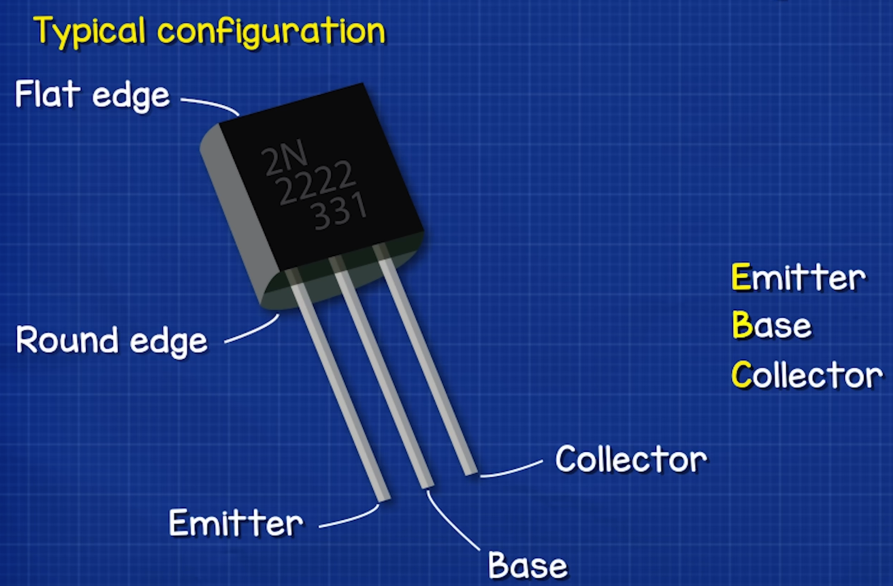
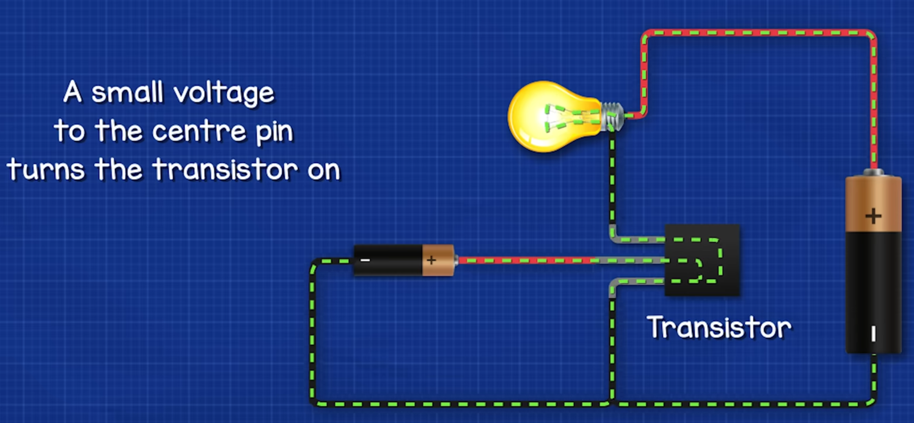
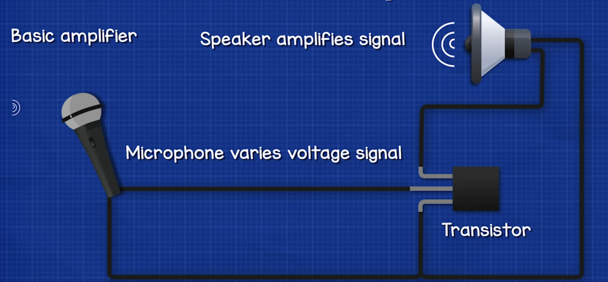
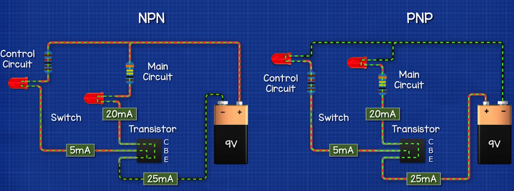
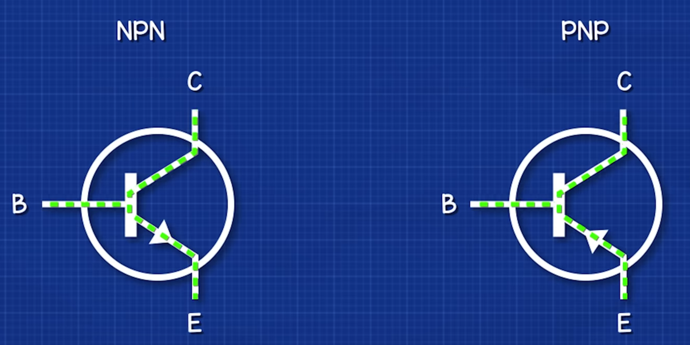
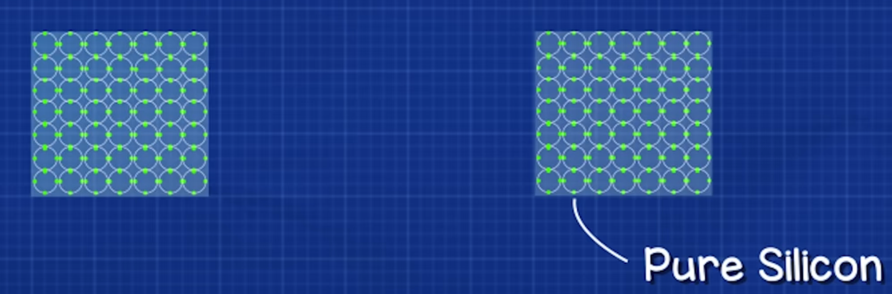
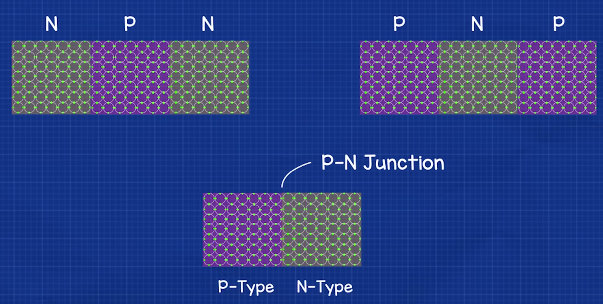
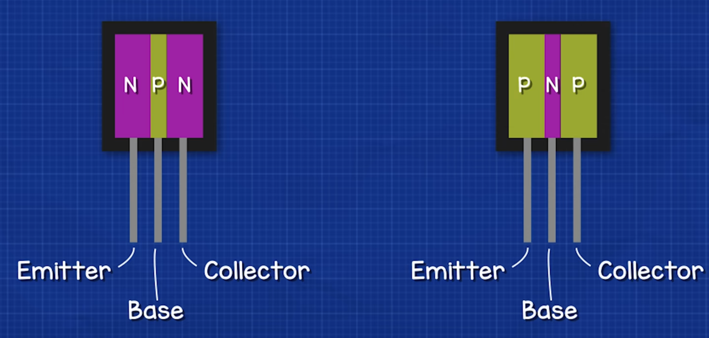
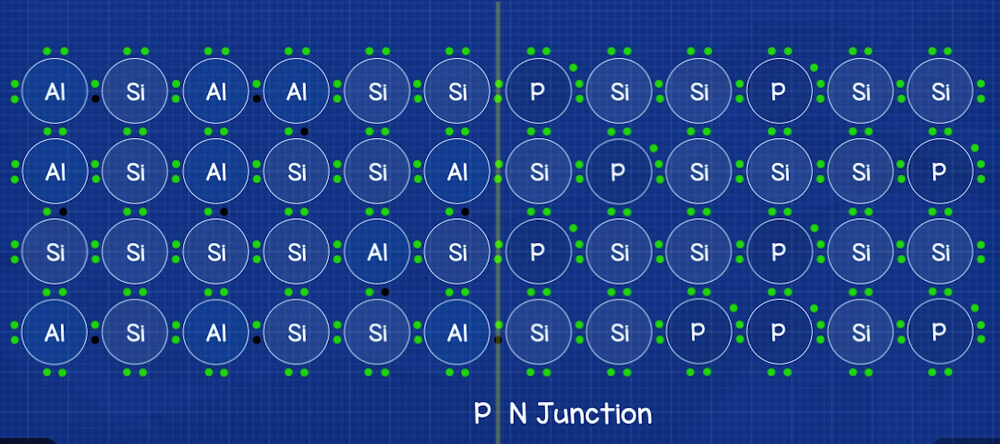

# Transistor

> "One of the most important devices invented ever."

REF: [Transistors Explained - How transistors work](https://www.youtube.com/watch?v=J4oO7PT_nzQ&list=WL)

Transistor's 2 main functions:
1. Switch circuits on/off
2. Amplify signals

Usually has 3 pins (3 legs) - EBC:
1. Emitter
2. Base
3. Collector

Why do we use a transistor?
> Instead of manually switch on/off a wire, transistor can **AUTOMATE** on/off for us by providing tiny bit electricity to the "base pin".

Transistor acts as an "amplifier" that **uses small signal to trigger larger signal**

2 types bipolar transistors: `PNP and NPN`

## How does a transistor work

> "The pipe."

Material study:

The electron (the energy) needs to be escaped from the atom's **valance shell**:

In P-type silicon, all atoms have only 3 (missing 1) electrons;
In the N-type silicon, all atoms have 5 (extra 1) electrons;
So when they're next to each other, the overflown electron "naturally" tends to fly out to the atom where it has empty spots.

