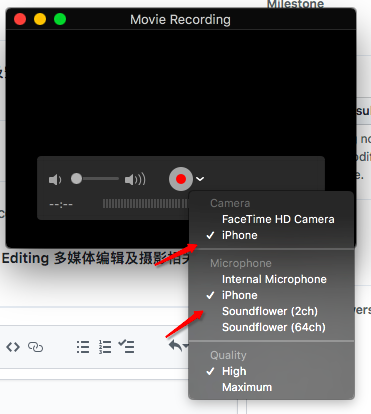
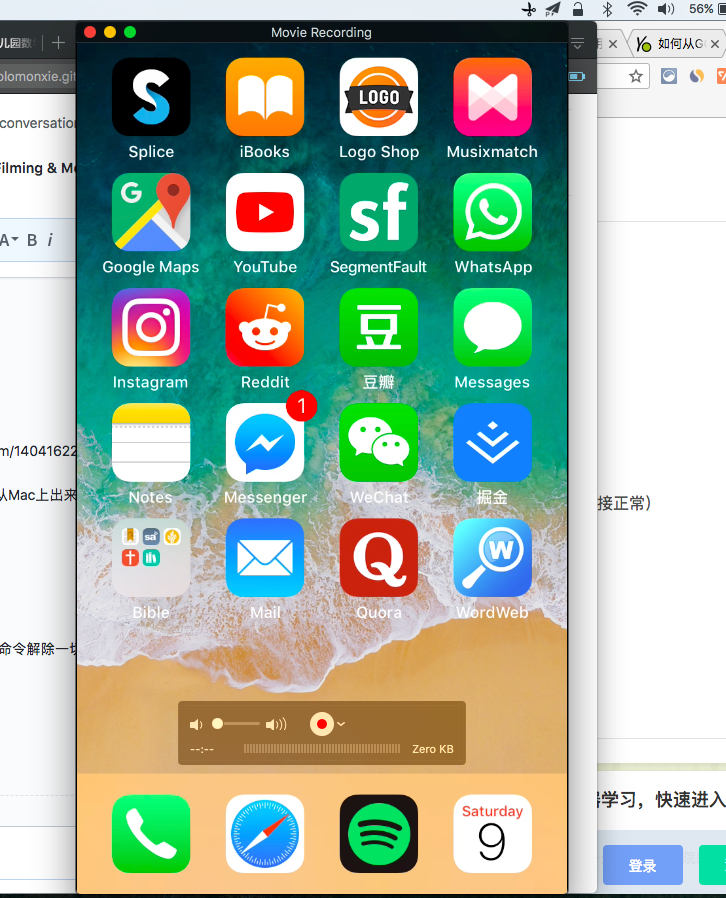

# iphone投影到Mac电脑

[参考：How to Record your iPhone Screen on a MAC Computer](https://www.youtube.com/watch?v=TCsrsTUWHUc)

一般来讲极其简单：
- 直接把iphone用数据线连接到Mac上
- 打开Quicktime Player
- 打开菜单-> File -> New Movie Recording
- Camera和Microphone都选择iphone

- 这样就可以在Mac上显示iphone画面，且声音也是从Mac上出来了（iphone里的声音自动关闭）

效果：



## Quicktime上不显示iPhone的选项
那是因为不知道什么东西占用了iphone或什么端口。
需要执行命令来解除占用。在命令行里输入以下两个命令解除一切占用：
```sh
sudo killall VDCAssistant

sudo killall AppleCameraAssistant
```

