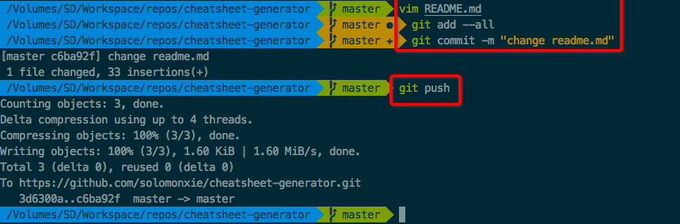

#  ❖ Git Workflow 1: Beginner's flow

> 最简单的Git工作流--即给初学者的工作流，尽量避免多分支，现在master分支上把常用指令学明白，然后再开启分支合流模式。

## 第一步 建立仓库 (Init | Clone)
一般会提到`git init`这个指令，在本地某个文件夹执行它就会把这个文件夹建立成一个git项目。但是我们初学者一般不是这个流程，我们需要建立一个github的repo，并将本地和它联通，反而简单很多。
首先直接到github首页新建一个repo，建好了以后直接点clone按钮复制.git结尾的链接。在本地用`git clone`命令克隆到本地生成一个文件夹项目。如果本地已经做了一些文件，那就把文件复制进这个文件夹就好了。
命令如下：
```
$ git clone 项目克隆网址 本地路径
```
然后进入文件夹开始项目即可。

## 第二步 本地提交 (commit)
先不涉及远程repo仓库，git需要在本地完成提交，常规三步如下：
```git
# 查看本地文件变动状态
$ git status
# 添加变动文件到预备区
$ git add --all
# 完成提交
$ git commit -m "变动描述"
```
然后本地的准备就完成了，随时可以连接远程仓库。

## 第三步 远程提交 (push)
一般情况下，远程仓库都是我们自己的，拥有所有权限，所以暂不涉及向其他人的仓库提交（pull request)一类概念。
所以只需推送到远程自己的仓库，一句话`git push`即可。
然后如果在安装git后设置过通用的用户名和邮箱，这里就只会要求你输入密码，然后就可以上传本地提交到远程repo仓库里了。
就这么简单。前三步基本流程如下图：


## 第四步 远程抓取 (pull)
有的时候会用别的机器（比如公司）提交一些变化到远程，然后回家后想把变化同步到本地。
如果远程也是自己的repo拥有完全权限，那么直接`git pull`即可完成一切同步。
