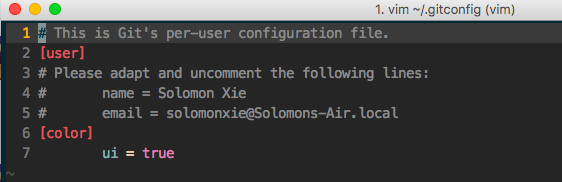
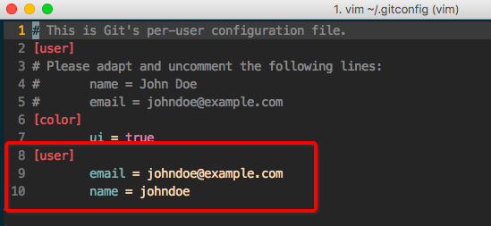

# 初次运行Git的配置
> Linux和Mac的git安装都很方便很多是自带的，Windows则强烈推荐安装Git Bash整个终端，包括了git本身以及所有常用的linux指令。

初始配置不是必要的。
因为主要是配置通用的用户名和邮箱，方便每个项目登录github并上传用的。简单就是两句话设置好：
```git
$ git config --global user.name "John Doe"
$ git config --global user.email johndoe@example.com
```
这两句话就会分别设置好当前电脑用户的通用github（或其他服务商）登录名和邮箱，密码不在这里写是要在用的时候才在命令行里输入。

其实我要将的不是这两句话，网上很多人说过。只是要讲其实用`git config`命令的作用，只是把内容帮你加到`~/.gitconfig`这个文件里而已。虽然效果一样，但是便于日后管理所有git的配置内容，强烈建议不用命令输入，而是直接到这个文件里面改。参考下图：

这个是默认状态下的配置文件：


这个是利用`git config`命令后的文件：


所以为了日后方便管理，还是直接改文件的好。
另外，详细初始配置，如默认编辑器是vim还是emacs，differ用哪个编辑器显示等细节，参考git官方文档。[起步 - 初次运行 Git 前的配置](https://git-scm.com/book/zh/v1/%E8%B5%B7%E6%AD%A5-%E5%88%9D%E6%AC%A1%E8%BF%90%E8%A1%8C-Git-%E5%89%8D%E7%9A%84%E9%85%8D%E7%BD%AE)
