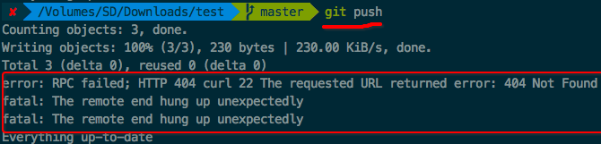
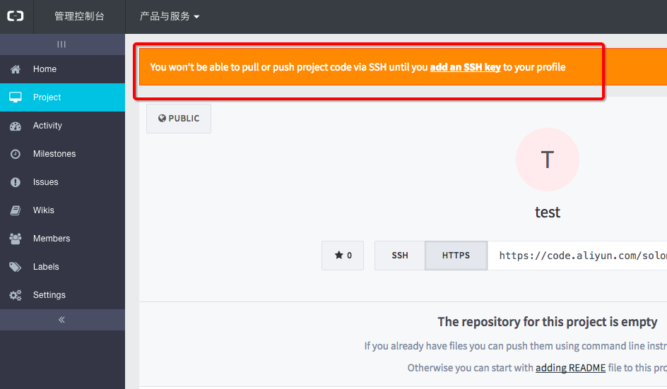
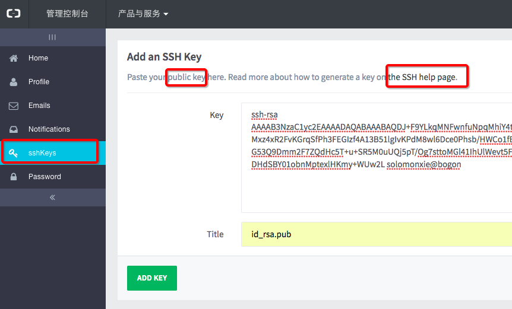
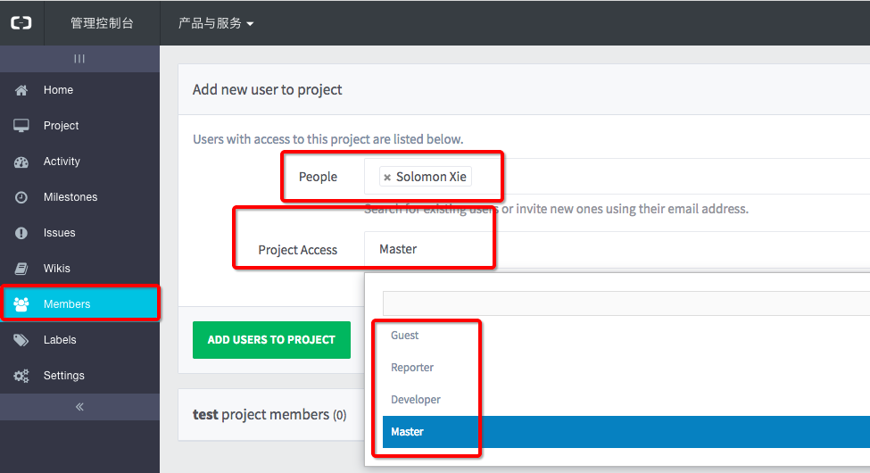

#  ❖ 阿里云Code (Git托管）的初始设置

最近在考虑有的时候想托管一些国内方便的内容比如当cdn使用，还有码云什么的，比较了下易用性和容量，仅有的几个托管商里也就阿里云最合适，也最接近github。
[链接](https://code.aliyun.com/)
其它都是正常操作，唯一遇到的问题是git push的时候总是无法完成用户认真，在git里面设置了user.name和email等都不行。
原来阿里云code的登录密码是单独设置的，不能直接用自己的账号密码去登录，
必须要在阿里云Code的管理后台里面找到密码设置，然后选择忘记密码（修改密码没用，因为没有原始密码，只能点忘记密码）。

发邮件确认后，设置密码，就可以登录了。
所以这里git push时，用户名是阿里云的账号email， 密码是Code的单独密码。
参考[官方文档](https://help.aliyun.com/document_detail/60018.html#h1-u4E2Au4EBAu8BBEu7F6E)。

但是！这时候还不能做push等远程操作。如图：

repo页面里面，一不小心漏过了一条提示：

按照提示，在Profile->sshkeys页面里面，把本地电脑里`~/.ssh/id_rsa.pub`这个公钥文件内容粘贴到里面，添加密钥：

阿里云还需要设置每个参与人员的权限。在控制台里可以找到，如下图：

但是不管我怎么尝试，都添加不了members，项目中都members总是为0。

最后结果还是不能push。
