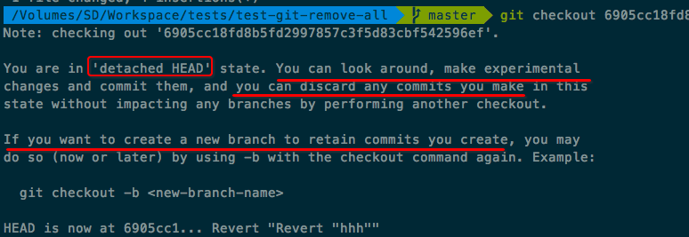

#  ❖ Git入门之形象化理解checkout

> `git checkout`实际上其实是个平行宇宙时光机，可以带你穿梭到任意一个平行宇宙中，还可以带你穿梭回过去的任意一个时间点。在过去的那个点上，你可以各种观察、修改、删除等，而不对原本时间点产生任何影响。

每一个branch分支，都是一个平行的宇宙，你可以用checkout在两个宇宙之间穿梭。
每一个commit提交，都是现在时间轴上的一个时间点，你可以用checkout回到过去的任何一个时间上。

顺着时光机的思路，你现在身处的时间点，在git里叫`HEAD`，而当你回到过去时，你的时间点就叫做`detached HEAD`，因为你已经是"detached reality"脱离现实了。

再来让它容易记一点，我们可以叫`checkout`为一个`Jumper`！
它可以跳来跳去，跳到任何地方。你可以用它来跳到别的分支，还可以跳到过去的任何点，总之git里面的它都可以跳过去。所以每次我们用`git checkout`时，我们可以心里念`git 跳到`，这样就好理解多了！

> 如果是`git checkout 时间点`，那么这就是一个回到过去的跳跃；
   如果是`git checkout 宇宙名`，那么这就是一个平行宇宙的跨越。

其中`时间点`，就是每次commit的sha值，可以在`git log`中看到；
`宇宙名`，指的就是每个branch的名字，可以在`git branch`中看到。

## 那么如果我checkout跳到过去，还改变了些东西，会发生什么？
> 可以肯定的是，不会发生时空扭曲或祖母悖论。

现在我试一试用`git checkout 时间点`, git返回了如下信息：

意思就是告知我，现在已经和`现实分离`，随便玩。“现实”就是`HEAD`，所以`现实分离`状态就是`detached HEAD`。不管怎么样都可以，add, rm, commit等等。
但是，如果做了些实验发现挺好的，想保留，那么就要新建立一个分支来保持这些变动。然后呢，再让这个分支去和主流合并，这之后就是正常merge流程了。

那么回到过去，修修改改后，想保存并建立分支需要用如下命令：
```shell
git checkout -b <new-branch-name>
```
实际上它是把两个单独的命令合到一起，一个是`git branch <name>`建立新分支并保存当前的改变，和另一个`git checkout <name>`跳转到该分支，这样一步到位还是挺方便的。

### 返回到现在进行时
当跳跃到过去到某个点时，它是绝对的`detached Head`状态。
在各种时间跳跃后，简单一句`git checkout master`就可以跳回到现在进行时了。当然，也可以是`git checkout 某分支名`跳跃到任何一个平行宇宙的现在进行时。

## Git checkout 的妙用：撤销更改
`git checkout 某文件名`则可以让某个自己不满意的文件，回到最近一个时间点，即最近一个commit提交。
