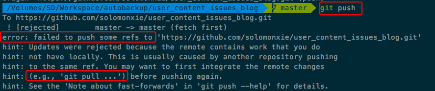

# Git push 遇到 `failed to push some refs to` 错误
> 一直在让脚本自动push本地仓库，仓库中的一些文件是从网上更新下来的，每次到push这一步都会产生错误，好像意思是remote有更新但是本地还没更新之前就push是不行的。但是所有remote更新都是本地push上去的，本地应该是一直保持在最新才对。。。不知道为什么

[参考stackoverflow回答](https://stackoverflow.com/questions/24114676/git-error-failed-to-push-some-refs-to)

在每次commit本地更新后，在push前用`git pull --rebase origin master`解决了。

