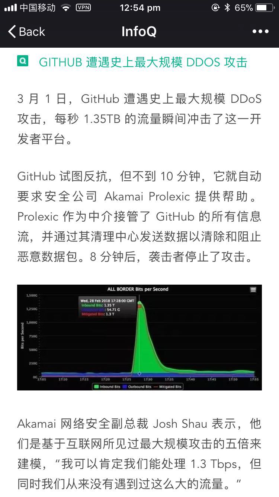

# 用SSH连接github项目时报错`ssh_exchange_identification: Connection closed by remote host`
一直在正常通过ssh连接github的repo，在哪里都没有改动的情况下突然`git push`不管用，一直报这个错误，就连`git clone`一个ssh地址都不行。
还以为github把我屏蔽。
考虑了网上很多本地ssh连接的问题，都没用，而且思路也不对。
索性ssh连接到我在新加坡租用的服务器，在服务器里尝试ssh连接github。
结果还是不行！
所以不是Github屏蔽了我的IP，也不是我本地的ssh设置问题，因为服务器的ip地址和ssh等都不一样还是遇到了这个问题。
网上还有说路由器的加速插件问题，这个也通过用服务器连接和切换wifi的方式否定掉了。
结果我心里只有一个结论：那就是Github本身的问题了。
结果没过几分钟，
所有端都可以正常连接了。
也许真的是github突然遇到什么问题导致所有地方都不能访问。

第二天更新：
结果真的第二天就收到这个新闻：Github昨天晚上遭遇史上最大DDOS攻击。但是不包括我吧，我顶多每分钟10次连接，而且还是用的绑定的ssh key和oauth码。。。

