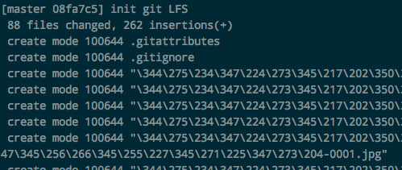

# Git 乱码 不显示unicode字符问题

一直以来使用git，在出现中文时都是这种样子 ▼



习惯了，就没管。但是现在才觉得非常不方便，所以开始找解决方案。

一般来讲，修改这一句话就够了：
```sh
$ git config --global core.quotePath false
```

如果还不行，Mac上参考这个设置：

> This option is only used by Mac OS implementation of Git.
When core.precomposeUnicode=true, Git reverts the unicode decomposition of filenames done by Mac OS.

```sh
$ git config --global core.precomposeunicode true
```
