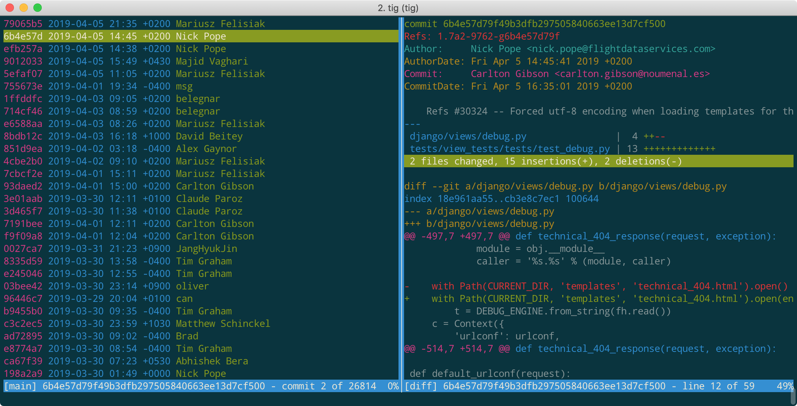
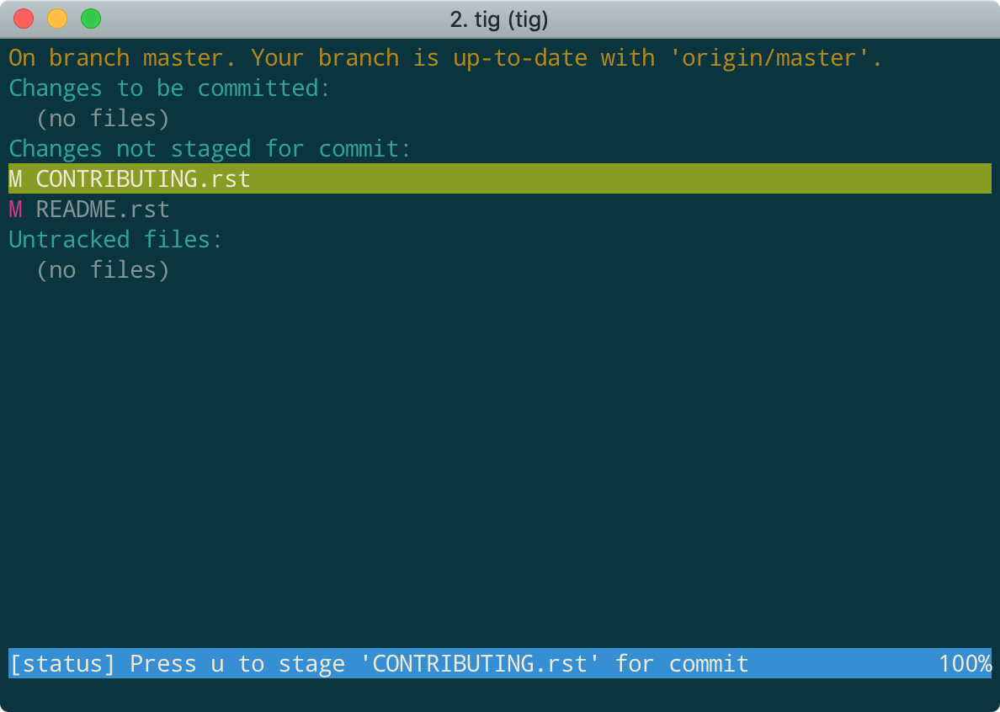
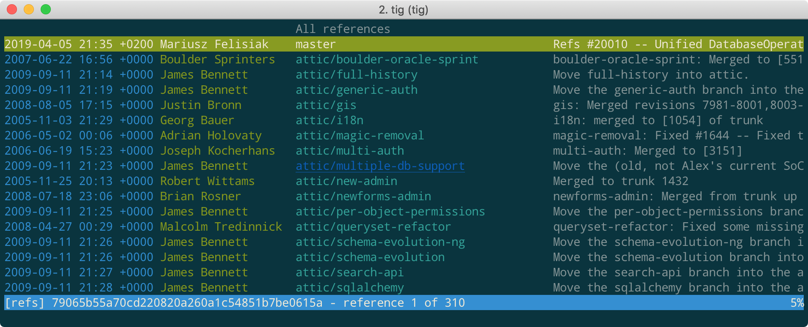
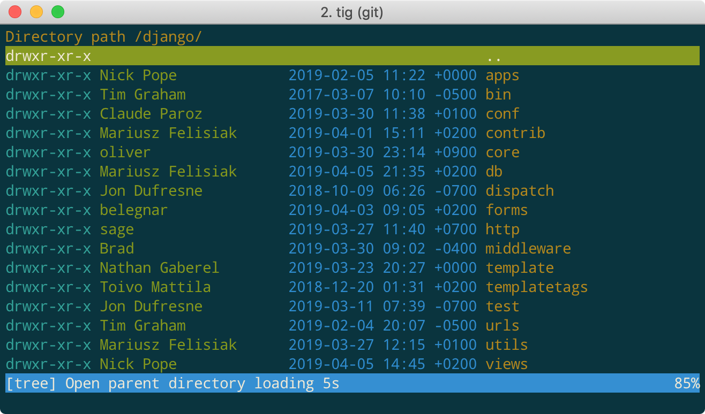

# How To Use `Tig` Like A Boss [DRAFT]

In the first place, I use `tig` as a CLI lightweight alternative for `GitKraken` or other heavy GUI Git clients.
It indeed massively increases the speed of my git workflow at work.
As an unexpected benefit, whenever I use `tig` in front of my co-workers, they are all like, "man, you are good!"

Now let's talk about how to learn this fancy tool in a minite.

## Check Git Diffs Like A Boss

This is my favourite mode at `tig`, which is way much better than bare `git diff` command.
It almost gives you a feeling that, "life is short, I use tig to diff".

To check what differences a commit made, simply choose a commit and press `enter`:

To expand the diffs to full screen, press capital `O` (press `q` to leave).
To check next/previous diff of commits, you don't need to `q` and `enter`, but only `Ctrl-n` and `Ctrl-p`.

## Add & Commit Changes

Press `s` to the `status` view, and interactively "move up" or "move down" by pressing `u`, which means to `add file to stage` or `remove file from stage`.

When you have choosed which files to commit, press capital `C` to commit (it will pop out the commit editor)

## Show Git References

What are `git refs`?
In a brief, a `ref` is just an _**alias**_ for the `commit-ID` of a branch's latest commit.

In any mode of `tig`, you simply press `r` (reference) to see all the references:

## Browse With Tig Like a File Manager

Press `t` (tree) in any mode:

