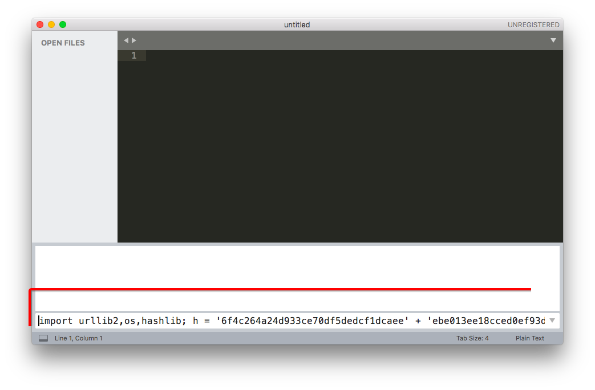
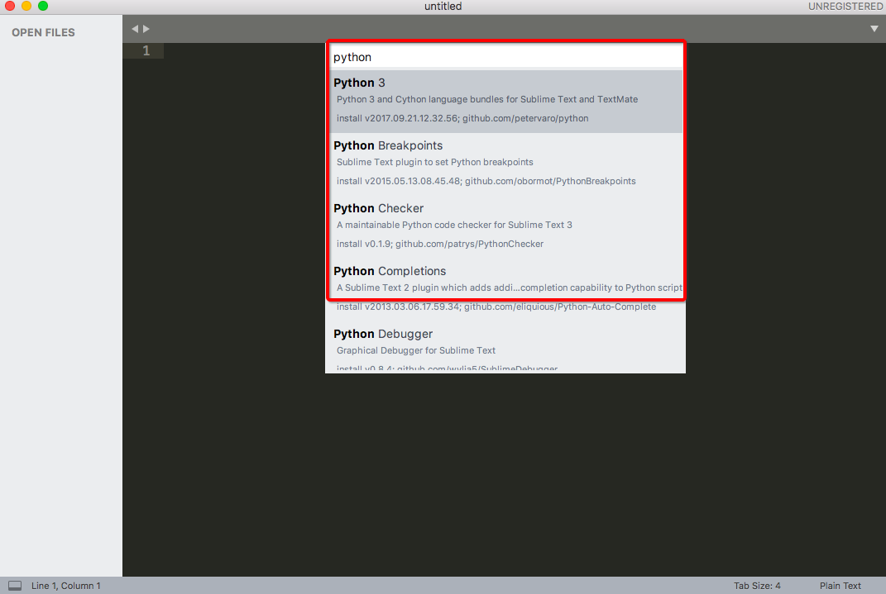

# Sublime 安装插件方法
> 长期不用的话还真能忘，这里记一下吧。

### 安装包管理器 Package Control
要装插件的话，必须从`包管理器`中才行，所以要安装它。
网上到[`Package Control`官网](https://packagecontrol.io/installation)，复制一下最新的安装命令（很长很长很长的一句命令）：
```
import urllib2,os,hashlib; h = '6f4c264a24d933ce70df5dedcf1dcaee' + 'ebe013ee18cced0ef93d5f746d80ef60'; pf = 'Package Control.sublime-package'; ipp = sublime.installed_packages_path(); os.makedirs( ipp ) if not os.path.exists(ipp) else None; urllib2.install_opener( urllib2.build_opener( urllib2.ProxyHandler()) ); by = urllib2.urlopen( 'http://packagecontrol.io/' + pf.replace(' ', '%20')).read(); dh = hashlib.sha256(by).hexdigest(); open( os.path.join( ipp, pf), 'wb' ).write(by) if dh == h else None; print('Error validating download (got %s instead of %s), please try manual install' % (dh, h) if dh != h else 'Please restart Sublime Text to finish installation')
```
然后回到Sublime里面，从菜单里`view-show console`，打开终端，输入官网那句话回车，等一等，就安装成功了。


安装成功后，按`Ctrl+Shift+P`就会弹出快捷命令菜单，然后输入`package control`搜索找到`Package Control: Install package`，回车，等一等，就会加载出一个最新的插件列表。

然后输入自己喜欢的插件就会安装好了，非常傻瓜式。
