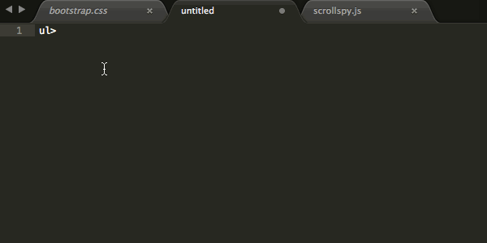

## Emmet语法
> 能力强到细思极恐的地步。不光适配Sublime，还可以应用到Vim等各种编辑器中。它不光是一个插件，而是一种语法，一种思路。它能把复杂的事、重复性的事简单化。简单一句话，按下Tab键，就可以生成一段高度订制的代码，而且还保留源语句为参考，可读性可复用性强。

先看这段Emmet语句:
```html
label[for="参数a"]{ 显示标签 }>input[type="checkbox"][id="参数a"]+input[type="text"][for="参数a"]
# 按一下Tab键，就会生成:
<label for="参数a"> 
    显示标签 
    <input type="checkbox" id="参数a">
    <input type="text" for="参数a">
</label>
```

然后简单说下语法吧：
- `label>input` 生成label嵌套input的结构
- `label[属性1=值][属性2=值]` 生成带有属性和值的结构，属性名直接写，值要用引号
- `label{内容}` 生成标签中间的文字内容
- `input+input` 会生成两个同级的input标签
比较详尽的用法看这个链接：
[使用Emmet加速Web前端开发](https://www.w3cplus.com/tools/using-emmet-speed-front-end-web-development.html)
看这个动图：



