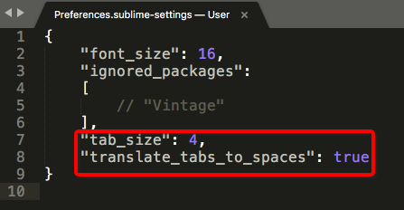

# Sublime 设置按Tab键输入4个空格（而非默认的一个Tab长度）
Tab还是Space之争，如Vim和Emacs之争一样是永无止境的。我是Space派，不过是希望按Tab出空格的那种。
找到Sublime菜单的设置-User设置，在出现的JSON格式配置文件中，加入如下参数：
```javascript
"tab_size": 4, // Tab长度
"translate_tabs_to_spaces": true, // 每次按tab都会变成上面指定长度的space
```
设置如图：



