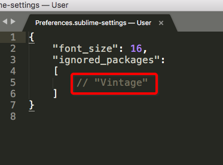

# Sublime Text 开启vim模式
在软件菜单里找到设置，会弹出Json格式的文件，也就是Sublime Text的配置文件。
对，Sublime任性，设置页坚决不用GUI显示，只用配置文件。
很简单，找到User 配置（`Preferences.sublime-settings`)这个文件，然后将`ignored_packages`数组中的`Vintage`数值删除即可，然后就变为Vim和Sublime模式通用了。如果再屏蔽vim模式，只要再将`Vintage`加回去该数组即可。

