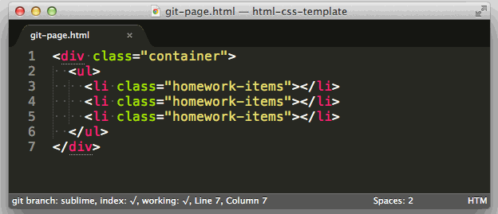
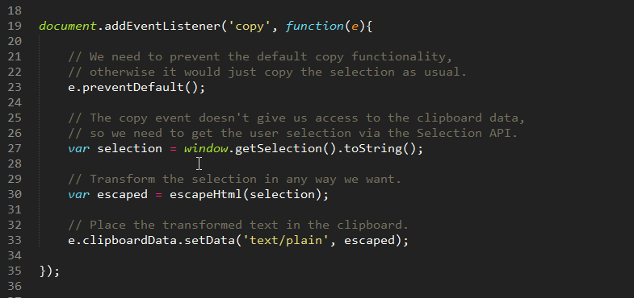
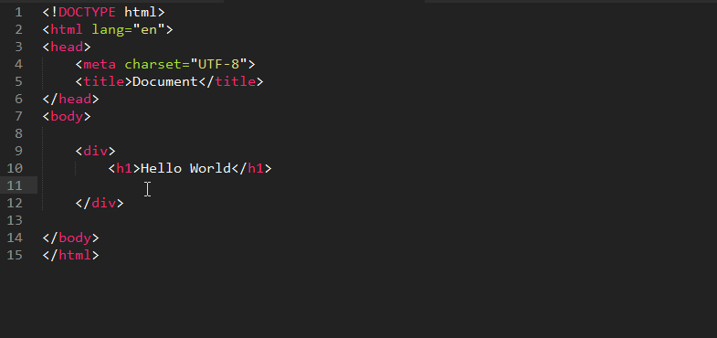
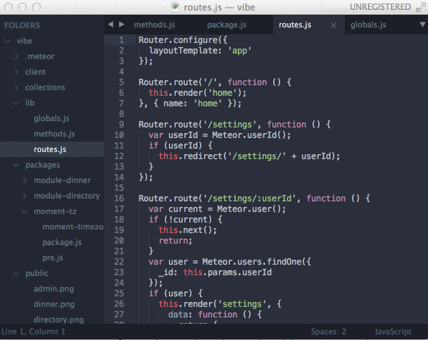

# Sublime 常用插件列表
可以直接参考几个文章链接。[15 Awesome Sublime Text Plugins For Web Development](https://tutorialzine.com/2016/10/15-awesome-sublime-text-plugins-for-web-development)。
- **Emmet** 用独特的输入方式超快生成批量的html和css语句,如图：

- **SublimeRepl** 编辑器内置程序编译器，直接显示Python等程序结果。(说实话不是很好用，稍微复杂点就显示不好了）
- **SidebarEnhancements** 稍稍增强ST的侧边栏的功能
- **SublimeTmpl** 快速HTMl/CSS/JS/Python等模板
- **SublimeCodeIntel** 鼠标点到函数上，自动提供该函数的文件所在位置，可以点击进行跳转

- **Minify** 将各种代码压缩并生成`.min`文件，包括js，python等多种
- **Placeholders** 为HTML快速生成"伪图片"

- **TernJS** 自动补全变量、属性等。

